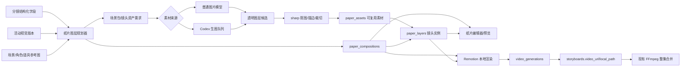

# LocalMiniDrama 纸片分层动画实施方案

> 文档状态：方案 v2 草案，可作为后续实现基线
> 创建日期：2026-07-19
> 目标：参考“Codex + Remotion 唐朝纸片分层动画”的制作方法，在 LocalMiniDrama 现有分镜、素材、TTS、视频记录和 FFmpeg 合并链路之上，增加可重复、本地化、可编辑的纸片分层动画能力。
>
> **动画专家修订（2026-07-19）**：本方案的“正式模式”不是把多张 PNG 排在一起，而是“可动主体 + 可解释的动作节拍 + 局部遮挡/蒙版 + 冻结音频时序 + 连续镜头验收”的完整镜头生产合同。凡是不满足这五项的结果，都只能停留在草稿，不能进入正式视频记录。

## 1. 结论先行

推荐新增一条与现有 AI 视频并行的本地渲染链路：

```text
现有链路：分镜/参考图 → 外部视频模型 → video_generations → 分镜视频 → FFmpeg 合集

新增链路：分镜/角色/场景/道具
          → 纸片素材规划
          → 独立背景板 + 透明 PNG 图层
          → 图层排版与动画参数
          → Remotion 本地逐帧渲染
          → video_generations
          → 分镜视频 → FFmpeg 合集
```

关键决策：

1. **不替换现有 AI 视频生成**，新增 `ai_video | paper_layered` 两种视频渲染方式。
2. **不复用 `storyboards.creation_mode` 表示纸片模式**。该字段继续只表达 `classic | universal` 分镜创作模式；新增独立的 `video_render_mode`。
3. **最终产物继续写入 `video_generations` 和 `storyboards.video_url/local_path`**，因此现有视频列表、轮询、主视频选择和整集 FFmpeg 合并可以继续复用。
4. **Remotion 只负责本地确定性逐帧渲染**，不负责生成图片；图片仍由现有图片模型或 Codex 队列生成。
5. 文章中的 Python/Pillow/NumPy 抠图，在产品代码中优先替换为项目已经依赖的 **`sharp` + 原始像素缓冲区**，保持纯 JavaScript、Windows 和 Electron 打包兼容。
6. 第一版先做“单个分镜 → 纸片动画 MP4”，再扩展到整集模板、批量生成和可视化编辑器。
7. **只保留正式生产模式**：不提供“整张分镜图一键分割后直接渲染”的快速模式，也不在素材不足时降级为整图推拉。

正式模式的最低产出定义：

- 主体图层必须具备可动结构；主角至少拆出躯干、头部、可见手臂和关键道具（具体按镜头可见部位裁剪），而不是只有一张整体 PNG。
- 每个镜头必须有一个叙事动作、一个动作反应或一个有意设计的镜头运动；“所有图层一起漂浮”不能算动画。
- z-index 只负责基础绘制顺序；需要局部遮挡的部位必须使用 occlusion group、Alpha mask 或 clip path。
- 动画时间必须绑定到已冻结的对白/旁白时序或明确的无声节拍，不得在整集合并后才临时决定动作峰值。
- 每个镜头必须通过 proof frames 和连续性检查，证明首帧、动作峰值、稳定帧和尾帧都可用。

### 1.1 本轮修订重点

| 原方案容易留下的歧义 | 本版明确规则 |
|---|---|
| 一张整体人物 PNG 也能当主角 | 主角按最小 rig 拆成父子部件，保存 pivot、脚底线和道具挂点 |
| 固定第几帧入场 | 由 `anticipation → entry → action → peak → settle → hold → exit` 和音频 cue 编译 |
| z-index 可以解决所有前后关系 | 全局 z-index 与 depth 分离，局部穿插必须有 mask/occluder |
| 轻微漂浮就算有动画 | 强制动作动词、action/reaction motion budget 和 motion coverage 检查 |
| 合并时再对齐对白 | 先冻结 `audio_timing`，动作峰值引用同一 timing hash |
| 三张静帧能验收镜头 | 使用六张 proof frames，并检查相邻镜头的 entry/exit continuity |

## 2. 第一版目标和非目标

### 2.1 第一版必须完成

- 每个分镜可以选择“AI 视频”或“纸片分层”。
- 能从当前分镜关联的场景、角色、道具生成一份纸片图层规划。
- 能生成或上传：
  - 无人物背景底板；
  - 主角、配角、道具的独立透明 PNG；
  - 可选前景纸屑、胶带、烟尘、印章等装饰图层。
- 能编辑图层的顺序、位置、缩放、进入时间、进入方向和轻微漂浮参数。
- 主角能使用最小关节化纸片结构（父子层级、pivot、局部旋转和道具挂点）完成一个可辨识动作；不要求第一版提供专业骨骼编辑器。
- 规划器能输出 `anticipation → entry → action → peak → settle → hold → exit` 语义节拍，并将其转换为帧区间。
- 支持局部遮挡、蒙版、前景遮挡物和接触阴影，避免仅靠全局 `z-index`。
- 在渲染前冻结音频时序和连续镜头契约，并生成首帧、预备帧、峰值帧、稳定帧、尾帧前保持帧和精确末帧证明图。
- 能在本地渲染固定画幅、固定帧率的 MP4。
- 渲染结果能出现在现有分镜视频区域，并能参加现有整集合并。
- 所有图片素材保留当前视觉版本、上下文快照和来源信息。
- 无视频模型 API Key 时，仍然可以完成纸片动画渲染。

### 2.2 第一版暂不做

- 专业级骨骼编辑器、自动口型同步、动作捕捉和 AI 肢体重绘；第一版只实现可复用的最小关节化纸片结构和预设动作。
- 不提供把一张完整分镜图自动分割后直接渲染的降级模式。
- After Effects 级关键帧曲线编辑器。
- 多人实时协作。
- 直接替代专业非编软件。
- 一开始就对整部剧的全部分镜自动生成正式素材。

## 3. 当前代码可以复用什么

| 当前能力 | 代码入口 | 在纸片动画中的复用方式 |
|---|---|---|
| 剧本、集、分镜和镜头时长 | `storyboards`、`episodeStoryboardService.js` | 决定每个纸片片段的内容和帧数 |
| 分镜关联角色、场景、道具 | `storyboards.characters`、`scene_id`、`storyboard_props` | 自动生成图层清单 |
| 统一视觉风格 V2 | `promptCompiler.js`、`generationContextService.js`、`referencePackService.js` | 生成纸片资产时冻结风格、参考图与 prompt |
| 图片模型生成 | `imageService.js`、`imageClient.js` | 生成背景板和独立图层素材 |
| Codex 生图队列 | `codexImageJobService.js`、`jobs.json` | 无图片模型时生成纸片图层候选 |
| 首帧、尾帧、分镜主图 | `storyboardFrameBinding.js`、`storyboardMedia.js` | 作为构图参考，不直接当最终可动图层 |
| 视频生成记录 | `video_generations`、`videoService.js`、`/videos` | 保存本地纸片渲染结果，保持前端兼容 |
| 异步任务和轮询 | `async_tasks`、`taskService.js` | 上报素材处理和渲染进度 |
| 项目本地存储 | `storageLayout.js` | 把纸片资产和渲染结果放进稳定项目目录 |
| TTS 与解说字幕 | `ttsService.js`、`mergedEpisodePostProcess.js` | 第一版继续在整集合并阶段混音和烧字幕 |
| FFmpeg 合并 | `videoMergeService.js` | 合并纸片片段或纸片/AI 混合片段 |
| 画布工作流 | `DramaCanvas.vue`、`dramaCanvasAdapter.js` | 后续展示“图层规划 → 渲染视频”节点 |
| 桌面打包 | `desktop/` | 后续随安装包分发 Remotion 平台二进制和模板 |

### 3.1 当前缺口

当前代码中的视频生成，本质上是把提示词和参考图交给外部视频模型：

- `frontweb/src/views/FilmCreate.vue` 调用 `videosAPI.create()`；
- `backend-node/src/routes/videos.js` 创建 `video_generations`；
- `backend-node/src/services/videoService.js` 调用 `videoClient.callVideoApi()`；
- 完成后下载 MP4，并回写分镜视频字段。

当前没有以下能力：

- 独立图层资产的数据模型；
- 透明图层抠图与边缘处理；
- 图层排版参数；
- 本地逐帧动画渲染器；
- 纸片动画预览器；
- 纸片素材的 Codex 任务类型；
- Electron 内的 Remotion 二进制打包规则。

## 4. 对参考文章方案的本项目化改造

| 参考方案 | LocalMiniDrama 采用方案 | 原因 |
|---|---|---|
| Codex 读取文案并串联全部工具 | 现有分镜数据 + 后端纸片规划服务 + 可选 Codex 辅助 | 产品内不能依赖每次人工对话编排 |
| Imagegen 生成背景和人物 | 现有图片模型与 Codex 队列双通道 | 延续当前候选图和人工“使用”流程 |
| 纯绿背景人物 | 作为 MVP 的稳定输出合同 | 便于完全本地、可重复抠图 |
| Python + Pillow + NumPy 抠图 | `sharp` + Buffer 色差/透明度处理 | 当前后端已有 `sharp`，无需新增 Python 运行时 |
| 文章中的 F5-TTS 声音克隆 | 第一版复用现有普通 TTS；声音克隆另设适配器阶段 | 当前已有 `audio_local_path` 和 `narration_audio_local_path`，但尚未接入 F5-TTS |
| Remotion 编排图层 | 新增后端本地 Remotion 渲染器 | 可按帧确定性渲染并使用 JSON 参数化 |
| FFmpeg 抽帧和验收 | 复用项目 FFmpeg/ffprobe 工具 | 桌面版已经携带 FFmpeg |
| 一个工程手工写坐标 | 生成规范化图层 JSON，并在页面编辑 | 才能让功能复用于不同剧集和画幅 |

## 5. 目标架构



### 5.1 模块边界

- **规划器**只产生图层清单、默认布局和动画参数，不生成图片。
- **素材生成器**只生成背景或单个透明对象，并写入可复用 `paper_assets`，不决定整镜动画。
- **抠图服务**只把绿幕图或已有 Alpha 图处理为规范 PNG。
- **图层实例**只保存某个素材在某个分镜中的位置、层级和动画，不复制素材文件。
- **编辑器**只编辑一份版本化 JSON，不直接操作 Remotion 源代码。
- **Remotion 渲染器**只读取冻结的 JSON 和本地媒体，不回读会变化的业务表。
- **视频记录层**继续使用 `video_generations`，让后续功能无需认识渲染器内部细节。

## 6. 数据模型

建议新增迁移：

```text
backend-node/migrations/30_paper_layer_animation.sql
```

### 6.1 `storyboards` 新字段

```sql
ALTER TABLE storyboards
  ADD COLUMN video_render_mode TEXT DEFAULT 'ai_video';
```

允许值：

```text
ai_video | paper_layered
```

项目默认值放在：

```json
{
  "default_video_render_mode": "ai_video",
  "paper_render": {
    "fps": 30,
    "template": "paper_history_v1",
    "preview_scale": 0.5
  }
}
```

> `creation_mode` 仍然只允许 `classic | universal`，不要把纸片模式塞进该字段。

### 6.2 `paper_compositions`

每个分镜一份当前纸片合成配置，历史渲染通过快照保存。

```sql
CREATE TABLE paper_compositions (
  id INTEGER PRIMARY KEY AUTOINCREMENT,
  drama_id INTEGER NOT NULL,
  episode_id INTEGER NOT NULL,
  storyboard_id INTEGER NOT NULL UNIQUE,
  sequence_id INTEGER,
  sequence_index INTEGER,
  version INTEGER NOT NULL DEFAULT 1,
  schema_version INTEGER NOT NULL DEFAULT 2,
  template_key TEXT NOT NULL DEFAULT 'paper_history_v1',
  fps INTEGER NOT NULL DEFAULT 30,
  width INTEGER NOT NULL,
  height INTEGER NOT NULL,
  duration_frames INTEGER NOT NULL,
  camera_json TEXT,
  continuity_json TEXT,
  audio_json TEXT,
  audio_timing_status TEXT NOT NULL DEFAULT 'unlocked',
  status TEXT NOT NULL DEFAULT 'draft',
  spec_hash TEXT,
  created_at TEXT NOT NULL,
  updated_at TEXT NOT NULL,
  deleted_at TEXT
);
```

状态建议：

```text
draft | assets_pending | ready | rendering | rendered | stale | failed
```

`audio_timing_status` 只能按以下状态流转：

```text
unlocked → provisional → locked → stale
```

正式渲染只接受 `locked`。重新生成对白/旁白、改变音频起止点或改变分镜时长后，必须回到 `stale`，不能沿用旧动作节拍。

### 6.2.1 `paper_sequences`：连续镜头合同

单个 `paper_composition` 能渲染出来，不代表相邻镜头接得上。连续的同场景镜头需要保存顺序、共享锚点、相机速度和转场约束：

```sql
CREATE TABLE paper_sequences (
  id INTEGER PRIMARY KEY AUTOINCREMENT,
  drama_id INTEGER NOT NULL,
  episode_id INTEGER NOT NULL,
  scene_id INTEGER,
  sequence_key TEXT NOT NULL,
  fps INTEGER NOT NULL DEFAULT 30,
  continuity_json TEXT NOT NULL DEFAULT '{}',
  status TEXT NOT NULL DEFAULT 'draft',
  version INTEGER NOT NULL DEFAULT 1,
  created_at TEXT NOT NULL,
  updated_at TEXT NOT NULL,
  deleted_at TEXT,
  UNIQUE(episode_id, sequence_key)
);
```

`continuity_json` 至少保存：

- `entry_anchor` / `exit_anchor`：角色脚底、脸部、关键道具和视线的归一化锚点；
- `camera_signature`：机位、焦段感、水平线、光线方向和纸张尺度；
- `allowed_delta`：相邻镜头允许的位移、缩放、朝向和色温变化；
- `transition`：`hard_cut`、`crossfade`、`push` 或其他明确转场及其帧数；
- `audio_cue_range`：该连续段可使用的对白/音效 cue 范围。

如果镜头故意跳轴或改变场景，必须显式声明 `continuity_break: true`，不能让渲染器猜测。

### 6.3 `paper_assets`

一张分镜图不能承担所有动画图层。可复用的场景背景板、人物姿势、道具和前景装饰应先成为独立素材，再被不同分镜引用。

```sql
CREATE TABLE paper_assets (
  id INTEGER PRIMARY KEY AUTOINCREMENT,
  drama_id INTEGER NOT NULL,
  scene_id INTEGER,
  storyboard_id INTEGER,
  asset_scope TEXT NOT NULL DEFAULT 'storyboard',
  asset_key TEXT NOT NULL,
  asset_type TEXT NOT NULL,
  variant_key TEXT,
  rig_key TEXT,
  source_entity_type TEXT,
  source_entity_id INTEGER,
  source_image_generation_id INTEGER,
  context_snapshot_id TEXT,
  style_version_id INTEGER,
  prompt TEXT,
  negative_prompt TEXT,
  image_url TEXT,
  local_path TEXT,
  cutout_local_path TEXT,
  processing_json TEXT NOT NULL DEFAULT '{}',
  camera_signature TEXT,
  facing TEXT,
  foot_line REAL,
  content_bbox_json TEXT,
  alpha_bbox_json TEXT,
  matte_quality TEXT NOT NULL DEFAULT 'unknown',
  schema_version INTEGER NOT NULL DEFAULT 1,
  asset_hash TEXT,
  status TEXT NOT NULL DEFAULT 'missing',
  created_at TEXT NOT NULL,
  updated_at TEXT NOT NULL,
  deleted_at TEXT
);
```

`asset_scope` 建议值：

```text
drama | scene | storyboard
```

- `drama`：纸张纹理、胶带、印章、烟尘等全剧共享装饰。
- `scene`：同一场景可复用的无人物背景板、中景建筑和前景遮挡物。
- `storyboard`：只服务于某个镜头的角色姿势、特殊道具状态或专用背景角度。

`asset_type` 不能只写“character/prop”这种业务实体类型，正式资产必须表达其可动用途：

```text
background_plate | midground | cutout | rig_part | prop_state |
occluder | mask | atmosphere | texture | decoration
```

`camera_signature`、`facing`、`foot_line` 和 `content_bbox_json` 是排版校准数据，不是可选的展示元数据。缺失时只能进入 `needs_review`，不能被规划器静默当作可复用素材。

### 6.3.1 `paper_rigs`：最小关节化结构

主角的多个身体部件需要共享一个可复用的父子结构；把多个 PNG 放在同一 z-index 并不等于 rig。第一版可以手写/程序生成 `parts_json`，暂不提供专业骨骼编辑器：

```sql
CREATE TABLE paper_rigs (
  id INTEGER PRIMARY KEY AUTOINCREMENT,
  drama_id INTEGER NOT NULL,
  subject_type TEXT NOT NULL,
  subject_id INTEGER NOT NULL,
  rig_key TEXT NOT NULL,
  schema_version INTEGER NOT NULL DEFAULT 1,
  root_part_key TEXT NOT NULL,
  parts_json TEXT NOT NULL,
  status TEXT NOT NULL DEFAULT 'draft',
  created_at TEXT NOT NULL,
  updated_at TEXT NOT NULL,
  deleted_at TEXT,
  UNIQUE(subject_type, subject_id, rig_key)
);
```

最小 `parts_json` 结构：

```json
{
  "root": "torso",
  "parts": [
    { "key": "torso", "asset_id": 516, "parent": null, "pivot": [0.5, 0.82] },
    { "key": "head", "asset_id": 517, "parent": "torso", "pivot": [0.5, 0.18] },
    { "key": "arm_front", "asset_id": 518, "parent": "torso", "pivot": [0.78, 0.36] },
    { "key": "prop", "asset_id": 519, "parent": "arm_front", "pivot": [0.92, 0.52] }
  ]
}
```

### 6.4 `paper_layers`

```sql
CREATE TABLE paper_layers (
  id INTEGER PRIMARY KEY AUTOINCREMENT,
  composition_id INTEGER NOT NULL,
  paper_asset_id INTEGER,
  rig_id INTEGER,
  layer_key TEXT NOT NULL,
  layer_type TEXT NOT NULL,
  role TEXT,
  parent_layer_key TEXT,
  content_json TEXT NOT NULL DEFAULT '{}',
  z_index INTEGER NOT NULL DEFAULT 0,
  depth REAL NOT NULL DEFAULT 0.5,
  pivot_json TEXT NOT NULL DEFAULT '{}',
  transform_json TEXT NOT NULL DEFAULT '{}',
  animation_json TEXT NOT NULL DEFAULT '{}',
  occlusion_json TEXT NOT NULL DEFAULT '{}',
  mask_asset_id INTEGER,
  schema_version INTEGER NOT NULL DEFAULT 2,
  status TEXT NOT NULL DEFAULT 'missing',
  created_at TEXT NOT NULL,
  updated_at TEXT NOT NULL,
  deleted_at TEXT,
  UNIQUE(composition_id, layer_key)
);
```

`layer_type` 建议值：

```text
background | distant | character | character_part | prop | foreground | occluder | decoration | caption
```

`role` 建议值：

```text
primary | secondary | tertiary | atmosphere
```

`paper_asset_id` 对图片图层必填；字幕、纯色块等程序化图层可以为空，并使用 `content_json`。同一个 `paper_asset` 可以被多个 composition/layer 引用，但每个镜头的 transform 和 animation 独立保存。

必须区分两个概念：

- `z_index` 是绘制顺序，解决“谁整体盖住谁”；
- `depth` 是视差和阴影深度，解决“谁离镜头更近”。

局部遮挡写入 `occlusion_json`，至少支持 `occluder_layer_key`、`mask_asset_id`、`clip_path`、`affected_part_keys` 和 `feather_px`。没有这些字段时，渲染器不得假设改变 z-index 就能正确处理手臂穿过身体、人物站在桌后等情况。

### 6.5 复用 `video_generations`

建议增加：

```sql
ALTER TABLE video_generations
  ADD COLUMN generation_kind TEXT DEFAULT 'ai';

ALTER TABLE video_generations
  ADD COLUMN paper_composition_id INTEGER;

ALTER TABLE video_generations
  ADD COLUMN render_snapshot TEXT;

ALTER TABLE video_generations
  ADD COLUMN render_hash TEXT;
```

纸片渲染记录约定：

```text
provider = local_remotion
model = paper-layer-v1
generation_kind = paper_layered
```

这样 `GET /videos?storyboard_id=`、分镜播放器和最终合并仍能使用同一套记录。

## 7. 冻结渲染规范

渲染前必须生成不可变快照，避免渲染过程中用户改动分镜或素材导致结果不可复现。

建议规范：

```json
{
  "schema_version": 2,
  "composition": {
    "id": 12,
    "storyboard_id": 165,
    "width": 1920,
    "height": 1080,
    "fps": 30,
    "duration_frames": 150,
    "template": "paper_history_v1",
    "sequence_id": 9,
    "sequence_index": 2
  },
  "timing": {
    "status": "locked",
    "phases": [
      { "name": "anticipation", "start_frame": 0, "end_frame": 12 },
      { "name": "entry", "start_frame": 12, "end_frame": 32 },
      { "name": "action", "start_frame": 32, "end_frame": 82 },
      { "name": "peak", "start_frame": 82, "end_frame": 98 },
      { "name": "settle", "start_frame": 98, "end_frame": 118 },
      { "name": "hold", "start_frame": 118, "end_frame": 142 },
      { "name": "exit", "start_frame": 142, "end_frame": 150 }
    ],
    "cues": [
      { "id": "dialogue-emphasis-1", "frame": 84, "kind": "speech_peak", "source": "audio" }
    ]
  },
  "camera": {
    "start": { "x": 0.5, "y": 0.5, "scale": 1.0 },
    "end": { "x": 0.505, "y": 0.495, "scale": 1.015 }
  },
  "layers": [
    {
      "key": "background",
      "type": "background",
      "asset_id": 501,
      "asset_hash": "...",
      "src": "projects/.../paper/assets/scenes/scene-12/wide-background.png",
      "z": 0,
      "transform": {
        "x": 0.5,
        "y": 0.5,
        "width": 1.08,
        "anchor_x": 0.5,
        "anchor_y": 0.5
      },
      "motion": {
        "parallax": 0.12,
        "entry": null,
        "idle": { "x": 0.002, "y": 0.001, "period_frames": 240 }
      }
    },
    {
      "key": "character_emperor",
      "type": "character",
      "role": "primary",
      "asset_id": 516,
      "rig_id": 22,
      "asset_hash": "...",
      "src": "projects/.../paper/assets/characters/character-8/seated-right-cutout.png",
      "z": 40,
      "transform": {
        "x": 0.48,
        "y": 0.82,
        "width": 0.34,
        "anchor_x": 0.5,
        "anchor_y": 1.0,
        "rotation": 0
      },
      "motion": {
        "phase_tracks": {
          "anticipation": { "rotation": -2.0, "duration_frames": 8, "ease": "sine.inOut" },
          "entry": { "from_x": -0.04, "from_y": 0.05, "from_scale": 0.86, "from_opacity": 0, "ease": "power3.out" },
          "action": { "track": "rig.arm_front.rotation", "from": -8, "to": 16, "ease": "power2.inOut" },
          "peak": { "track": "rig.prop.rotation", "from": -4, "to": 5, "ease": "back.out" },
          "settle": { "scale": [1.01, 1.0], "ease": "sine.out" },
          "hold": { "ambient": "paper_breath_v1" }
        },
        "idle": {
          "y": 0.003,
          "rotation": 0.35,
          "period_frames": 100,
          "phase": 0.2
        },
        "parallax": 0.7
      }
    }
  ],
  "audio": {
    "dialogue": null,
    "narration": null,
    "sfx": [],
    "timing_snapshot_hash": "...",
    "enforce_audio_track": true,
    "sample_rate": 48000
  },
  "provenance": {
    "style_version_id": 3,
    "style_signature": "...",
    "spec_hash": "..."
  }
}
```

约束：

- 位置和尺寸使用相对于画布的 `0～1` 归一化值，便于 16:9、9:16、1:1 复用。
- 所有动画只能由 `currentFrame`、`fps` 和 JSON 参数计算，不能依赖实时定时器或随机数。
- 如需随机感，必须保存固定 `seed`，并使用确定性伪随机函数。
- `start_frame/end_frame` 必须来自语义 phase 和音频 cue 编译结果；禁止在模板代码中写死“第 4 帧、第 18 帧”这类与时长无关的全局规则。
- 空间动画只允许在 `x/y/scale/rotation/opacity` 等白名单属性上插值；不得在同一元素上叠加互相覆盖的 transform tween。需要同时做入场和持续推镜时，使用父层负责入场、子层负责推镜，或在一个统一 track 中合并。
- `rig` 的子部件必须从父部件继承 pivot 和 transform，不能各自以画布左上角为原点独立漂移。
- `occlusion` 引用的 mask/遮挡层必须存在且通过 Alpha 检查；缺失就拒绝正式渲染。
- 每次渲染把完整规范写进 `video_generations.render_snapshot`。
- `render_hash` 由规范、所有素材文件 hash 和渲染器版本共同计算。

### 7.1 v2 JSON 合同与不变量

`animation_json`、`transform_json`、`occlusion_json` 和 `content_json` 都必须带自己的 `schema_version`，由 `paperSpecCompiler` 在渲染前归一化。编译器至少执行以下不变量检查：

1. 每个 `layer_key` 唯一，父层存在且不能形成循环；`rig` 的 root 必须在该 composition 中可见。
2. 所有坐标、尺寸、pivot、foot line 和 mask 边界都能转换到 `0～1` 画布坐标；超出安全区必须有 `allow_bleed: true` 的明确声明。
3. phase 必须按时间递增、无重叠；`peak` 必须落在 `action` 之后，`settle` 必须落在 `peak` 之后；允许省略 `exit`，但必须声明 `ending: hold`。
4. 每个 `primary` 主体至少绑定一个 `action` 或 `camera` track；只有明确标注 `intentional_hold` 的镜头才可没有主体动作。
5. 一个元素只能拥有一个合并后的空间 transform track；持续运动通过父子层、复合 keyframe 或预计算函数实现，不能靠互相覆盖的 tween 叠加。
6. `occlusion_json.affected_part_keys` 中的每个部件都必须存在；mask 与被遮挡部件的尺寸、画布和 hash 必须一致。
7. 规范引用的每个本地文件都必须有 hash、相对 storage 路径和媒体尺寸；渲染器不接受任意绝对路径。

JSON schema 校验失败时返回字段级错误（`path`、`code`、`message`），不创建正式视频任务；编辑器可以保存 `draft`，但不能把 draft 当作 render 输入。

## 8. 素材规划与生成

### 8.1 为什么一张分镜图不够

完整分镜图只能作为构图蓝图，不能直接当成真正的纸片素材包，原因包括：

1. 人物、建筑、道具和背景已经烘焙到同一张图，无法独立改变层级和运动速度。
2. 人物背后的背景像素根本不存在；即使把人物抠出来，移动后也会露出空洞。
3. 同一角色在远景、近景、坐姿、站姿和不同朝向中需要不同轮廓，单张角色图不能覆盖。
4. 前景遮挡物和中景建筑必须独立，才能产生真实的视差。
5. 一张图整体缩放只能得到“会动的海报”，不能得到有叙事层次的纸片动画。

因此现有分镜图的正确用途是：

- 锁定构图、人物站位、色彩和镜头方向；
- 作为背景板、人物姿势和道具素材的参考图；
- 在编辑器中作为半透明对照底稿；
- 不直接成为最终可动图层。

本项目不提供“自动分割整张分镜图 + inpaint 背景空洞”的快速路径。素材不满足正式标准时，页面只显示缺失项并阻止渲染；不会退回整图缩放、推拉或伪分层。

### 8.2 素材应分为三级

#### 场景素材包

同一个 `scene` 不是只有一张图，而是一组可复用环境资产：

- 2～4 张无人物背景板：全景、中景、近景或不同机位；
- 1～3 个中景建筑/家具层；
- 1～3 个前景遮挡层；
- 1～2 个烟尘、云雾、火光、雨雪或纸纹氛围层。

同一场景中的多个分镜优先复用这些资产，只有机位、时间、破坏状态或光线明显改变时才创建新变体。

#### 实体素材包

角色和道具也不是“一实体一张图”：

- 角色身份参考图继续用于保持脸、服装和配饰一致；
- 纸片动画需要按镜头生成站立、坐姿、跪姿、持物、转身等姿势变体；
- 常用朝向至少考虑左、右、正面；
- 关键道具需要普通、打开、破损、发光等剧情状态变体；
- 群众角色可按 2～5 人合成一个群组图层，避免图层数量爆炸。

主角还必须有一份“可动部件包”，不能把整个人物 PNG 当作 rig：

- `root/torso`：决定脚底线和整体位置；
- `head`：有独立 pivot，用于视线、点头或回头；
- `arm_front` / `arm_back`：只拆镜头中确实可见且需要动作的手臂；
- `prop`：挂在手、桌面或其他明确锚点上；
- `occluder`：身体前后穿插时所需的局部遮挡片。

部件可以由同一张角色生成图人工切片，也可以分别生成，但必须共享同一 `style_version_id`、`camera_signature` 和身份参考包。切片只负责整理边界，不能把烘焙在整张分镜图中的像素直接冒充独立动作部件。

#### 分镜图层实例

某个分镜只保存“选了哪些资产，以及这些资产怎样摆放和运动”。例如同一张皇帝坐姿 PNG，可以在两个镜头中使用不同位置、大小、层级和入场时间，不需要复制两份图片。

### 8.3 典型素材数量

| 分镜类型 | 典型独立素材数 | 说明 |
|---|---:|---|
| 单人近景 | 3～5 | 背景、人物、关键道具、可选前景/氛围 |
| 双人对话 | 4～7 | 背景、两个人物、道具、中景或前景 |
| 宫殿群像 | 6～10 | 背景、主角、配角、群臣组、中景建筑、前景装饰 |
| 战争大场面 | 8～15 | 天空/远景/地面、主将、士兵组、旗帜、烟尘、前景兵器等 |

这是“独立可动素材数”，不是要求每镜全部重新生成。一个包含 3～6 个连续分镜的场景，通常先准备 10～25 个可复用资产，再由每镜选取其中 4～10 个组成动画。

### 8.4 一条分镜的默认图层

每镜至少使用：

1. 背景层：无人物的场景底板。
2. 后排层：远处建筑局部、群臣、侍从或环境元素。
3. 主体层：主角或核心道具。
4. 前景层：近景人物、纸边、烟尘、胶带或遮挡物。

不是所有分镜都必须有四个新文件；但要保留四层语义，至少保证“背景”和“主体”分离。

### 8.5 正式渲染素材门禁

调用正式渲染前必须全部满足：

1. 规划器输出的**所有可见语义对象**都有已确认的正式资产：背景板、可见角色/角色部件、关键道具、必要的后排群像、前景遮挡、mask 和氛围层；不能用“至少 3 个 asset”掩盖缺失主体。
2. `primary` 主体至少有一个可执行动作轨道；若动作涉及身体局部，必须绑定有效 `rig_id`、父子关系和 pivot。整体 PNG 只能作为静态远景或明确标注 `intentional_hold` 的次要层。
3. 人物和道具使用已通过 Alpha/绿边诊断的 `cutout_local_path`，不能直接使用带背景原图；需要局部遮挡的部位有有效 `occlusion_json` 和 mask。
4. 背景板不含主要人物，且宽高能覆盖镜头推拉、视差和 bleed 后的完整画布；背景的 `camera_signature` 与 composition 机位相容。
5. 所有素材属于当前活动视觉版本，朝向/脚底线/内容边界已校准；旧版本素材必须重新生成或由用户显式重新确认。
6. 所有本地路径存在、位于项目 storage 内，并且 asset hash、媒体尺寸与数据库一致。
7. 音频时序为 `locked`，动作峰值和字幕/对白 cue 的误差在验收阈值内；没有音频时必须使用明确的无声节拍而不是隐式默认。
8. proof frames 已生成：`first`、`anticipation`、`peak`、`settle`、`final_minus_hold`、`exact_final`；主体没有被裁掉头、手、脚或关键道具。
9. 连续镜头的 entry/exit anchor、相机速度和转场合同均通过检查；若是有意跳切，已显式标注 `continuity_break`。
10. 没有 `missing`、`needs_review`、`stale` 状态的必需素材或规范。

任一门禁失败时，`POST /paper-compositions/:id/render` 返回结构化缺失清单，不创建正式 `video_generations`，也不自动切换到 AI 视频或整图推拉。

错误响应固定为：

```json
{
  "ok": false,
  "code": "PAPER_RENDER_GATE_FAILED",
  "composition_id": 12,
  "status": "assets_pending",
  "blocking": [
    {
      "code": "MISSING_SEMANTIC_ASSET",
      "layer_key": "character_emperor.arm_front",
      "required": "rig_part",
      "message": "主角抬手动作缺少可动手臂部件"
    },
    {
      "code": "AUDIO_TIMING_UNLOCKED",
      "path": "audio_timing_status",
      "message": "请先锁定对白/旁白 cue"
    }
  ],
  "warnings": []
}
```

`blocking` 中任意一项存在时，前端只显示“补素材/修正规范/锁定时序”入口；不能把错误自动改写成“使用整图”或“减掉缺失图层”。

### 8.5.1 状态机与失效规则

资产、合成和渲染任务分开管理状态，但失效传播必须明确：

```text
paper_asset: missing → candidate → needs_review → ready → stale
paper_composition: draft → assets_pending → ready → rendering → rendered
                                     ↘ failed      ↘ stale
```

- 资产 hash、Alpha/mask、视觉版本、camera signature 或 rig 部件变化，会把引用它的 composition 标记为 `stale`。
- 音频文件、cue、分镜时长、sequence anchor 或 renderer/schema 版本变化，也会把 composition 标记为 `stale`。
- `stale` 只能重新跑 validation 和 proof frames 后回到 `ready`；不能直接覆盖历史 `render_snapshot`。
- `failed` 只记录本次任务失败原因，修复后允许从冻结 snapshot 重试；不得把半成品当作 `rendered`。

### 8.6 自动规划输入

纸片规划器读取：

- `storyboards.description/action/result/dialogue/narration`；
- `shot_type/angle_*/movement/layout_description`；
- `scene_id` 对应的场景；
- `storyboards.characters`；
- `storyboard_props`；
- 当前激活视觉版本；
- 上一镜和下一镜的连续性快照。

规划器输出结构化 JSON，不直接输出自由文本。至少包含：

- 图层类型；
- 对应业务实体；
- 素材复用范围和变体 key；
- 主次角色；
- 默认站位、宽度和脚底锚点；
- z-index；
- 生成提示词；
- 入场顺序；
- 推荐动画预设。

纸片素材不能直接绕过统一视觉上下文 V2。推荐先以原始角色、场景、道具或分镜作为内容来源，复用 `promptCompiler.js` 的活动风格、负面词和参考包，再追加纸片素材的输出合同；最终另存一份 `entity_type=paper_asset` 的 `generation_context_snapshots` 快照。这样既能继承原实体的身份和场景连续性，又能证明某个透明 PNG 属于哪一个可复用素材和视觉版本。

### 8.7 背景板生成合同

背景 prompt 必须强制：

- 保留当前场景、时代、建筑和光线；
- 不出现主要角色；
- 不出现字幕、标志、随机文字和水印；
- 画面边缘留出轻微安全扩展区域，便于推镜；
- 严格使用当前活动视觉版本。

现有场景主图和分镜图只作为风格、机位、空间参考，不直接当背景板。因为它们可能已经把人物烘焙进画面。

### 8.8 角色和道具生成合同

第一版统一使用：

```text
完整主体、不得裁掉头手脚、明确朝向、纯绿色背景、背景无阴影、
不含场景、不含其他人物、不含文字与水印、保留白色纸片描边安全区。
```

如果模型能稳定输出透明 PNG，可以直接保留 Alpha；否则使用绿幕合同。

### 8.9 Codex 队列扩展

现有 `codexImageJobService.js` 只允许：

```text
character | prop | scene | storyboard
```

不能把纸片素材伪装成普通 `storyboard/main`，否则“使用候选图”会错误覆盖分镜主图。

建议新增：

```text
entity_type = paper_asset
entity_id = paper_assets.id
frame_type = background | cutout | foreground | decoration
target_category = paper-assets
```

应用候选图时只更新 `paper_assets.image_url/local_path`，再调用透明化处理；不写角色、场景、道具和分镜正式主图。

实现该阶段时必须同步更新：

- `backend-node/src/services/codexImageJobService.js`；
- `backend-node/src/routes/codexImageJobs.js`；
- `backend-node/src/services/promptCompiler.js`；
- `backend-node/src/services/referencePackService.js`；
- `backend-node/src/services/generationContextService.js`；
- `frontweb/src/components/CodexImageJobButton.vue`；
- `frontweb/src/components/CodexImageCandidatePicker.vue`；
- `docs/codex-image-workflow.md`。

### 8.10 `sharp` 抠图流程

新增 `paperMatteService.js`：

1. 读取图片并转为 RGBA 原始像素。
2. 如果已有有效 Alpha，跳过绿幕识别。
3. 按颜色距离识别绿色：
   - 强绿区域 Alpha 设为 0；
   - 边缘区域使用软阈值；
   - 对残留绿色做 despill。
4. 自动裁切透明边界，并保留 4%～8% 安全边距。
5. 可选生成 3～6 像素纸片白边。
6. 保存为 PNG，并记录原图 hash、处理参数和输出 hash。
7. 输出质量诊断：透明占比、边界框、绿边像素比例、是否疑似主体被误删。

若自动诊断失败，状态设为 `needs_review`，不要自动进入正式渲染。`sharp` 只负责像素处理和质量诊断，不应被当作能可靠理解头发、纱衣、烟雾的抠图模型；正式管线应允许替换为本地 matting/分割适配器，并提供人工 Alpha mask 兜底。人工 mask 也必须保存 mask 文件 hash、绘制工具版本和审核人/时间，保证重渲染可复现。

## 9. 默认排版、动作与镜头规则

### 9.1 画面主次、相机和深度

初始模板以 1920×1080 为设计基线，保存时转换为归一化值。以下是规划器的起点，不是绕过构图审核的硬编码：

| 角色级别 | 推荐画面宽度 | 视差深度 `depth` | z-index 范围 | 纸片阴影 |
|---|---:|---:|---:|---|
| primary | 30%～40% | 0.65～0.80 | 40～59 | 中等、贴近脚底 |
| secondary | 16%～25% | 0.40～0.60 | 20～39 | 轻 |
| tertiary | 8%～16% | 0.20～0.40 | 10～19 | 很轻 |
| foreground/occluder | 18%～35% | 0.85～1.00 | 60～79 | 较强、可遮挡 |
| background/distant | 100%～112% | 0.00～0.20 | 0～9 | 只保留环境接触影 |

相机是独立的父级变换，图层的动作是子级变换。相机只描述“观众在看哪里”，图层 motion 只描述“物体在做什么”；禁止为了实现推镜而同时修改每个图层的绝对位置。每个镜头必须写明：起止中心、scale、水平线/焦段感、允许 bleed 和光线方向。

### 9.2 语义节拍，而不是固定帧位

每个镜头先写“观众经历什么”，再把动作分成以下阶段：

```text
anticipation（预备/蓄力）
→ entry（进入/显现）
→ action（叙事动作）
→ peak（动作峰值或对白重音）
→ settle（回弹/落定）
→ hold（可读性保持）
→ exit（离场，可省略）
```

规划器根据镜头时长、动作类型和 `audio.cues` 计算帧区间；模板只接收编译后的区间，不写死全局的“第 4 帧入场”。同一套阶段可以有不同节奏，至少提供以下预设作为起点：

| 预设 | 适用镜头 | 节奏特征 |
|---|---|---|
| `dialogue_observation` | 对话、凝视、压迫感近景 | 预备较短，动作和峰值贴对白重音，稳定保持较长 |
| `reveal_assemble` | 人物/场景逐层揭示 | 背景先锁定，主体错峰进入，峰值后留出读图时间 |
| `impact_reaction` | 打击、转身、道具落下 | 预备明显，峰值短而明确，反应层比主动作晚 2～6 帧 |
| `quiet_hold` | 情绪停顿、结尾定格 | 动作最少，但保留一个呼吸或微小视线变化，不伪造大幅漂浮 |

阶段编译的硬约束：进入用 `out` 类减速曲线，离场用 `in` 类加速曲线；入口和出口必须留安全 hold；峰值与对白/音效 cue 的默认误差不超过 ±2 帧（无音频的人工节拍不超过 ±4 帧）。

### 9.3 动作动机和运动预算

“漂浮”只能作为纸片材质的呼吸，不是每个图层的默认动作。规划器必须为每个可见主体写一个动作动词，例如“抬手、回头、递出、后仰、旗帜被风拉开、镜头推近”；如果不能写出动词，就应标记为静止保持或重新设计。

每镜采用三层运动预算：

1. **Load-bearing action**：主角或相机承担叙事动作，至少一个。
2. **Reaction**：另一个主体、道具或环境对主动作做一次可读反应，最多两个。
3. **Ambient**：纸纹、烟尘、光线或极轻微呼吸，最多一个共享机制。

默认不允许所有人物同步漂浮、同方向同幅度推拉或每镜都使用 Ken Burns。背景、主体和前景可以有不同速度，但速度差必须服务于纵深，不能用随机相位制造噪声。

### 9.4 最小关节化纸片结构

主角只要在画面中出现可见肢体动作，就必须用 `paper_rig`：

- `root/torso`：脚底线、整体入场和身体重心；
- `head`：脸部朝向、视线和点头；
- 可见的 `arm_front` / `arm_back`：动作关节；
- `prop`：挂在手、桌面或身体的明确锚点；
- 需要穿插时增加 `occluder` 或局部 mask。

每个部件保存局部 pivot、parent、初始角度、内容 bbox 和 facing。动作先作用于 parent，再由子部件继承；不要把手臂和手分别以画布坐标做两个独立漂移。次要角色若没有任何局部动作，可以使用整体 cutout，但必须标注 `static_cutout`，不能冒充主角 rig。

### 9.5 遮挡、蒙版与局部深度

全局绘制顺序通常为：

```text
背景 → 远景 → 后排群像 → 主体后半部 → 主体前半部/手臂 → 道具 → 前景遮挡 → 纸纹/字幕
```

实际渲染以 `occlusion_json` 为准。编辑器和渲染器必须支持：

- `occlusion_group`：同一主体的局部部件共享遮挡规则；
- Alpha mask / SVG clip path：处理手臂穿过身体、人物站在桌后、烟雾盖住局部等情况；
- occluder layer：由独立前景资产遮住局部，而不是把整张前景图放到最上面；
- 可视化 mask 边界、脸/手/道具保护框和脚底锚线；
- 逐帧检查遮挡关系是否在动作峰值时仍成立。

### 9.6 纸片材质合同

每个正式镜头必须统一以下材质语言：

- 同一光源方向、白边宽度和阴影色温；
- 主体边缘白边通常为 3～6 px（按输出分辨率缩放），不能一层有白边、一层没有；
- 脚底、手与道具接触处有轻微接触阴影，避免“贴在画面上”；
- 阴影强度随 `depth` 变化，前景更实、背景更软；
- 纸纹/胶带/印章等装饰是共享资产，不能每层随机生成不同纹理；
- 白边、阴影和纹理均不得掩盖脸、手、字幕或关键道具。

### 9.7 Remotion 确定性规则

渲染组件只能从 `useCurrentFrame()`、fps、冻结 snapshot 和本地媒体计算画面。禁止 wall-clock timer、网络请求、未保存的随机数和运行时 DOM 测量。所有尺寸在 composition setup 阶段预计算；所有持续呼吸都挂在同一帧函数上，不使用脱离时间轴的独立动画。

如果同一图层需要“入场 + 持续运动”，采用父层/子层拆分或合并成一个确定性的复合变换；不要让两个动画源同时写 `transform`。每个模板还要提供 `intentional_hold` 和 `reduced_motion` 分支，以便在验证时区分有意静止与动画失效。

### 9.8 Proof frames 与连续镜头验收

三张首/中/末帧不够发现动作穿帮。每个正式镜头至少生成六张证明图：

```text
first              第 0 帧，验证初始可见性和背景覆盖
anticipation       预备阶段末，验证重心/遮挡预告
peak               动作或对白峰值，验证 rig、手、道具和 mask
settle             回弹结束，验证主体落点和接触阴影
final_minus_hold   结束保持前一帧，验证离场不会提前消失
exact_final        duration_frames - 1，验证真实尾帧而非越界帧
```

连续镜头额外比较上一镜 `exact_final` 与本镜 `first`：脚底、脸部、关键道具和相机中心的差异必须落在 `paper_sequences.allowed_delta` 内；否则标记 `continuity_failed`，不能只靠人工“看起来差不多”放行。

编辑器必须支持拖拽层级、父子关系、pivot、入场/动作/峰值/保持阶段、脚底锚线、安全区、mask 边界和六张 proof frame 查看；“只调一个总漂浮开关”的编辑体验不符合正式模式。

### 9.9 动画有效性指标

为了让“有动作”可以被自动检查，`paperSpecCompiler` 输出 `motion_coverage`：

- `load_bearing_track`：主角动作或相机运动的 track key、覆盖 phase 和峰值帧；
- `reaction_tracks`：最多两个反应轨道及其相对延迟；
- `depth_motion_bands`：至少两个深度带的运动向量/速度范围；
- `intentional_hold`：若镜头以静止为叙事目的，必须说明原因和保持区间。

默认诊断阈值（模板可以提高或降低，但必须写入 snapshot）：主动作至少满足一个可感知的空间变化——画布归一化位移 ≥ 0.008、旋转 ≥ 1.5°、缩放变化 ≥ 1.5%；rig 局部动作可用关节角度 ≥ 4° 作为替代。透明度变化 ≥ 0.15 只有在明确标注 `reveal` 时才算有效动作，不能用淡入单独冒充叙事动作。若主动作和所有反应层都低于阈值，且没有 `intentional_hold`，渲染门禁报 `MOTION_COVERAGE_INSUFFICIENT`。同时检查不同深度带不能完全复制同一运动向量，避免把同一张海报整体移动多次伪装成视差。

## 10. Remotion 渲染器设计

### 10.1 为什么用 Remotion

参考方案的核心价值不是“React”本身，而是：

- 每帧都由数据计算，结果可复现；
- 同一模板可以用 JSON 批量渲染；
- 可以在本地输出真实 MP4；
- 音频、字幕和图层能统一放到时间轴；
- 适合把纸片动画抽象成模板。

Remotion 官方的 Node SSR 流程是：`bundle()` → `selectComposition()` → `renderMedia()`。Bundle 在模板源码不变时应缓存并复用，不应每个视频重新打包。

### 10.2 推荐目录

```text
backend-node/src/paper-renderer/
  entry.jsx
  Root.jsx
  PaperComposition.jsx
  components/
    PaperLayer.jsx
    PaperRig.jsx
    PaperOcclusion.jsx
    CaptionTrack.jsx
  motion/
    easing.js
    layerMotion.js
    rigMotion.js
    phaseCompiler.js
    cameraMotion.js
  schema/
    paperSpec.schema.json
    animation.schema.json
    normalizeSpec.js

backend-node/src/services/
  paperCompositionService.js
  paperLayerPlannerService.js
  paperMatteService.js
  paperSpecCompiler.js
  paperRenderService.js

backend-node/src/routes/
  paperCompositions.js
```

项目仍保持纯 JavaScript；Remotion 入口使用 `.jsx`，服务端调用层可以使用 `.mjs` 隔离 ESM 依赖。

### 10.3 渲染过程

1. 从数据库读取 composition、layers、rig、sequence 和已锁定的 audio timing。
2. 执行 schema、语义素材覆盖、路径安全、Alpha、mask、连续性和 proof-frame 门禁。
3. 生成并冻结 render snapshot；快照一旦进入 `rendering` 不再回读业务表。
4. 计算素材 hash、音频 timing hash 和 render hash。
5. 创建 `async_tasks(type=paper_render)`，并把失败原因写成可恢复的结构化错误。
6. 创建 `video_generations(provider=local_remotion)`，但只有门禁通过后才允许进入 `processing`。
7. 全局渲染队列以并发数 1 执行，避免桌面端 CPU/内存被占满。
8. 复用缓存后的 Remotion bundle；bundle 版本参与 render hash。
9. 用 `selectComposition()` 传入同一份 `inputProps` 计算画幅和帧数。
10. 用 `renderMedia()` 输出临时文件，渲染过程中只使用帧驱动的确定性组件。
11. 先渲染六张 proof frames，再渲染 MP4；proof frame 失败时不发布视频。
12. ffprobe 验证时长、分辨率、帧率、像素格式和音轨；必要时检查 hard cue 的音画偏差。
13. 原子移动到项目正式 `videos/` 目录。
14. 更新 `video_generations`、`storyboards`、composition 状态和异步任务；任何素材/音频改动都将 composition 标为 `stale`。

### 10.4 输出规范

第一版固定：

```text
codec: H.264
pixel format: yuv420p
fps: 30
audio: AAC 48kHz 静音轨或正式音轨
resolution: 跟随项目画幅
```

渲染片段必须保证编码参数一致，否则当前 `videoMergeService.js` 的 FFmpeg concat copy 可能失败。

同时建议增强 `videoMergeService.js`：

- 首先尝试现有 concat copy；
- 失败时，把所有片段归一化为统一 H.264/AAC 后重新 concat；
- 对 AI 视频与纸片视频混合的剧集尤其必要。

### 10.5 任务恢复和取消

- 本地渲染用临时文件，成功后再原子移动。
- 后端重启时，`processing` 且不存在完整输出的纸片任务标记为 `interrupted` 或 `failed`，允许一键重试。
- 第一版不做中间帧续渲染。
- 后续可接 Remotion cancel signal，实现页面取消渲染。
- 渲染取消或进程崩溃不得留下可被播放器误认的 `completed` 记录；临时目录和 video generation 状态必须成对清理/标记。

## 11. 音频、字幕与音效策略

### 11.1 第一版

TTS 和音频时序必须在动作规划之前冻结，而不是等整集合并时才决定：

1. 对白继续使用 `storyboards.audio_local_path`，解说继续使用 `storyboards.narration_audio_local_path`。
2. 通过 ffprobe 读取音频时长、采样率和声道，并生成 `audio_timing` 快照。
3. 规划器把对白重音、句间停顿、音效命中点和字幕起止点写成 cue；没有可用音频时，必须由用户/剧本提供明确的无声 beat，并标记 `source=manual`。
4. 用户确认后把 `audio_timing_status` 设为 `locked`，生成 `timing_snapshot_hash`；动作峰值、入场和转场都引用这个 hash。
5. 纸片分镜可以先输出带正式音频的片段，也可以为兼容现有合并链路输出带 AAC 静音轨的片段，但两者都必须使用同一份 timing snapshot。音频不能在合并阶段“重新估计”动作时间。
6. 整集合并仍由 `mergedEpisodePostProcess.js` 对齐分镜时长、混音和烧字幕，使用渲染时已经冻结的 cue；如果音频后来变化，composition 必须标记 `stale` 并重渲染。

建议的最小快照：

```json
{
  "status": "locked",
  "sources": [{ "kind": "dialogue", "local_path": "...", "sha256": "...", "duration_ms": 2380 }],
  "cues": [
    { "id": "line-1-start", "frame": 18, "kind": "speech_start" },
    { "id": "line-1-emphasis", "frame": 64, "kind": "speech_peak" },
    { "id": "line-1-end", "frame": 88, "kind": "speech_end" }
  ],
  "hash": "..."
}
```

这样不会重复实现当前已经可用的 TTS、SRT 和字幕链路，同时让动画可以真正和对白节拍同步。

当前项目可直接使用的语音能力是普通文字转语音：`POST /api/v1/audio/extract` 会把对白或解说文本交给 `ttsService.js`，保存为本地音频，并分别写入 `audio_local_path` 或 `narration_audio_local_path`。当前代码实际支持 MiniMax 和 OpenAI 兼容接口；`ttsService.js` 顶部提到的 edge-tts 目前没有对应的实际 provider 分支。

因此，本方案第一版可以“生成配音并合成到纸片动画整集”，但不能承诺“用一段参考音频克隆指定人物声音”。后者需要单独增加 F5-TTS、ChatTTS 或其他本地语音服务适配器、参考音频管理、音色配置和桌面端 Python/模型依赖。

### 11.2 第二版

在第一版 timing contract 稳定后，Remotion 可以增加每层入场音效：

```text
primary → impact
secondary → whoosh
tertiary → tick/pops
镜头切换 → riser/impact
```

每个 SFX 也必须进入同一份 `audio_timing.cues`，不能在组件里使用 `setTimeout` 或按渲染速度触发。对白和旁白仍建议保留在当前后处理链路，直到整集 Remotion 渲染器成熟；渲染器只消费已冻结的音频文件和 cue，避免分镜重渲染时重复生成 TTS、整集混音不一致。

### 11.3 声音克隆后续阶段

如果目标是文章中的“固定人物声线”，建议在纸片渲染闭环稳定后再做：

1. 抽象 `ttsService` 的 provider 适配接口。
2. 增加本地 ChatTTS/F5-TTS 服务的健康检查和进程管理。
3. 为角色增加参考音频、参考文本、音色/seed 和语言字段。
4. 生成音频时冻结 voice snapshot，保证重渲染不会换声。
5. 保持生成结果仍写入现有两个 storyboard 音频字段，避免改动整集合并逻辑。

仓库中已有 ChatTTS 集成设计稿，但它目前标记为“设计中”，不能当作已经可用的本地声音克隆实现。

## 12. API 设计

建议新增：

```text
GET    /api/v1/paper-compositions?storyboard_id=:id
POST   /api/v1/storyboards/:id/paper-composition/plan
GET    /api/v1/paper-compositions/:id
PUT    /api/v1/paper-compositions/:id
GET    /api/v1/paper-compositions/:id/validation
POST   /api/v1/paper-compositions/:id/lock-timing
POST   /api/v1/paper-compositions/:id/layers
PUT    /api/v1/paper-layers/:id
DELETE /api/v1/paper-layers/:id
GET    /api/v1/paper-rigs/:id
PUT    /api/v1/paper-rigs/:id
GET    /api/v1/paper-assets?drama_id=:id&scene_id=:id
POST   /api/v1/paper-assets
PUT    /api/v1/paper-assets/:id
DELETE /api/v1/paper-assets/:id
POST   /api/v1/paper-assets/:id/generate
POST   /api/v1/paper-assets/:id/matte
POST   /api/v1/paper-compositions/:id/preview-frame
POST   /api/v1/paper-compositions/:id/proof-frames
POST   /api/v1/paper-compositions/:id/render
POST   /api/v1/paper-compositions/:id/duplicate
GET    /api/v1/paper-sequences/:id
PUT    /api/v1/paper-sequences/:id
```

接口规则：

- `plan` 默认只创建草稿，不自动消耗图片额度。
- `paper-assets` 按 drama/scene/storyboard scope 查询，可跨同场景分镜复用。
- `generate` 走普通图片模型；Codex 按钮走现有候选图队列。
- composition layer 只引用 `paper_asset_id`，生成和抠图不挂在 layer 实例上。
- `validation` 只读返回素材覆盖、schema、rig、遮挡、音频、连续性和 proof frame 的逐项结果；它不能因为“至少 3 个素材”而放过缺少语义主体的 composition。
- `lock-timing` 固化音频 cue、版本和 hash；素材/音频/时长变更后自动解锁并标记 stale。
- `render` 前必须执行完整校验，且只接受 `audio_timing_status=locked` 的正式 composition。
- API 返回的本地媒体路径统一转换为 `/static/...`。
- 所有更新使用 composition `version` 做乐观锁，避免覆盖并发编辑。

## 13. 前端交互

### 13.1 制作页

在分镜卡片的视频区域增加：

```text
视频方式：[AI 视频] [纸片分层]
```

选择纸片分层后，原“生成分镜视频”按钮替换为：

```text
[生成图层方案] [编辑纸片动画] [渲染纸片视频]
```

不要删除原有 AI 视频按钮；切换回 AI 视频时，纸片配置和历史纸片视频都保留。

纸片分层内部不再提供“快速/正式”切换。选择纸片分层就意味着执行正式素材门禁；素材不足时只允许继续补素材，不能用一张分镜图直接生成伪分层视频。

### 13.2 纸片编辑弹窗/页面

建议第一版使用独立大弹窗，后续再拆成路由：

```text
┌──────────────┬────────────────────────────┬──────────────┐
│ 图层列表      │ 画布预览                    │ 参数面板      │
│ 背景          │                            │ 位置/缩放     │
│ 后排人物      │        当前帧画面           │ 锚点/层级     │
│ 主角 > 手臂   │                            │ phase/pivot   │
│ 前景/遮挡     │                            │ mask/材质     │
├──────────────┴────────────────────────────┴──────────────┤
│ 0f ─ 预备 ─ 入场 ─ 动作 ─ 峰值 ─ 落定 ─ 保持 ─ 150f      │
│ [六张证明图] [低清预览] [锁定时序] [正式渲染]            │
└──────────────────────────────────────────────────────────┘
```

MVP 可先只提供：

- 图层增删和排序；
- 图层父子关系、rig 部件和 pivot 编辑；
- 拖动位置；
- 缩放；
- 角色级别；
- phase 预设（预备/进入/动作/峰值/落定/保持）和动作动词；
- 相机轨道与图层轨道分离；
- 局部遮挡和 mask 预览；
- 纸边、接触阴影和深度校准；
- 六张 proof frames 和连续镜头差异提示。

完整时间轴曲线编辑、逐点手绘 mask 和高级 rig 编辑器放到后续阶段；但第一版不能省略 rig、phase、mask 和 proof frame 的数据结构。

### 13.3 预览实现

前端是 Vue，Remotion Player 是 React。不要把 React 直接混进 `FilmCreate.vue`。

推荐两步：

1. MVP：后端调用 `renderStill()` 生成六张 proof frames，Vue 显示阶段标签和逐张诊断；可额外生成低分辨率 MP4。
2. 后续：把 Remotion Player 做成独立预览页面，通过 iframe + `postMessage` 与 Vue 编辑器通信。

低分辨率预览必须使用与正式渲染相同的 `paper_assets`、图层规范、rig、mask、音频 timing 和动画，只降低输出分辨率，不能减少图层、跳过局部遮挡或换成整张分镜图。这样既能隔离 Vue/React 依赖，也避免继续膨胀已经很大的 `FilmCreate.vue`。

### 13.4 画布模式

后续增加节点：

```text
分镜 → 纸片图层 → 纸片视频 → 音频
```

建议节点 ID：

```text
sbpaper:{storyboardId}
sbvid:{storyboardId}
```

工作流 pipeline 新增：

```text
paper_assets | paper_render
```

不要把 `paper_render` 继续映射为现有外部视频 API 的 `video` 步骤。

## 14. 存储结构

建议沿用 `storageLayout.getProjectStorageSubdir()`：

```text
backend-node/data/storage/projects/<project>/
  paper/
    assets/
      scenes/
        scene-12/
          wide-background.png
          medium-background.png
          foreground-columns.png
      characters/
        character-8/
          seated-right-source.png
          seated-right-cutout.png
          seated-right-rig.json
          seated-right-mask.png
      props/
        prop-3/
          open-box-cutout.png
      shared/
        paper-texture.png
        smoke-overlay.png
    rigs/
      character-8/
        seated-right-v1.json
    compositions/
      storyboard-165/
        previews/
          frame-0000.png
          frame-0012-anticipation.png
          frame-0082-peak.png
          frame-0118-settle.png
          frame-0142-final-minus-hold.png
          frame-0149-exact-final.png
        specs/
          composition-v2.json
          render-<hash>.json
  videos/
    vg_<id>_<uuid>.mp4
```

规则：

- 可复用纸片素材放在 `paper/assets/<scope>`；
- 分镜只在 `paper/compositions/storyboard-*` 保存预览和冻结规范；
- 正式视频仍放现有 `videos/`；
- 数据库只保存 storage 相对路径；
- 删除 composition 时只删除图层实例，不删除仍被其他分镜引用的素材；
- 删除素材前检查引用计数，没有引用时仍先软删除；
- 工程 ZIP 导出/导入后续需要加入 `paper/` 目录和数据表映射。

## 15. 后端改造清单

### 15.1 新增文件

```text
backend-node/migrations/30_paper_layer_animation.sql
backend-node/src/routes/paperCompositions.js
backend-node/src/routes/paperAssets.js
backend-node/src/routes/paperSequences.js
backend-node/src/routes/paperRigs.js
backend-node/src/services/paperCompositionService.js
backend-node/src/services/paperAssetService.js
backend-node/src/services/paperLayerPlannerService.js
backend-node/src/services/paperSequenceService.js
backend-node/src/services/paperRigService.js
backend-node/src/services/paperAudioTimingService.js
backend-node/src/services/paperValidationService.js
backend-node/src/services/paperMatteService.js
backend-node/src/services/paperSpecCompiler.js
backend-node/src/services/paperRenderService.mjs
backend-node/src/paper-renderer/entry.jsx
backend-node/src/paper-renderer/Root.jsx
backend-node/src/paper-renderer/PaperComposition.jsx
backend-node/src/paper-renderer/PaperRig.jsx
backend-node/src/paper-renderer/PaperOcclusion.jsx
backend-node/src/paper-renderer/motion/layerMotion.js
backend-node/src/paper-renderer/motion/rigMotion.js
backend-node/src/paper-renderer/motion/phaseCompiler.js
backend-node/src/paper-renderer/motion/cameraMotion.js
backend-node/src/paper-renderer/schema/paperSpec.schema.json
backend-node/src/paper-renderer/schema/animation.schema.json
backend-node/scripts/render-paper-storyboard.mjs
backend-node/scripts/verify-paper-render.js
```

### 15.2 修改文件

```text
backend-node/src/db/migrate.js
backend-node/src/routes/index.js
backend-node/src/services/storyboardService.js
backend-node/src/services/episodeStoryboardService.js
backend-node/src/services/dramaService.js
backend-node/src/services/videoService.js
backend-node/src/services/videoMergeService.js
backend-node/src/services/codexImageJobService.js
backend-node/src/services/promptCompiler.js
backend-node/src/services/referencePackService.js
backend-node/src/services/generationContextService.js
backend-node/src/services/visualStyleVersionService.js
backend-node/src/services/dramaExportService.js
backend-node/src/services/dramaImportService.js
backend-node/package.json
```

其中 `videoService.js` 不应把 `local_remotion` 送到 `videoClient.callVideoApi()`。本地纸片渲染应走独立 `paperRenderService`，但最终复用相同完成写回逻辑。

## 16. 前端改造清单

### 16.1 新增文件

```text
frontweb/src/api/paperCompositions.js
frontweb/src/api/paperAssets.js
frontweb/src/components/paper/PaperLayerEditor.vue
frontweb/src/components/paper/PaperAssetLibrary.vue
frontweb/src/components/paper/PaperLayerList.vue
frontweb/src/components/paper/PaperLayerCanvas.vue
frontweb/src/components/paper/PaperLayerInspector.vue
frontweb/src/components/paper/PaperRenderProgress.vue
frontweb/src/utils/paperComposition.js
```

### 16.2 修改文件

```text
frontweb/src/views/FilmCreate.vue
frontweb/src/utils/dramaCanvasAdapter.js
frontweb/src/composables/useCanvasWorkflowRunner.js
frontweb/src/components/dramaCanvas/CanvasStoryboardNode.vue
frontweb/src/components/dramaCanvas/CanvasStoryboardPanel.vue
frontweb/src/components/dramaCanvas/CanvasMediaPanel.vue
```

建议把新逻辑放进 composable/组件，不继续把全部状态和方法直接堆进 `FilmCreate.vue`。

## 17. Electron 与依赖打包

这是实现前的强制技术门槛。

当前桌面版：

- 在 Electron 主进程中直接启动 Express 后端；
- `desktop/scripts/copy-backend.js` 只复制 `src/configs/scripts/migrations`；
- 原生依赖来自 `desktop/node_modules`；
- FFmpeg 通过 `extraResources` 复制到用户目录；
- `asarUnpack` 当前只覆盖 `better-sqlite3`、`sharp` 等少量目录。

Remotion 官方说明，在 Electron 等打包环境中可能需要显式设置 `binariesDirectory`，其中包含平台相关 FFmpeg、ffprobe、Rust 二进制和共享库。因此必须先做打包验证，再大规模开发 UI。

实现时至少需要：

- `backend-node/package.json` 和 `desktop/package.json` 同步 Remotion/React 依赖；
- `copy-backend.js` 复制纸片 renderer 源码；
- 将 Remotion compositor 平台包加入 `asarUnpack` 或 `extraResources`；
- Windows x64、macOS x64/arm64 分别验证；
- 禁止运行时静默联网下载浏览器或二进制，正式安装包应预置所需文件；
- 后端提供 `GET /paper-render/doctor`，检查浏览器、二进制、写权限和可用磁盘空间。

## 18. 实施阶段

### 阶段 0：可行性闸门

目标：在不改业务 UI 的情况下证明本地渲染与打包可用。

- 建立最小 Remotion JS/JSX composition。
- 读取一份手写 JSON，渲染 5 秒、4 层、1920×1080、30fps MP4。
- 验证 `bundle()` 缓存和 `renderMedia()` 进度回调。
- 验证 macOS 开发模式。
- 验证 Windows Electron 打包模式。
- 验证安装包完全离线渲染。
- 确认 Remotion 的许可证与本项目分发方式兼容。

通过标准：同一 JSON 连续渲染两次，抽取六张 proof frames 和 MP4 的关键帧得到一致画面；安装包内无需额外安装 Python、Chrome 或 FFmpeg；明确记录许可证、安装包体积、渲染耗时和失败恢复行为。

### 阶段 1：单分镜完整动画 MVP（不可退回静态分层）

- 新增数据表和 API。
- 手动上传无人物背景与透明 PNG，并通过正式素材门禁。
- 为主角准备最小 `paper_rig`（躯干、头、可见手臂、关键道具）和局部 pivot。
- 页面编辑层级、父子关系、位置、缩放、相机和 mask。
- 锁定一份对白/旁白或无声 beat timing，生成 phase 时间轴。
- 实现一个有叙事意义的动作、一个反应和一个有限环境运动；不以全层漂浮通过验收。
- 生成六张 proof frames 和与正式渲染相同的低清预览。
- 渲染 MP4。
- 写回 `video_generations` 和分镜视频。
- 参加现有整集合并。

此阶段不自动生图，先证明“手工正式素材 → rig/遮挡 → 语义节拍 → proof frames → MP4 → 合并”闭环。通过标准是人工能看出主体完成了动作，而不是一张分镜图做慢推拉。

### 阶段 2：自动规划、素材生成和抠图

- 从分镜关联资源生成图层清单。
- 根据动作动词、镜头类型和 audio cue 生成 phase 与连续镜头合同。
- 背景板和绿幕主体走普通图片模型。
- 自动生成/复用场景包、角色姿势变体、rig 部件和前景遮挡。
- 新增 Codex `paper_asset` 队列任务。
- `sharp` 自动抠图、裁切、描边和质量诊断。
- 接入可插拔 matting 与人工 mask 复核。
- 候选图仍由用户点击“使用”。
- 写入当前视觉版本和上下文快照。

### 阶段 3：动画模板和低清预览

- 增加 `dialogue_observation`、`reveal_assemble`、`impact_reaction`、`quiet_hold` phase 预设。
- 增加 rig 动作、相机推镜、视差、接触阴影和前景局部遮挡；漂浮只作为有限 ambient 机制。
- 支持 16:9、9:16、1:1。
- 增加与正式规范完全一致的低分辨率预览。
- 增加六张 proof frame、连续镜头差异和音画偏差诊断。
- 增加模板：历史纸片、悬疑剪影、知识图解。

### 阶段 4：批量与画布

- 批量生成缺失纸片素材。
- 批量渲染纸片分镜。
- 画布增加纸片节点和工作流步骤。
- 支持 AI 视频与纸片视频混合合并。
- 增加失败重试、取消和队列并发控制。

### 阶段 5：音效和整集模板

- 入场 SFX 和章节转场。
- BGM 音量自动压低。
- 可选由 Remotion 直接渲染整集时间轴。
- 保留现有 FFmpeg 合并作为兼容路径。

## 19. 推荐首个样片

当前本地数据库中：

```text
项目：历史战争（drama_id=4）
第 2 集（episode_id=7）
分镜：35 条
已有分镜图：7 条
已有视频：3 条
场景：13 个
本集角色：5 个
道具：6 个
```

推荐使用已经有图、有视频、能做同内容对照的连续三镜：

| 分镜 ID | 镜号 | 标题 | 时长 | 现状 |
|---:|---:|---|---:|---|
| 165 | 2 | 夜幕下的倾宫 | 5 秒 | 有图、有 AI 视频 |
| 166 | 3 | 酒池中的暴君 | 6 秒 | 有图、有 AI 视频 |
| 167 | 4 | 烈日下的诅咒 | 5 秒 | 无正式分镜图、有 AI 视频 |

推荐执行顺序：

1. 先用分镜 165 做 5 秒、4～6 个语义层（含主角最小 rig）技术样片，验证 phase、音频 cue 和六张 proof frames。
2. 再用分镜 166 验证多人物前后遮挡、局部 mask、主角动作反应和与 165 的 entry/exit continuity。
3. 分镜 167 验证从场景和文本规划全新纸片素材、镜头改变和明确的 continuity break。
4. 三镜合并为 16 秒对照样片。
5. 与现有 AI 视频逐镜比较：人物稳定性、层次、节奏、成本和渲染时间。

这三镜不能只准备三张分镜图。建议样片资产预算为：

- 分镜 165、166 共用同一宫殿场景包：2 张无人物背景机位、1～2 个中/前景建筑层、6～10 个角色姿势或群组层、2～4 个道具/氛围层，以及主角 4～6 个 rig 部件和至少 1 个局部遮挡 mask。
- 分镜 167 使用新场景包：天空、地面或农田至少拆为 2 层，再准备 1～3 个主体层和 2 个前景/氛围层。
- 三镜合计约 22～35 个独立素材/部件，但每镜实际只选择其中 5～12 个语义图层；部件数量增加不等于每镜都要堆满图层。

不要直接把当前 35 个分镜全部入队。先通过这三个分镜确定 rig 拆分规则、模板、白边、抠图阈值、audio timing 和连续镜头节奏。

## 20. 验收标准

### 20.1 自动验收

- 后端现有测试全部通过。
- 前端现有测试和 `npm run build` 通过。
- 同一 spec 和素材 hash 渲染两次，关键帧像素结果一致。
- 所有图层路径都限制在项目 storage 内，拒绝目录穿越。
- schema、phase、rig 父子关系、pivot、mask 和 continuity contract 全部通过；不能靠“至少 3 个素材”作为唯一门槛。
- 每个可见语义对象都有资产覆盖；完整分镜图只能出现在 reference 字段，不能进入最终 render layers。
- 必需素材缺失、待检查或风格过期时，正式渲染 API 必须拒绝创建视频任务。
- `audio_timing_status=locked`，timing snapshot hash 与 render snapshot 一致；hard cue 的峰值误差 ≤ 2 帧。
- 主角存在至少一个有效 action/camera track；非 `intentional_hold` 的镜头不能只输出静态画面或统一漂浮。
- rig、mask 和 occluder 在 `peak` proof frame 上仍然有效；透明 PNG 主体边缘无大面积绿色残留。
- 六张 proof frames 均存在，`exact_final` 使用 `duration_frames - 1`，不能越界或空白。
- 输出分辨率、帧率、时长、像素格式和音轨符合规范。
- 纸片视频能被 `GET /videos` 列出。
- 纸片视频完成后正确回写分镜视频。
- 纸片视频能与 AI 视频混合进行整集合并。
- 后端重启后不会把半成品临时文件当作已完成视频。
- 同一 `paper_sequence` 的相邻镜头锚点和相机速度差异在 `allowed_delta` 内；有意跳切必须有显式标记。
- 达到最大层数、图片尺寸、内存和并发限制时给出可解释错误，不静默删层。
- 旧项目无新字段时自动迁移，默认仍走 `ai_video`。

### 20.2 人工验收

- 主角明显大于配角，叙事层级清楚。
- 能用一句话说出本镜的动作动词和峰值；动作不是无动机的 PNG 滑入。
- 主角的头、手臂、道具或相机至少有一个可辨识动作，反应层在正确的节拍出现。
- 背景、后排、主体、前景运动速度不同但不互相抢戏，画面有纵深。
- 人物的脸、手、脚和关键道具没有被错误裁切；pivot 转动时关节不脱节。
- 手臂穿过身体、人物站在桌后等局部遮挡在动作峰值时仍自然，不只靠整体 z-index。
- 白边和阴影统一，不出现明显绿边。
- 入场、动作、峰值、落定和保持有清楚的层次，不会所有图层同时弹出。
- 轻微纸纹/呼吸只服务材质，不会造成眩晕或廉价“PPT 动画”感。
- 六张 proof frames 与最终视频对应；不会在 `exact_final` 提前消失、黑帧或露出背景洞。
- 对白重音、动作峰值和字幕可读时间一致；静音镜头也能说明其 beat 来源。
- 相邻连续镜头的脚底、视线、关键道具和相机运动没有无意跳变。
- 16:9、9:16、1:1 下主体都位于安全区。
- 无需配置外部视频模型也可以生成正式 MP4。

## 21. 测试建议

后端新增：

```text
backend-node/test/paperCompositionService.test.js
backend-node/test/paperAssetService.test.js
backend-node/test/paperSpecCompiler.test.js
backend-node/test/paperRigService.test.js
backend-node/test/paperSequenceService.test.js
backend-node/test/paperAudioTimingService.test.js
backend-node/test/paperValidationService.test.js
backend-node/test/paperMatteService.test.js
backend-node/test/paperRenderService.test.js
backend-node/test/paperVideoMergeCompatibility.test.js
backend-node/test/paperCodexImageJob.test.js
```

重点测试：

- composition/layer CRUD；
- rig 部件父子关系、pivot 继承和循环引用拒绝；
- phase 编译、音频 cue 对齐、`intentional_hold` 和 `reduced_motion` 分支；
- z-index/depth 分离、局部 mask/occluder 和峰值帧遮挡；
- 归一化坐标转换；
- spec hash 稳定性；
- proof frame 六点采样和 `exact_final` 边界；
- sequence continuity contract 与允许偏差校验；
- 风格版本变更后 composition 标记 stale；
- Codex 候选图只能写回对应 paper asset；
- 同一 scene asset 可以被多个分镜引用，删除单个 composition 不删除共享素材；
- Alpha 图跳过绿幕处理；
- 绿幕软边和误删保护；
- 缺素材时禁止正式渲染；
- 语义素材覆盖不完整时禁止正式渲染，不接受仅有三个 asset 的假通过；
- 本地渲染失败后的任务状态；
- `local_remotion` 不会调用外部视频 API；
- FFmpeg concat 失败时的统一编码回退。

前端新增：

```text
frontweb/test/paperComposition.test.js
frontweb/test/paperRenderMode.test.js
```

## 22. 风险与规避

| 风险 | 处理 |
|---|---|
| Remotion 许可证与自动化产品分发不匹配 | 阶段 0 必须确认；渲染器保持接口抽象，必要时替换为其他本地 HTML/Canvas 渲染器 |
| Electron 打包后找不到 compositor/浏览器二进制 | 显式 `binariesDirectory`，平台包解包，Windows/macOS 安装包分别做离线冒烟测试 |
| Remotion 依赖显著增大安装包 | 记录增加体积；必要时提供“纸片渲染组件”可选安装包 |
| 渲染占满 CPU/内存 | 默认并发 1、限制最大分辨率与层数、低清预览单独配置 |
| 正式素材数量多、生成成本高 | 场景包和实体包跨分镜复用，群众按组生成，只补缺失变体，不允许重复生成同 hash 素材 |
| 主角 rig 拆分后关节脱节或脸手变形 | 第一版只支持明确的最小部件集合；保存 pivot/foot line/content bbox，峰值 proof frame 必须人工复核 |
| 动画退化为 PNG 滑入和统一漂浮 | 强制动作动词、phase、action/reaction motion budget 和自动 motion coverage 检查；素材不足时拒绝渲染 |
| 局部遮挡只改 z-index 仍穿帮 | 引入 occlusion group、mask 和独立 occluder；mask 缺失或峰值帧失败时阻止发布 |
| TTS 后生成导致动作峰值失配 | TTS/音频 cue 先锁定并写入 timing hash；音频变化自动标记 composition stale |
| v1/v2 JSON 混用导致渲染结果漂移 | schema_version + 编译归一化；不识别的字段拒绝正式渲染，保留 snapshot 迁移器 |
| 绿幕抠图出现绿边 | 软阈值 + despill + 白边；失败标记人工检查 |
| 角色被裁手脚 | prompt 输出合同 + 透明边界诊断 + 安全边距 |
| 旧图画风污染新图层 | 复用视觉版本 provenance；旧参考图默认过滤 |
| 分镜图已烘焙人物 | 只作为构图参考，重新生成无人物背景板 |
| `creation_mode` 逻辑被破坏 | 新增独立 `video_render_mode`，不修改 classic/universal 语义 |
| `FilmCreate.vue` 继续膨胀 | 新功能必须拆到 `components/paper` 和 composable/API 文件 |
| AI 视频和纸片视频编码不同，concat 失败 | 纸片输出固定编码；合并服务增加重编码回退 |
| 项目改风格后仍复用旧纸片资产 | 对比 style signature，asset、composition 和 layer 标记 stale，不自动覆盖 |
| 用户改素材后历史视频不可追溯 | 每次渲染冻结 snapshot、文件 hash 和 renderer version |

## 23. 实现前的最终检查项

- [ ] 确认 Remotion 许可证适合 LocalMiniDrama 的开源分发和自动渲染场景。
- [ ] 完成 macOS 开发模式最小渲染。
- [ ] 完成 Windows Electron 安装包离线渲染。
- [ ] 确认安装包增加体积可接受。
- [ ] 确认 paper asset 的视觉版本、复用范围和 Codex 候选图写回规则。
- [ ] 确认产品只保留正式模式，界面、API 和任务队列均没有整图分割或伪分层降级入口。
- [ ] 确认 v2 JSON schema、paper rig、pivot/foot line、occlusion/mask 和 continuity contract 已冻结。
- [ ] 确认第一版只做单分镜渲染，不同时改整集合成架构，但分镜 timing 已能被现有整集合并消费。
- [ ] 确认 TTS/旁白已生成或无声 beat 已人工锁定，`audio_timing_status=locked`。
- [ ] 确认六张 proof frames、动作覆盖、局部遮挡和相邻镜头连续性均通过验收。
- [ ] 用分镜 165 完成 5 秒样片后再进入批量开发。

## 24. 参考资料

- 原始方案：[我用 Codex + Remotion，做了一条唐朝纸片分层动画](https://x.com/vbjby3/status/2076530524110369070)
- Remotion 官方：[Node SSR 渲染流程](https://www.remotion.dev/docs/ssr-node)
- Remotion 官方：[`renderMedia()`](https://www.remotion.dev/docs/renderer/render-media)
- Remotion 官方：[`bundle()`](https://www.remotion.dev/docs/bundle)
- 项目内：[Codex 生图队列工作流](../codex-image-workflow.md)
- 项目内：[统一视觉上下文 V2 改造方案](../visual-style-v2-migration-plan.md)
- 项目内：[漫剧画布工作流实施计划](2026-06-15-drama-canvas-workflow-plan.md)
