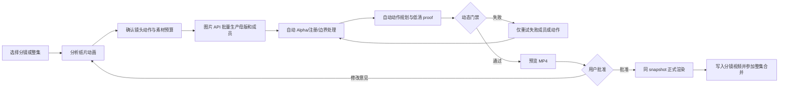
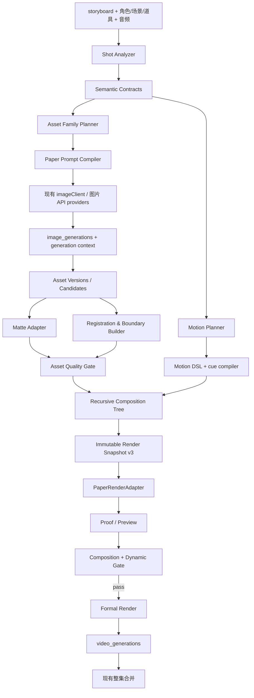

# LocalMiniDrama 纸片动画 v3 全链路预研与实施方案

> 文档状态：预研结论，可进入架构评审和垂直切片开发
> 日期：2026-07-24
> 适用项目：LocalMiniDrama
> 上一代文档：`2026-07-19-paper-layer-animation-plan.md` 与对应 technical design 仅作为 v2 历史记录，不再作为实现基线
> 参考实现：[cyberlesterr/paper-collage-video](https://github.com/cyberlesterr/paper-collage-video)
> 硬约束：所有图片素材走 LocalMiniDrama 已配置的图片 API/provider；不设计、不依赖 Codex 生图队列
> 下游技术设计：[独立纸片动画工作室 v3 技术方案](../technical/2026-07-24-paper-studio-v3-technical-design.md)

## 0. 结论先行

当前纸片功能不能通过继续调抠图阈值、坐标、z-index 或相机幅度修好。需要把 v2 的“扁平贴图渲染”升级为 v3 的“语义资产生产 + 关系组合 + 动作编译 + 视觉证明”流水线。

这里的 v3 是一个统一、独立的纸片动画制作模式，不是若干具体剧情模板。“沉船断路”只是第一条全链路测试场景；生产系统必须从任意分镜提取通用主体、动作、支撑、接触、前后遮挡和环境边界，再组合能力完成动画。具体剧情名不得成为产品入口、用户选项或核心状态机分支。

v3 冻结以下关键决策：

1. 图片生产只调用现有 `imageClient.callImageApi()` 及其 provider 体系，不再经过 Codex 任务、`jobs.json` 或人工导入对话。
2. 完整分镜图只做构图和风格参考，不能直接作为最终背景或可动层。
3. 每个镜头先形成语义合同和动作合同，再生成素材。不能先随便生几张 PNG，最后再猜它们怎么动。
4. 互相接触、包含或共享边界的素材必须属于同一 `source_family`，具有同一注册画布或明确的锚点关系。
5. 组合树采用 `asset | group` 递归节点，支持：
   - `free`
   - `supported-subject`
   - `registered-environment`
6. 角色动画采用混合策略：
   - 小幅手势：最小关节 rig；
   - 走、推、跪、打、下沉等形变明显动作：同源姿态状态图/pose atlas；
   - 环境和特效：确定性的 SVG/Canvas/关键帧；
   - 不要求用户手工绑骨骼。
7. 主体动作是正式渲染的硬门禁。纯相机推拉、整体漂浮、呼吸微动不能冒充叙事动作。
8. 水面、船舷、桌沿、门框等关系由注册边界、前后槽位和 mask 表达，不能只靠全局 z-index。
9. preview 与正式渲染必须消费同一份不可变 snapshot；二者只允许分辨率和编码参数不同。
10. proof 不再是“存在六张图就通过”，而是每个 proof target 都带可计算断言、局部裁切、debug overlay 和视觉差异指标。
11. 第一条垂直切片固定用“沉船断路”，跑通从分镜分析、API 生图、自动抠图、动作、水面遮挡、预览、动态门禁到正式 MP4 的完整链路。
12. v2 composition 不自动迁移为 v3。旧数据缺少 source family、关系和证明语义，自动迁移只会制造假合格；产品提供“用 v3 重建”入口并保留旧视频。

## 1. 为什么当前结果必然没有用

### 1.1 当前实现的真实行为

仓库中已有的 v2 链路是：

```text
storyboard
  → paperLayerPlannerService
  → background_plate + character rig + prop layer
  → paperSpecCompiler v2
  → 扁平 Remotion layer/rig 渲染
  → 六张静态 proof + MP4
```

从代码可以确认以下问题：

| 位置 | 当前行为 | 后果 |
|---|---|---|
| `paperLayerPlannerService.js` | 场景主图直接成为 `background_plate` | 背景里可能已经含人物/道具，独立纸片叠上后重复 |
| `ensureCharacterRig()` | 所有角色固定创建 `torso/head/arm_front` | 与真实姿态、可见部位和动作无关 |
| `deriveActionVerb()` | 无匹配动作时退回“镜头呼吸” | 规划器可以没有主体动作 |
| `paperMatteService.js` | 主要是边框取色 + RGB 色差去背景 | 白衣、头发、阴影、暖灰背景容易一起被抠除或残留 |
| `paper_layers` | 每层只有全局 transform、z-index 和一个 occlusion JSON | 无法表达一人坐在船内、岸水共享边界等组合关系 |
| `paperValidationService.js` | camera motion 可以令总体 motion coverage 通过 | 静态贴图加推拉可以被判为动画 |
| `paper_render_proofs` | proof 文件生成后直接写 `pass` | 只证明文件存在，不证明动作和关系正确 |
| `paperRenderService.js` | proof/preview 允许 provisional timing，正式渲染要求 locked timing | 预览与成片可能不是同一时序合同 |
| `paperRenderService.js` | preview 输出位于临时目录，任务结束后清理 temp | 预览产物生命周期与正式产物不一致 |

所以“沉船断路”只生成背景、船贴片和轻微移动，不是偶发 bug，而是当前数据合同能够表达的上限。

### 1.2 必须停止的补丁方向

- 继续提高/降低白底抠图阈值；
- 给船和人物手填几个位置数值；
- 多加几个默认 z-index；
- 让相机移动更大；
- 把整张分镜当背景，再叠一层同样的人物；
- 仅增加 proof 图片数量；
- 对失败镜头静默降级为整图推拉。

这些做法都没有增加“人物在船内”“船进入水下”“士卒做了推船动作”等语义表达能力。

## 2. 产品完成定义

### 2.1 用户看到的完整流程

用户不需要抠图、填坐标、改 JSON 或打开动画编辑器。



建议只保留三个内容确认点：

1. 镜头计划：系统展示“谁做什么、有哪些关系、预计生成多少张图”。
2. 预览：用户用自然语言指出问题，例如“船沉得不够”“士兵应该在船后面”。
3. 正式结果：选择是否作为当前分镜主视频。

素材候选、抠图边缘和注册坐标属于系统内部质量控制。只有自动处理连续失败时，才打开诊断面板，而不是把人工抠图变成正常流程。

### 2.2 三个生产档位

所有档位都必须有主体动作，不能用相机运动降级。

| 档位 | 用途 | 最低生产合同 |
|---|---|---|
| `draft` | 快速验证叙事 | clean plate、1 个主动作、至少 2 个主体状态、必要遮挡、3 个 proof beat |
| `balanced` | 默认正式生产 | 3 层环境、主角 3–5 个状态或最小 rig、关键道具、关系 mask、5 个 beat、完整动态门禁 |
| `full-depth` | 重点镜头 | 4–7 层环境、多人/多道具关系、5–8 个角色部件或状态、局部特效、连续镜头检查 |

### 2.3 非目标

- 不做任意图片的一键自动动画化；
- 不做 After Effects/Spine 级通用动画编辑器；
- 不把视频扩散模型生成的 MP4伪装成本地纸片动画；
- 不要求所有 provider 都具有相同能力；
- 不保证没有参考图、只有一句提示词时仍能保持角色身份；
- 不在 v3 第一阶段做自动口型、复杂布料形变和手指级动作。

## 3. 总体架构



### 3.1 新增模块边界

| 模块 | 负责 | 不负责 |
|---|---|---|
| `paperShotAnalyzerService` | 从分镜提取动作参与者、关系、边界、beat 和风险 | 生成图片、写动画代码 |
| `paperSemanticContractService` | 持久化“必须证明什么” | 用 prompt 代替验收 |
| `paperSourceFamilyService` | 规划母版、成员、注册画布、派生关系 | 独立生一堆无关联图片 |
| `paperPromptCompiler` | 结合视觉版本、实体参考、母版和 slot 生成 API 请求 | 直接调用特定厂商 SDK |
| `paperAssetGenerationService` | 复用 `imageClient` 创建异步任务、候选和 provenance | 更新角色/场景正式主图 |
| `paperMatteAdapter` | 调用 rembg/模型并用 sharp 做边缘后处理 | 决定语义关系 |
| `paperRegistrationService` | 画布、锚点、接触区、边界和 mask | 动画时间 |
| `paperMotionPlannerService` | 选择动作预设、参数和 cue | 生成任意 JS/React 代码 |
| `paperMotionCompiler` | 将 DSL 编译为确定性 frame tracks | 访问数据库或网络 |
| `paperCompositionCompilerV3` | 构建递归树和冻结 snapshot | 在渲染期间读取业务表 |
| `paperQualityGateV3` | 资产、关系、动作、视觉和连续性门禁 | 静默降级 |
| `PaperRenderAdapter` | proof、preview 和 formal render | 重新编译业务计划 |

## 4. 先规划关系，再规划素材

### 4.1 语义合同

每个镜头至少生成：

- `subjects`：主角、配角、关键道具、环境主体；
- `predicates`：`inside/on/held-by/contacts/above-boundary/below-boundary/free`；
- `action`：动作动词、发起者、承受者、开始/峰值/结束；
- `proof_targets`：哪一个时间点、哪一块像素、要证明什么；
- `continuity`：与前后镜头共享的身份、朝向、位置、光线和相机约束。

示例：

```json
{
  "shot_key": "sink-boats-01",
  "contracts": [
    {"subject": "soldier_group", "predicate": "behind", "object": "boat_front"},
    {"subject": "boat", "predicate": "contacts", "object": "shoreline"},
    {"subject": "boat", "predicate": "below-boundary", "object": "waterline", "at": "final"}
  ],
  "action": {
    "verb": "push-and-sink",
    "actor": "soldier_group",
    "target": "boat",
    "peak_cue": "splash_peak"
  },
  "proof_targets": [
    {"at": "action", "assert": "soldiers visibly push the boat"},
    {"at": "peak", "assert": "boat tilts and crosses the waterline"},
    {"at": "final", "assert": "front water occludes the lower hull"}
  ]
}
```

语义合同可由已配置文本模型产生候选，但必须经过 JSON Schema、实体引用、动作 catalog 和关系规则校验。模型只能选择受限 DSL，不能输出任意代码。

### 4.2 三种组合模式

#### `free`

适合互不接触的纸片：字幕、飞鸟、印章、叶片、烟尘、远景装饰。

最低要求：独立素材、普通 transform、局部 z-order。

#### `supported-subject`

适合人坐在船里、手拿道具、人站在车上、物体放在桌上。

必须包含：

```text
support-rear
contact-shadow（可选）
subject
support-front
contact-anchor
contact-zone
occlusion-zone
```

组变换作用一次，成员共享运动；subject 的接触锚点在 proof 时刻必须位于 contact zone，除非动作显式声明 `detach`。

#### `registered-environment`

适合岸/水、地/天、室内墙/地面、窗内/窗外等共享边界。

必须包含：

- 同一 `registration_canvas_id`；
- 同一画布尺寸和原点；
- 至少一条 boundary；
- upper/lower 或 inside/outside mask；
- 每个成员声明允许覆盖的一侧；
- 禁止语义内容在两个成员中重复。

水纹可以在 lower mask 内运动，但水岸边界本身不能跟着纹理漂移。

### 4.3 source family

所有耦合成员都要有同一 `source_family_id`。一个 family 包含：

- `layout_master`：完整关系参考；
- `clean_plate`：无可动主体的环境；
- `members`：角色、道具、前后支撑、环境层；
- `masks/boundaries`：注册边界；
- `derivation`：`segmented | inpainted | api_edit | generated_member | procedural`；
- `generation_context_snapshot_id`；
- provider/model/请求指纹/参考图指纹；
- registration canvas 与 anchor。

互相接触的图不能只因 prompt 相似就算同源。至少要共享同一母版、同一 API edit 输入或同一注册画布合同。

## 5. 图片 API 生产链路

### 5.1 复用现有能力

现有 `imageClient.js` 已经具备：

- OpenAI-compatible、Gemini、DashScope、Volcengine/Seedream、Kling、Nano Banana 等协议路由；
- 多参考图；
- prompt、negative prompt、size、quality；
- 下载到项目 storage；
- `image_generations`、`async_tasks`、generation context snapshot；
- provider/model/provenance。

v3 不复制这些代码，只新增 paper 专用编排和完成回调。

### 5.2 必须新增的 provider 能力声明

不能只根据 provider 名称猜能力。建议在 `ai_service_configs.settings` 增加：

```json
{
  "paper_capabilities": {
    "text_to_image": true,
    "reference_images": true,
    "max_references": 6,
    "image_edit": false,
    "masked_edit": false,
    "transparent_output": false,
    "seed_reuse": false,
    "max_parallel": 2
  }
}
```

能力路由：

1. 有 `transparent_output`：直接请求透明单体，仍要做 Alpha QC。
2. 无透明输出但有参考图：请求单体位于无纹理纯色板，再走 matte adapter。
3. 有 `masked_edit`：优先用母版 + mask 生成 clean plate 或注册成员。
4. 只有 text-to-image：先生成 family master，再通过本地 vision/matte 派生成员；不能独立生耦合层。
5. 无法满足 registered/supported 合同：明确报 `PAPER_PROVIDER_CAPABILITY_MISSING`，不能退回静态整图。

### 5.3 生成请求类型

`generation_purpose` 建议枚举：

```text
family_layout_master
environment_clean_plate
registered_member
character_pose_state
character_rig_part
prop_state
support_front
support_rear
effect_sprite
semantic_mask
repair_edit
```

每次请求都必须冻结：

- active visual style version/signature；
- storyboard/scene/character/prop 快照；
- family master 和实体参考；
- camera signature、facing、shot scale；
- slot、动作和接触关系；
- provider capability；
- prompt/negative prompt/hash；
- 尺寸、质量、attempt index。

### 5.4 不覆盖正式素材

API 结果先成为候选版本，不直接覆盖 `paper_assets.local_path`。正常流程：

```text
image_generations.completed
  → paper_asset_versions(status=candidate)
  → matte / registration / asset QC
  → accepted
  → paper_assets.current_version_id
```

失败重试只新增 version。已被成片 snapshot 引用的文件和 hash 永远不修改。

### 5.5 素材生产策略

#### 环境

优先直接从场景 prompt 和相机合同生成无人物、无道具的 clean plate。完整分镜图只作为布局参考。

对水面等边界，balanced 默认采用“注册 clean plate + 程序化边界/mask + 纸张纹理层”，避免要求图片模型输出像素精确的黑白 mask。full-depth 可用 masked edit 或语义分割生成更复杂边界。

#### 角色

- 角色 identity 参考使用现有角色主图/四视图；
- 同一动作的多个 pose state 属于同一 family；
- 要求全身、单人、无遮挡、固定朝向和脚底留白；
- 单图只允许一个 pose，禁止把未拆分的联系表直接送入渲染；
- 系统可让 API 先生成 pose sheet，再自动切分，但每格必须单独过身份、Alpha 和比例检查。

#### 道具

关键道具按动作状态生产，例如：

```text
boat.intact
boat.tilted
boat.damaged
boat.submerged
```

没有形变的道具可以只用一张图配 transform；发生破坏、开合、液体变化时必须有状态图或可分离部件。

## 6. 自动抠图、分割和注册选型

### 6.1 推荐分层

| 层级 | 方案 | 定位 |
|---|---|---|
| A | provider 原生透明输出 | 最优输入，但不能假设每个模型都支持 |
| B | `rembg` + `birefnet-general` | 默认通用主体 Alpha |
| B2 | `rembg` + `isnet-anime` | 动漫/插画角色 fallback |
| C | BiRefNet HR/matting | 对发丝、细边和高分辨率重点镜头的可选高质量模式 |
| D | SAM2 / Grounded-SAM2 sidecar | 多物体或“水面/船/人物”语义选择，不作为桌面默认依赖 |
| E | `sharp` | 去色溢、erode/dilate、羽化、trim、bbox、hash 和诊断；不再承担主语义抠图 |

`rembg` 提供 CLI、HTTP server、Python library 和多种 ONNX 模型，适合做可替换 sidecar。SAM2/Grounded-SAM2 依赖 Python/PyTorch，GPU 和打包成本明显更高，因此只通过 `PaperVisionAdapter` 接口接入，不耦合 Express 主进程。

### 6.2 PaperVisionAdapter

```js
class PaperVisionAdapter {
  async matte(input, options) {}
  async segment(input, prompts, options) {}
  async landmarks(input, options) {}
  async health() {}
}
```

实现顺序：

1. `rembg_http`：默认开发实现；
2. `rembg_command`：无常驻服务 fallback；
3. `grounded_sam2_http`：可选高质量语义分割；
4. `external_http`：用户以后可接自己的视觉服务。

模型文件需预下载并记录 checksum。正式生产期间禁止临时联网下载权重。

### 6.3 Alpha 自动门禁

每个透明成员至少检查：

- 真实透明像素比例；
- 前景占画布比例；
- 最大连通域/碎片数量；
- 边缘半透明带宽；
- 纯色板残留/色溢；
- bbox 是否触边；
- 预乘 Alpha 黑边/白边；
- 最小分辨率；
- 紧裁图、棋盘格图和暗/亮背景 stress 图。

`matte_quality=pass` 只能说明 Alpha 可用，不能说明人物位于船内。关系质量由组合门禁负责。

### 6.4 锚点

默认从 Alpha bbox 和 slot 规则计算：

- `foot_center`
- `body_center`
- `head_center`
- `hand_left/right`（可选）
- `prop_mount`

MediaPipe Pose 可以作为真实/半写实人物的可选增强；对高度风格化角色检测失败时，系统回退到 bbox/slot 模板，而不是让用户填坐标。

## 7. 动作系统

### 7.1 动作不是 layer 微移

每个镜头的主动作必须声明：

- actor 和 target；
- action verb；
- start/peak/end cue；
- 影响的 node/part/state；
- 最小可读幅度；
- 与遮挡、接触或状态切换的联动；
- proof target。

### 7.2 Motion DSL

```json
{
  "schema_version": 1,
  "beats": [
    {"id": "establish", "at": 0.0},
    {"id": "anticipation", "at": 0.18},
    {"id": "action", "at": 0.36},
    {"id": "peak", "at": 0.58},
    {"id": "settle", "at": 0.78},
    {"id": "final", "at": 1.0}
  ],
  "cues": [
    {"id": "boundary_contact", "kind": "contact", "at": 0.38},
    {"id": "transition_peak", "kind": "event", "at": 0.60}
  ],
  "actions": [
    {
      "id": "supported_boundary_transition",
      "preset": "supported_boundary_transition",
      "actor": "group.supported_group",
      "from_cue": "boundary_contact",
      "to_cue": "transition_peak",
      "params": {"dx": 0.14, "dy": 0.22, "rotation": 13, "occlusion": 0.62}
    },
    {
      "id": "actor_state_transition",
      "preset": "state_swap_reaction",
      "actor": "asset.actors",
      "params": {"states": ["engage", "destabilize", "separate"]}
    }
  ]
}
```

### 7.3 第一批动作 catalog

| 类别 | preset |
|---|---|
| 入退场 | `enter`, `exit`, `reveal`, `settle` |
| 人物 | `gesture`, `point`, `raise`, `push`, `pull`, `carry`, `strike`, `kneel`, `turn`, `recoil`, `pose_swap` |
| 道具 | `lift`, `drop`, `tilt`, `open`, `close`, `break_apart`, `sink`, `float` |
| 关系 | `attach`, `detach`, `handoff`, `supported_move`, `boundary_occlude` |
| 特效 | `transition_effect`, `environment_effect`, `paper_shake`；液体、烟尘等仅作为 appearance 参数 |
| 相机 | `push_in`, `pull_out`, `pan`, `shake`，只能作为辅助轨 |

每个 preset 自带：

- 支持的 composition pattern；
- 需要的 asset states/parts；
- 参数范围；
- 最小动作幅度；
- 默认 easing；
- 必须生成的 proof；
- 可联动的 SFX cue。

### 7.4 规划器策略

1. 规则层先识别中文动作动词和关系；
2. 已配置文本模型在受限 catalog 内补全计划；
3. JSON Schema 和语义 validator 拒绝不存在的实体、part、state、cue；
4. catalog compiler 生成完整 0..1 keyframes；
5. 无可执行动作时直接阻断 `MOTION_PLAN_UNSUPPORTED`；
6. 绝不回退到“镜头呼吸”。

### 7.5 seek-safe 和确定性

- 动画只由 `frame/fps/snapshot` 决定；
- 不使用 `Date.now()`、`performance.now()`、未 seeded random 或无限循环；
- 所有关键帧覆盖首尾状态；
- preview/formal 由同一编译结果采样；
- 布局常量在编译时计算，渲染帧内不做依赖实时 DOM 的测量；
- 音效和动作共同引用 cue，不各自保存一套时间。

## 8. 递归组合和渲染

### 8.1 Snapshot v3 核心结构

```json
{
  "schema_version": 3,
  "composition": {},
  "timing": {"beats": [], "cues": [], "timing_hash": "sha256:..."},
  "source_families": [],
  "boundaries": [],
  "root": {
    "id": "shot-root",
    "kind": "group",
    "pattern": "free",
    "children": [
      {
        "id": "river-environment",
        "kind": "group",
        "pattern": "registered-environment",
        "children": []
      },
      {
        "id": "boat-with-soldiers",
        "kind": "group",
        "pattern": "supported-subject",
        "children": []
      }
    ]
  },
  "motion": {"actions": [], "compiled_tracks": []},
  "proof_targets": [],
  "provenance": {}
}
```

### 8.2 变换规则

- camera transform 作用于 shot root 一次；
- group transform 作用于组一次；
- child 使用局部坐标；
- registered environment 的成员全部使用相同画布原点；
- supported subject 由 pattern 拥有局部绘制顺序；
- 不允许同一 transform 在父子两层重复应用。

### 8.3 水面遮挡

推荐绘制顺序：

```text
sky / distant
bank rear
water rear texture
boat support rear
soldier subject
boat support front
water front mask / foam
splash / ripple
bank foreground
```

水面实现包含：

- 固定 registration boundary；
- front-water mask；
- 可在 mask 内局部移动的纹理；
- boat 的 `submerge` 参数；
- 由 boat alpha 与 water mask 计算的实际遮挡比例；
- splash cue 和状态联动。

这样“船下沉”不只是 y 增加，而是 y/rotation/state/occlusion/splash 同时改变。

### 8.4 保留 Remotion，但隔离许可证和技术依赖

当前仓库已经使用 Remotion 4，短期继续复用，避免无意义重写。新增接口：

```js
class PaperRenderAdapter {
  async renderProof(snapshot, options) {}
  async renderPreview(snapshot, options) {}
  async renderFormal(snapshot, options) {}
  async inspect() {}
}
```

第一实现为 `RemotionPaperRenderAdapter`。业务层、snapshot 和质量门不依赖 Remotion API，保留以后换成 Motion Canvas 或自有 Chromium/FFmpeg 渲染器的可能。

Remotion 对自动视频产品和较大商业团队有专门许可证要求。进入正式商业发行前必须确认当前主体是否符合免费条件，或购买相应许可证；这是发布门禁，不是代码备注。

## 9. 动态和组合质量门

### 9.1 五层门禁

| Gate | 证明内容 |
|---|---|
| Asset gate | 文件、Alpha、分辨率、hash、身份和状态可用 |
| Registration gate | 同源成员画布、锚点、boundary 和 mask 一致 |
| Composition gate | inside/on/contact/occlusion 等关系成立 |
| Motion gate | 主体有可辨识动作，峰值与 cue 对齐 |
| Render gate | proof 像素、音视频规格、确定性和 preview parity 通过 |

### 9.2 camera-only 必须失败

正式镜头至少满足其一：

- primary node 的 transform 达到对应动作 preset 的最小幅度；
- primary subject 发生 pose/state 变化；
- rig 的语义 part 发生动作；
- 关系状态发生可见变化，例如 `attached → detached` 或 `above → below waterline`。

camera track、ambient、整体呼吸和纹理运动不计入主动作 coverage。

### 9.3 proof evidence

每个 proof target 产出：

- full frame；
- 关系 ROI crop；
- debug overlay：node bbox、anchor、contact zone、boundary、mask、id；
- 参与成员 Alpha 缩略图；
- assertion 和计算结果；
- frame/hash/snapshot hash。

### 9.4 可计算断言

示例：

```text
subject_anchor_in_contact_zone == true
support_front_alpha_in_occlusion_zone >= 0.08
boat_rotation_delta >= 8deg
boat_centroid_displacement >= 0.08 canvas
boat_water_occlusion_ratio at peak in [0.15, 0.45]
boat_water_occlusion_ratio at final >= 0.50
primary_pose_state_changed == true
peak_frame_distance_from_cue <= 2
subject_roi_changed_pixel_ratio >= 0.03
```

像素差异只在主体 ROI 内计算，避免相机或背景变化冒充动作。SSIM/pHash/changed-pixel 只能作为视觉证据，不能替代语义轨道断言。

### 9.5 preview 与正式渲染一致

流程必须改为：

```text
compile once
  → snapshot_id + render_hash
  → proof(scale=0.5)
  → preview(scale=0.5)
  → approve(snapshot_id)
  → formal(scale=1.0, same snapshot_id)
```

正式渲染前如果素材、动作、音频、renderer version 或 proof target 改变，旧批准失效。preview 只能改变：

- `scale`；
- codec/bitrate；
- 是否显示 debug overlay。

不能重新读取数据库或使用 provisional timing。

## 10. 数据模型 v3

### 10.1 兼容原则

- 保留现有 `paper_*` v2 表和视频记录；
- `schema_version=2` 继续可查看，但不再新增功能；
- v3 使用新表/字段，不把缺失语义伪造出来；
- `video_generations` 继续作为最终视频统一出口。

### 10.2 `paper_source_families`

```sql
CREATE TABLE paper_source_families (
  id INTEGER PRIMARY KEY AUTOINCREMENT,
  drama_id INTEGER NOT NULL,
  episode_id INTEGER,
  storyboard_id INTEGER NOT NULL,
  family_key TEXT NOT NULL,
  pattern TEXT NOT NULL,
  registration_canvas_json TEXT NOT NULL,
  contract_json TEXT NOT NULL,
  layout_master_version_id INTEGER,
  context_snapshot_id TEXT,
  provider_signature TEXT,
  status TEXT NOT NULL DEFAULT 'planned',
  version INTEGER NOT NULL DEFAULT 1,
  created_at TEXT NOT NULL,
  updated_at TEXT NOT NULL,
  deleted_at TEXT,
  UNIQUE(storyboard_id, family_key)
);
```

### 10.3 扩展 `paper_assets`

`paper_assets` 变成逻辑 slot，而不是直接代表某一次生成文件：

```text
source_family_id
slot_key
current_version_id
registration_canvas_id
required_for_gate
```

### 10.4 `paper_asset_versions`

```sql
CREATE TABLE paper_asset_versions (
  id INTEGER PRIMARY KEY AUTOINCREMENT,
  paper_asset_id INTEGER NOT NULL,
  source_family_id INTEGER,
  image_generation_id INTEGER,
  parent_version_id INTEGER,
  derivation_kind TEXT NOT NULL,
  source_local_path TEXT,
  alpha_local_path TEXT,
  mask_local_path TEXT,
  processing_json TEXT NOT NULL DEFAULT '{}',
  registration_json TEXT NOT NULL DEFAULT '{}',
  provenance_json TEXT NOT NULL DEFAULT '{}',
  source_hash TEXT,
  alpha_hash TEXT,
  review_status TEXT NOT NULL DEFAULT 'candidate',
  created_at TEXT NOT NULL
);
```

### 10.5 `paper_composition_nodes`

```sql
CREATE TABLE paper_composition_nodes (
  id INTEGER PRIMARY KEY AUTOINCREMENT,
  composition_id INTEGER NOT NULL,
  node_key TEXT NOT NULL,
  parent_node_id INTEGER,
  node_kind TEXT NOT NULL,
  pattern TEXT,
  slot TEXT,
  asset_version_id INTEGER,
  transform_json TEXT NOT NULL DEFAULT '{}',
  relation_json TEXT NOT NULL DEFAULT '{}',
  clip_json TEXT NOT NULL DEFAULT '{}',
  local_z INTEGER NOT NULL DEFAULT 0,
  status TEXT NOT NULL DEFAULT 'draft',
  version INTEGER NOT NULL DEFAULT 1,
  created_at TEXT NOT NULL,
  updated_at TEXT NOT NULL,
  deleted_at TEXT,
  UNIQUE(composition_id, node_key)
);
```

`paper_layers` 不再作为 v3 主表示，可由 compiler 为兼容调试视图生成扁平投影。

### 10.6 `paper_motion_plans`

```text
composition_id
schema_version
source_contract_hash
plan_json
compiled_tracks_json
timing_hash
status
version
```

动作计划和编译轨道分开保存，便于升级 compiler 而不丢失创意意图。

### 10.7 proof 数据

当前 `paper_render_proofs` 的唯一键无法保存同一时刻的多个局部证据。新增：

- `paper_proof_runs`：snapshot、renderer、scale、状态、总报告；
- `paper_proof_evidence`：target、frame、full/crop/debug 路径、assertion、metrics、状态。

只有所有 required evidence `pass`，proof run 才能通过。

### 10.8 扩展 `image_generations`

新增可空字段：

```text
paper_asset_id
paper_asset_version_id
paper_source_family_id
generation_purpose
attempt_index
request_fingerprint
```

纸片生成完成后只回写候选 version，不修改 `characters/scenes/props` 的主图。

## 11. 状态机和 API

### 11.1 状态机

```text
draft
  → analyzed
  → plan_review
  → assets_generating
  → assets_processing
  → asset_gate
  → motion_planning
  → proof_rendering
  → preview_ready
  → approved
  → rendering
  → delivered
```

可恢复失败状态：

```text
generation_failed
asset_gate_failed
motion_gate_failed
proof_failed
render_failed
stale
```

每个失败状态保存 `retry_scope`，例如单个 slot、单个 family、单个 action 或一次 render；重启后从最小失败范围恢复。

### 11.2 建议 API

```text
POST /storyboards/:id/paper-v3/analyze
POST /paper-productions/:id/confirm-plan
POST /paper-productions/:id/generate-assets
POST /paper-productions/:id/retry-assets
POST /paper-productions/:id/plan-motion
POST /paper-productions/:id/proof
POST /paper-productions/:id/preview
POST /paper-productions/:id/approve-preview
POST /paper-productions/:id/render
GET  /paper-productions/:id
GET  /paper-productions/:id/evidence

POST /episodes/:id/paper-v3/analyze
POST /episodes/:id/paper-v3/run
```

整集接口只是批量编排单镜头状态机，不另写一套渲染逻辑。

## 12. UI 工作台

主界面不再以“图层坐标编辑器”为中心，而是四个步骤：

1. **镜头计划**：动作、关系、档位、图片预算、阻断项；
2. **素材生产**：按 family 展示 master、成员、自动 QC 和局部重试；
3. **动作预演**：时间轴只展示 beat/cue/action，不要求编辑每个数值；
4. **证据与预览**：预览视频、关键 proof、失败断言和自然语言修改入口。

专家诊断抽屉可显示：

- recursive tree；
- registration canvas；
- anchor/contact/occlusion zone；
- Alpha stress 图；
- compiled tracks；
- snapshot/render hash；
- provider 和生成尝试。

但正常用户不需要接触它们。

## 13. “沉船断路”垂直切片

### 13.1 镜头目标

一条 5–7 秒纸片镜头，清楚表达：士卒将船推入水中，船倾斜下沉，水面遮住船身，最终通路被切断。

### 13.2 素材 family

#### `river_environment`

模式：`registered-environment`

- clean sky/distant；
- bank rear；
- water rear texture；
- fixed waterline boundary；
- water front mask/foam；
- bank foreground。

#### `boat_with_soldiers`

模式：`supported-subject`

- boat rear/seat；
- soldier pose states：brace、push、release、recoil；
- boat front/hull；
- contact anchor/zone；
- occlusion zone；
- boat states：intact、tilted、damaged/submerged（按生产档位）。

#### `splash_effect`

模式：`free`

- 程序化 ripple；
- splash sprite 或 SVG burst；
- SFX cue。

### 13.3 beat

| Beat | 画面和动作 | 必须证明 |
|---|---|---|
| establish | 船在岸边，士卒就位 | 人、船、岸、水关系可读 |
| anticipation | 士卒蓄力，船轻微受力 | pose 从 brace 进入 push |
| action | 船向水面移动 | 主体位移，不是相机运动 |
| peak | 船倾斜、越过水线，水花爆发 | rotation、water occlusion、splash cue |
| settle | 士卒后撤，船继续下沉 | pose recoil，遮挡比例增加 |
| final | 船身大部被水面遮挡 | 与首帧有明确叙事状态差异 |

### 13.4 验收阈值

- 至少 1 个 clean plate、1 个 registered environment group、1 个 supported subject group；
- 士卒至少 3 个可辨识 pose state；
- boat 主体位移 ≥ 画布宽度 8%；
- peak rotation ≥ 8°；
- final water occlusion ≥ boat 可见 Alpha 的 50%；
- splash peak 与 cue 偏差 ≤ 2 帧；
- 首帧与 peak 的主体 ROI changed-pixel ratio ≥ 3%；
- camera-only coverage 必须为 false；
- preview 与 formal 的 snapshot/render hash 相同；
- 正式 MP4 可写入 `video_generations` 并参加现有合并。

只有这一条真实分镜用真实 API 生成结果跑通，才算阶段 1 完成。fixture 和 SVG demo 只能用于单元测试。

## 14. 开源方案取舍

| 方案 | 结论 | 原因 |
|---|---|---|
| paper-collage-video v4 | 借鉴生产合同，不直接搬插件状态机 | 组合模式、source family 和双质量门非常适合；Codex/plugin 人机流程不适合产品内运行 |
| rembg | 推荐默认 sidecar | MIT、ONNX、CLI/HTTP/library、多模型、易替换 |
| BiRefNet | 推荐默认高质量 matte 模型 | 高分辨率和 matting 方向强；仍需评估 Mac CPU 性能 |
| ISNet Anime | 推荐动漫 fallback | 对插画/动漫角色更合适 |
| SAM2 | 可选增强 | Apache-2.0、图像/视频 prompt segmentation 强，但 Python/PyTorch/GPU/打包重 |
| Grounded-SAM2 | 可选语义 sidecar | 能用文本找到并分割对象；不适合作为桌面必装依赖 |
| MediaPipe Pose | 可选锚点增强 | Apache-2.0、跨平台；风格化角色可能检测失败 |
| Spine | 不采用 | 要求专业绑骨骼和专门许可证，违背无人工制作目标 |
| Rive | 不作为 v3 主链路 | runtime 开源，但制作 `.riv` 仍需要编辑器/导出工作流，不适合 API 图片自动生产 |
| DragonBones | 不采用 | 运行时可用但制作链路和生态不符合当前产品 |
| Motion Canvas | 仅保留替代渲染器可能 | MIT，但迁移不能解决当前语义资产和组合问题 |
| LivePortrait/SadTalker 类 | 不进主链路 | 解决人脸/肖像驱动，不解决全身、道具、环境边界和纸片关系 |

## 15. 失败恢复与成本控制

### 15.1 生成账本

每次图片 API 调用都记录：

- request fingerprint；
- provider/model；
- attempt；
- 输入参考图 hash；
- 费用/张数（可获得时）；
- 成功、拒绝、废稿、被替代；
- 所属 family/slot。

相同 fingerprint 且文件 hash 有效时允许复用。风格、母版、关系或尺寸变化后不能复用旧候选。

### 15.2 局部重试

- Alpha 失败：先换 matte 模型/参数，不重新生图；
- 身份失败：只重生该角色 state；
- 注册失败：优先 repair edit 或重生 family member；
- 关系失败：重编排 anchor/mask，必要时重生整个耦合 family；
- 动作失败：调整 preset/参数，不重生无关环境；
- renderer 失败：复用同 snapshot 重试。

默认单 slot 最多 2 次自动生图重试；超过后明确显示失败原因和预计新增成本，不无限烧 API。

### 15.3 不允许的恢复

- 删除失败角色继续渲染；
- 把 supported group 改为 free；
- 关闭水面 mask；
- 用相机推拉替代缺失动作；
- 使用未批准或 hash 已变化的旧文件；
- preview 失败却直接正式渲染。

## 16. 分阶段实施

### 阶段 0：冻结 v3 合同

交付：

- v3 JSON Schema；
- source family、recursive node、motion DSL、proof target schema；
- provider capability schema；
- `PaperRenderAdapter` / `PaperVisionAdapter` 接口；
- “camera-only 必失败”等规则单测。

验收：正确/错误 fixture 能稳定区分，且不改动现有 v2 视频记录。

### 阶段 1：沉船断路真实垂直切片

交付：

- 现有图片 API 生成 family master/clean plate/角色 pose/boat state；
- rembg matte adapter；
- registered environment + supported subject 递归渲染；
- push/sink/waterline/splash 动作；
- v3 proof evidence；
- 同 snapshot preview/formal render。

验收：达到第 13.4 节所有标准，生成的 MP4 能成为分镜视频。

### 阶段 2：通用资产生产

交付：

- `paperSourceFamilyService`；
- `paperPromptCompiler`；
- image generation 完成回调和 immutable versions；
- provider capabilities；
- 通用 character/prop/environment slots；
- 批量局部重试和缓存。

验收：至少覆盖人物对话、手持道具、桌后遮挡、岸水边界四类镜头。

### 阶段 3：通用动作规划和动态门禁

交付：

- 第一批 catalog；
- 规则 + LLM 受限规划；
- cue 编译；
- motion/composition metrics；
- 关系 ROI 和 debug evidence；
- 相邻镜头 continuity gate。

验收：测试集中不存在纯相机/漂浮假动作通过正式门禁。

### 阶段 4：产品工作台和四分镜批量生产

交付：

- 镜头计划、family 素材、动作预演、证据预览四步 UI；
- 自然语言修改映射到 contract/action，而非坐标；
- 4 个分镜并发编排、单 provider 限流；
- 整集状态和失败恢复。

验收：用户不打开 Alpha/坐标编辑器即可完成 4 个分镜的预览和正式渲染。

### 阶段 5：打包、性能和商业发布

交付：

- Mac/Windows sidecar 打包；
- 模型权重 checksum、离线 doctor；
- 内存/并发/超时；
- renderer license 决策；
- 第三方 notices；
- 真实项目回归集。

验收：重启可恢复、断网可渲染已冻结 snapshot、不同机器输出关键 proof 一致。

## 17. 实施优先顺序

不要先做大而全 UI，也不要先接 SAM2。推荐代码顺序：

1. schema v3 + fixture tests；
2. recursive renderer；
3. registered environment / supported subject；
4. motion DSL + 沉船动作；
5. proof assertions；
6. paper API generation wrapper；
7. rembg matte adapter；
8. immutable asset versions；
9. preview/formal snapshot parity；
10. 垂直切片 UI；
11. 通用 planner/catalog；
12. 批量与增强 vision。

先把一条真实镜头做对，再扩到四条；不能再次先铺满 CRUD 和按钮，最后才发现核心关系表达不了。

## 18. Go / No-Go 标准

满足以下条件才进入全面开发：

- 当前图片 provider 至少支持 text-to-image 和参考图，或本地 vision adapter 可用；
- rembg 目标模型在目标 Mac 上完成一次性能/内存 benchmark；
- Remotion 使用主体和商业计划已完成许可证判断；
- “沉船断路”所需角色/船/水面语义在现有分镜数据中可取得；
- v3 schema 和动态门禁测试先于 UI 开发通过。

若图片 provider 无参考图、又不允许本地模型，则不能承诺稳定的角色身份和同源 family，项目应暂停而不是用静态贴图假装完成。

## 19. 主要风险

| 风险 | 影响 | 缓解 |
|---|---|---|
| 图片 API 不遵守单体/姿态指令 | 成员不可用 | capability、参考图、attempt、局部重试、候选 QC |
| 角色多个状态身份漂移 | 动画跳脸/换服装 | 同一 family、identity refs、状态批次、相似度/人工预览 |
| Mac 上 matte 模型慢 | 素材处理阻塞 | ONNX CPU benchmark、session reuse、lite fallback、并发 1 |
| 语义分割 sidecar 太重 | 打包体积和兼容性 | v1 用程序化边界 + rembg，SAM2 可选安装 |
| 关系几何通过但视觉仍假 | 成片质量差 | ROI proof + preview 人工批准，不只看数值 |
| LLM 规划输出不稳定 | 无法渲染 | 受限 catalog、schema、deterministic compiler、失败阻断 |
| preview/formal 漂移 | 批准结果与成片不一致 | compile-once snapshot + hash approval |
| Remotion 商业许可证 | 发布合规风险 | adapter 隔离、发行前许可证门禁、保留替代渲染器 |

## 20. 最终判断

这个方向可行，但前提是把“纸片动画”定义为一条生产系统，而不是一个视频滤镜：

```text
分镜语义
→ 关系与动作合同
→ 图片 API 的同源素材 family
→ 自动 Alpha/注册/边界
→ 递归组合
→ 确定性动作 DSL
→ 带断言的 proof
→ 同 snapshot 预览与正式渲染
```

参考项目最值得复制的是 v4 的组合合同和双质量门；LocalMiniDrama 必须自研的是产品内 API 生图编排、资产版本、通用动作 planner、自动 matte/注册、批量状态机和无坐标 UI。

下一步不再修改 v2 抠图按钮，直接执行阶段 0，并以“沉船断路”完成阶段 1 的垂直切片。

## 21. 调研来源

- [paper-collage-video](https://github.com/cyberlesterr/paper-collage-video)：递归组合、source family、supported subject、registered environment、proof/quality gate。
- [rembg](https://github.com/danielgatis/rembg)：MIT；CLI、HTTP、library、ONNX 模型和批量处理。
- [BiRefNet](https://github.com/ZhengPeng7/BiRefNet)：高分辨率 dichotomous segmentation/matting。
- [SAM 2](https://github.com/facebookresearch/sam2)：Apache-2.0；promptable image/video segmentation。
- [Grounded-SAM-2](https://github.com/IDEA-Research/Grounded-SAM-2)：文本 grounding + SAM2 segmentation/tracking。
- [MediaPipe](https://github.com/google-ai-edge/mediapipe)：Apache-2.0；可选人物 pose/landmark。
- [Remotion License](https://github.com/remotion-dev/remotion/blob/main/LICENSE.md)：使用资格和 company license 条件。
- [Motion Canvas](https://github.com/motion-canvas/motion-canvas)：MIT；备选代码动画渲染器。
- [Rive runtimes](https://rive.app/docs/runtimes/getting-started)：runtime 为 MIT，但制作/导出流程不适合当前自动生产目标。
