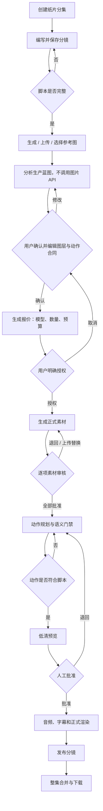

# LocalMiniDrama 纸片动画工作室：业务与用户体验闭环改造方案

> 文档状态：实施完成（Phase 0–4 已完成真实四镜有声交付；Phase 5 已完成任务/调用中心、上下文恢复、统一影响确认、首次示例、可访问性与真实浏览器验收；第 17 节 Go/No-Go 审计通过）
> 日期：2026-07-26
> 最近校准：2026-07-26（按真实用户旅程、业务闭环和当前代码基线复核）
> 适用范围：独立纸片动画模式（Paper Studio）
> 文档视角：产品设计、服务设计、交互设计、业务规则与实施验收
> 前置文档：`docs/technical/2026-07-26-paper-studio-independent-authoring-design.md`
> 核心结论：现有系统已经在同一真实项目中完成“独立创作 + 四镜生产蓝图 + 显式费用授权边界 + 逐素材审核 + 动作证据 + 有声正式发布 + 4/4 交付 + MP4/SRT 合并播放下载”。Phase 5 已把首次清单、零调用示例草稿、返回恢复、跨分镜任务/调用中心、任务控制和影响预览接入产品，并完成真实浏览器、全量回归与 Go/No-Go 审计。

### 文档使用方式

本文不是单纯的 UI 改版稿，而是 Paper Studio 后续开发、设计评审和端到端验收的共同合同：

- 产品评审检查用户是否能完成一部作品，而不是检查页面是否“有按钮”；
- 交互评审检查每一步是否看得懂、可停止、可恢复、有明确下一步；
- 技术评审检查授权、revision、素材、snapshot 和发布结果是否可追溯；
- 测试验收使用第 16、17 节，不以接口成功或单个 Demo 画面代替流程完成。

## 0. 决策摘要

纸片动画工作室不能被定义成“有一排步骤按钮的生产后台”，它应当是一套面向创作者的可控生产服务：

```text
写清故事
  → 确认角色、道具、场景和动作
  → 看懂系统准备生成什么
  → 明确授权并控制图片 API 成本
  → 审核每一张正式素材
  → 验证动作是否真的符合脚本
  → 批准同一版本预览
  → 发布带画面、对白/旁白和可下载文件的成片
```

本次改造的最高优先级不是视觉美化，而是持续关闭以下五个信任断点；其中付费授权、保存门禁和空白校验已经完成核心改造，仍需作为全链路回归门禁保留：

1. 用户没有点击“生成素材”，后台仍可能自动调用图片 API；
2. 用户填写但未保存的内容不会进入生产版本，并且会静默丢失；
3. 空白分镜也能分析、生产并通过模板门禁；
4. 动态门禁验证的是模板发生了变化，而不是用户描述的动作真的发生；
5. 对白、旁白、角色、道具和独立层必须在同一真实四镜整集中形成可追溯的最终交付；本轮已完成该验收，后续以回归门禁持续保持。

P0 安全改造、逐素材审核和四分镜交付闭环已经完成。批量正式生图仍不是默认首要入口，用户必须先看懂蓝图、范围和调用数量并显式授权。

### 0.1 当前实施基线

截至本次复核，Phase 0–4 已完成核心能力接入与真实浏览器四镜交付，Phase 5 体验组件和本地指标数据层也已落地，不应再把以下能力写成“未来建议”：

| 已落地能力 | 用户获得的确定性 | 当前边界 |
|---|---|---|
| 草稿自动保存、dirty 状态、离开保护和本机上下文恢复 | 屏幕上看到的内容不会静默丢失；返回时恢复分集/分镜/Run/Shot/阶段 | 本轮只承诺本机恢复，不承诺跨设备同步 |
| 创建 Run 时校验 revision 和分镜完整性 | 未保存、空白或缺少动作的分镜不能进入生产 | 纯环境镜头必须显式声明 |
| 生成报价、授权、执行三段式门禁 | 确认蓝图不会自动调用图片 API | 任务抽屉已展示授权上限、剩余额度、API 实际版本、接受/失败/采用/未采用数和槽位明细；真实浏览器已验收 |
| Run 暂停、恢复、取消 | 用户可以停止后续任务 | 项目级任务抽屉与统一影响确认已接入；跨页面真实恢复待最终走查 |
| 用户可见事件流 | 后台失败不再只存在日志 | 仍需补事件聚合、筛选和恢复入口 |
| 当前分集 Run 隔离、历史兼容分组 | 独立纸片分集不再与其他 Run 混杂 | 旧工作台只允许显式导入/同步的边界仍需持续验收 |
| 结构化生产蓝图 | 生图前可以检查角色、道具、环境锚点、独立层和生成槽位 | 仍需补参考图约束、身份库绑定和复杂实体关系的可视化编辑 |
| 动作合同与蓝图重编译 | 修改主体、状态、路径和关系后会真实生成新蓝图版本 | 通用动作覆盖和动态证据仍不足，不能以单个回归场景代表完成 |
| 蓝图版本与授权联动 | 修改已确认蓝图会使旧授权失效，避免拿旧报价执行新计划 | 仍需完成恢复旧蓝图版本的明确交互和真实浏览器回归 |
| 参考图候选、上传与构图约束 | 用户可以保留历史候选，并在主体、道具、遮挡和移动范围上约束后续生产，刷新后约束可恢复 | 支撑线、字幕安全区和复杂构图关系仍需补充可视化编辑 |
| 槽位级授权与重新生成 | 只为需要重做的素材调用图片 API，其他已批准版本保持不变 | 仍需真实交互验证授权范围与费用解释是否容易理解 |
| 逐素材审核与版本恢复 | 每张正式素材都可单独批准、退回、上传替换、重新抠图和查看历史；Mask 后保留槽位、缩放和检查背景 | 横竖图极端比例、键盘审核和复杂 Mask 仍需继续回归 |
| 动作语义与证据 | 定向移动、姿态变化、道具跟随/释放拥有语义门禁、证据帧、实测值和局部修订 | 双人交互、复杂遮挡和业务时间线编辑器仍未闭合 |
| 正式视觉渲染 | 批准的 snapshot 可正式渲染并发布到独立纸片分镜；重复触发会复用同一任务；Run 内包含声音门禁 | 真实四镜均已完成正式 H.264 渲染与发布；继续回归局部返工失效行为 |
| 独立音频与字幕 | 对白/旁白可形成不可变版本，支持 TTS、上传、试听、cue、音量、字幕和明确静音；snapshot 固定音频和字幕 hash | 真实四镜声音版本已进入对应正式视频，整集 SRT 时间轴通过文件核验 |
| 分集交付 | 可逐镜校验当前音频是否进入当前发布视频；前端可查看精确阻断、定位修复、发起合并并下载 MP4/SRT | 真实交付看板达到 4/4；24 秒整集和 SRT 已完成播放、下载及 ffprobe 核验 |

核心交付文件和 Phase 5 体验闭环均已通过验收。业务时间线、更多通用动作、复杂键盘审核和高级 Mask 仍可继续增强，但不再是本轮独立纸片动画完整流程的阻断项。

### 0.2 设计师视角的三层闭环

本产品是否可用，不能只看接口和状态机，需要同时闭合三条环：

| 闭环 | 用户问题 | 完成标准 |
|---|---|---|
| 内容闭环 | “我写的故事最后真的变成视频了吗？” | 脚本、实体、素材、动作、声音和正式视频属于同一可追溯版本 |
| 控制闭环 | “系统现在在做什么、会不会花额度、错了怎么办？” | 每次付费调用都先说明再授权；每个失败都能停止、局部修改和继续 |
| 交付闭环 | “四个分镜到底少了什么，成片在哪里？” | 分镜级就绪状态可定位，整集可播放、下载、重做并保留历史版本 |

设计优先级遵循：先建立信任，再提高效率，最后增加高级控制。任何高级参数如果不能帮助用户做出上述三类决策，都不应占据默认界面。

### 0.3 设计方向基线

#### 视觉命题

Paper Studio 是一张深色、安静、媒体优先的数字剪辑台：画面和视频始终是视觉中心，暖金色只标记当前唯一主操作，状态、费用和技术证据退居辅助层。它应当让创作者感到“作品正在被我控制”，而不是“我正在操作一套任务调度后台”。

#### 内容层级

所有工作区使用同一信息顺序：

1. 当前分集、分镜和正在处理的对象；
2. 当前媒体或可见证据；
3. 还差什么、为什么被卡；
4. 唯一主操作及其费用/版本影响；
5. 历史版本、运行日志和技术详情。

如果用户只浏览标题、状态和主按钮，也必须能判断自己在哪里、系统是否正在调用图片 API、下一步做什么。

#### 交互命题

- **阶段推进有反馈**：只在真正从创作、蓝图、素材、动作、预览进入下一阶段时出现一次轻量过渡，并保留返回和修订入口；
- **媒体状态稳定**：轮询只局部更新数字和状态，不闪烁、不替换当前大图、不重置缩放、Mask 点位或视频播放位置；
- **返工影响可预见**：修改素材、动作、音频或脚本前，以差异摘要说明将保留什么、使什么失效、是否需要再次调用图片 API。

这三个命题是后续视觉稿、组件实现和真实浏览器验收的共同基线，不允许为了表现“任务正在运行”而牺牲创作上下文的稳定性。

## 1. 产品定位

### 1.1 产品命题

Paper Studio 是 LocalMiniDrama 内的一种独立创作模式，而不是旧工作台的附属渲染器，也不是围绕某个测试场景定制的功能。

它向用户承诺：

- 可以在纸片模式内直接创建分集和分镜；
- 可以用图片 API 或用户上传素材建立干净背景、角色、道具和遮挡层；
- 可以把自然语言动作变成可审查、可修改、可验证的纸片动作；
- 所有付费生成都有明确授权、数量和结果归属；
- 所有人工门禁都能看见证据、逐项决定并保留历史；
- 最终能得到可播放、可下载、可合并、可继续修改的正式视频。

### 1.2 目标用户

#### 核心用户：独立短剧创作者

- 不熟悉 source family、slot、snapshot、render hash 等技术概念；
- 关注角色是否一致、动作是否正确、画面是否好看、额度是否可控；
- 希望一人完成脚本、画面、审核和发布；
- 需要明确知道当前卡在哪里、下一步做什么、失败后怎么恢复。

#### 进阶用户：导演 / 美术负责人

- 需要控制分镜构图、角色姿态、遮挡、节奏和跨镜连续性；
- 希望在生成前修改系统的拆层和动作理解；
- 希望只重做错误素材，不破坏已批准结果。

#### 审核用户：素材或制片负责人

- 需要知道一次生成预计调用多少张图、使用哪个模型；
- 需要追溯是谁批准了什么素材；
- 需要暂停、取消、恢复生产任务；
- 需要看到最终交付与已批准版本完全一致。

### 1.3 用户核心任务（Jobs to Be Done）

1. 当我写完一个分镜时，我希望系统准确理解主体、道具、场景和动作，而不是生成一个泛化模板。
2. 当我要调用图片 API 时，我希望先知道生成什么、生成几张、使用哪个模型，再决定是否消耗额度。
3. 当某张素材不好时，我希望只修改、上传或重做这一张，而不是推倒整个镜头。
4. 当动作不正确时，我希望看到错误发生在哪个阶段，并能用自然语言或关键点修正。
5. 当我批准预览时，我希望正式视频与我批准的版本完全相同。
6. 当我完成一个分集时，我希望直接得到带声音的分镜视频、整集视频和可追溯生产记录。

## 2. 业务闭环

### 2.1 业务价值链


业务不能只统计“任务是否完成”，还要确保：

- 付费调用有授权；
- 结果与用户输入一致；
- 错误可以局部恢复；
- 已批准资产可以复用；
- 每个正式产物可以追溯到脚本、素材、动作和批准版本；
- 用户能够从成片返回创作区创建新版本，而不是被锁死在已发布状态。

### 2.2 商业目标

| 目标 | 业务意义 | 对应产品能力 |
|---|---|---|
| 提高首个有效预览完成率 | 用户更快感知产品价值 | 脚本校验、生产蓝图、局部生图、快速预览 |
| 降低无效图片 API 消耗 | 控制用户成本并建立信任 | 显式授权、数量预估、生成前确认、暂停取消 |
| 降低素材重做率 | 减少等待时间与额度浪费 | 结构化实体、参考约束、逐槽位审核和替换 |
| 提高动作语义通过率 | 避免“画面动了但故事没发生” | 动作合同、语义断言、可视化修订 |
| 提高分集交付率 | 从 Demo 走向可用产品 | 音频、字幕、正式渲染、整集合并、下载 |
| 增加素材复用率 | 提升多镜头生产效率 | 角色/道具资产库、身份版本、跨镜连续性 |

### 2.3 北极星指标

建议使用：

```text
每周完成“至少 1 个含正式画面、动作、音频并成功发布的纸片分集”的活跃项目数
```

该指标同时要求创作、生成、审核、动作、渲染和交付全部闭环，不能被单纯的任务数量虚高。

### 2.4 服务蓝图

用户看到的操作、系统自动执行和人工门禁必须分层，避免“按钮显示在这一步，但后台已经跑到下一步”的错位：

| 阶段 | 用户前台行为 | 系统后台行为 | 人工门禁 | 业务凭证 |
|---|---|---|---|---|
| 创作 | 写分镜、选择环境镜头、保存 | 校验并生成不可变 revision | 无 | revision id / content hash |
| 蓝图 | 检查实体、图层、动作、生成槽位 | 解析脚本、编译生产蓝图，不生图 | 确认蓝图 | blueprint revision / contract hash |
| 授权 | 查看模型、数量、范围并确认 | 生成报价和限次授权 | 明确授权 | authorization id / quote fingerprint |
| 素材 | 查看进度、暂停、替换、重试 | 图片 API、本地 Matte、质量检查 | 逐项批准 | asset version / review decision |
| 动作 | 调路径、事件、遮挡和状态 | 编译 Motion DSL、生成 proof | 语义门禁 + 人工预览批准 | proof / snapshot approval |
| 交付 | 配声音、字幕、发布和下载 | 音频合成、正式渲染、整集合并 | 发布确认 | render hash / published version |

任何阶段都必须同时回答：当前对象是什么、系统在做什么、是否正在产生费用、是否等待我、完成后去哪里。

## 3. 当前用户旅程与剩余断点

下表以 Phase 0 已完成、Phase 1 主干已落地后的真实基线为准。已经解决的问题不再重复列为未来需求：

| 阶段 | 已有体验 | 用户仍会卡在哪里 | 下一设计动作 |
|---|---|---|---|
| 新建分集 | 可以在独立纸片模式创建分集 | 缺少重命名、归档、删除和首次进入引导 | 补分集管理和第一部作品任务清单 |
| 新建分镜 | 可以独立新增、排序、复制、编辑分镜 | 批量管理和四镜完成度不直观 | 增加分镜就绪状态和批量选择反馈 |
| 保存 | 已有自动保存、dirty 状态和离开保护 | 保存失败后的本地恢复与跨设备恢复仍弱 | 增加恢复草稿、复制内容和重试入口 |
| 参考图 | 可以上传本地参考图、选择历史候选并绘制主体/道具/遮挡/移动约束 | 支撑线、字幕安全区和复杂关系仍不够直观 | 在现有画布补业务化约束工具和键盘操作 |
| 创建 Run | 只冻结已保存 revision，空白/不完整分镜会被阻止 | “生产版本”和“当前草稿”的关系仍需要解释 | 创建前展示冻结范围和版本摘要 |
| 生产蓝图 | 可以编辑实体、独立层、动作主体、状态、路径、关系和生成槽位 | 身份库绑定、参考图约束和复杂关系仍偏表单化 | 增加画布式关系预览与项目素材绑定 |
| 费用授权 | 蓝图确认不会生图；报价、授权、执行已分离 | 费用说明仍偏技术，缺少槽位级范围和消费结果 | 统一生成前/生成中/生成后费用口径 |
| 素材生成 | 可调用用户配置的图片 API，也可完全通过本地上传补齐正式槽位 | 跨槽位任务反馈和实际消费汇总仍偏弱 | 接入全局任务与费用中心 |
| 素材审核 | 已有首屏逐张审核、透明背景检查、Mask 修正、版本历史和局部替换 | 极端尺寸、键盘审核和批量相似问题处理仍需打磨 | 保留逐项门禁，补效率与可访问性 |
| 动作规划 | 已能表达并校验主体移动、姿态、道具跟随/释放、阶段和关键点 | 还不是可直观看懂的业务时间线，双人交互覆盖不足 | 建立业务时间线和扩充通用动作 fixture |
| 动态门禁 | 已展示断言、实测值、起始/过程/结束证据帧和失败项局部修复 | 遮挡关系的画布化编辑和跨主体对比仍不足 | 补关系轨道与复杂遮挡证据 |
| 预览批准 | 有视频预览、退回和批准 | 缺少版本差异、事件跳转点和退回原因结构化 | 建立“看—比—批—退”预览页 |
| 正式发布 | 对白/旁白双轨、TTS/上传、试听、cue、音量、字幕、明确静音和有声发布门禁已在真实四镜逐镜通过 | 仍需持续回归修改声音后旧预览/正式视频的精确失效 | 将版本影响说明纳入统一确认组件和回归门禁 |
| 整集合并 | 同一真实四镜已达到 4/4，就绪后完成内容寻址合并、播放和 MP4/SRT 下载 | 任务中心、返回恢复和当前/历史 Run 已完成真实浏览器最终验收 | 真实交付文件与浏览器状态共同通过 Go/No-Go 审计 |

### 3.1 真实用户路径验收记录（2026-07-26）

本轮不是接口冒烟，而是从空态按真实用户操作完成了一次单镜生产：

```text
新建独立纸片分集
→ 新建分镜并自动保存
→ 上传参考图并绘制约束
→ 创建生产版本（图片调用 0）
→ 分析并确认蓝图
→ 本地上传五张正式素材
→ Mask 修正并逐张批准 5/5
→ 动作规划与 Proof
→ 批准预览
→ 正式渲染并发布视觉视频
```

验收确认：

- 创建生产版本和确认蓝图阶段没有图片 API 调用，也没有生成授权记录；
- 仅通过本地上传即可完成素材门禁，不强迫用户先调用图片 API；
- 刷新不会丢失参考图约束；轮询不会卸载素材工作台；Mask 后不跳回第一张素材；
- 定向移动、人物状态、道具跟随、道具状态和释放时刻均有独立证据；
- 正式渲染曾暴露“编排器自动触发 + 用户按钮再次触发”的重复任务问题，现已增加数据库唯一门禁、后端原子认领和“渲染中”界面状态；
- 该记录只证明单镜视觉链路，不能单独作为完整交付证据；完整四镜证据见下节。

### 3.2 真实四镜有声交付记录（2026-07-26）

同一真实项目已完成四镜生产与交付，不使用接口成功替代文件和播放证据：

```text
Drama 3 · Paper Episode 5 · Run 12 / R03
Storyboards 6 / 9 / 10 / 11
Shots 21 / 22 / 23 / 24
Formal video generations 10 / 11 / 12 / 13
Delivery 4/4 · Merge 8
```

验收结果：

- 四镜分别完成脚本保存、TTS 与字幕、蓝图确认、五个正式素材槽位、逐张审核 5/5、动作门禁、预览批准、H.264 正式渲染和独立发布；
- 本轮没有调用图片 API，20 个正式槽位全部通过正式上传接口复用本地 PNG，证明图片授权不是隐式前置条件；
- 交付看板真实达到 `4/4`，每镜均为“脚本已保存 / 素材与动作已发布 / 音频完整 / 字幕已生成 / 当前有声版本”；
- 整集文件 `backend-node/data/storage/projects/0003_20260725_试试/videos/merged/merged_1785052505911.mp4`；
- 字幕文件 `backend-node/data/storage/projects/0003_20260725_试试/paper-studio/episodes/5/deliveries/0019668a31cfc83c2548b60759a1a991dc954324a256a6ad47964db090da3fed.srt`；
- `delivery_hash = sha256:0019668a31cfc83c2548b60759a1a991dc954324a256a6ad47964db090da3fed`；
- `ffprobe` 确认 24 秒、1920×1080、30 fps、H.264 视频、AAC 48kHz 双声道音轨；
- 单镜和整集播放器均为未静音、`readyState = 4`，播放时间实际推进；MP4 与 SRT 下载入口指向真实文件；
- Run 声音门禁能从缺声音阻断准确返回原分镜声音区，不跳回 Run 首页。

这次走查把优先级明确为：不再扩充场景专用模板，先完成 Phase 5 的首次清单、返回恢复、任务/费用中心、统一影响确认和最终 Go/No-Go 审计；上述工作现已完成。复杂动作编辑器继续作为持续质量能力，不阻断已成立的交付主线。

## 4. 体验设计原则

### 4.1 创作内容优先于生产状态

用户首先管理的是“分集和分镜”，Run 只是不可变生产版本。默认页面不应让历史 Run 抢占主导航。

### 4.2 所见即冻结

创建生产版本前，用户屏幕上看到的脚本、参考图、角色、道具和动作蓝图必须与将要冻结的 revision 完全一致。

### 4.3 付费调用必须显式、可预估、可撤销

任何图片 API 请求必须满足：

```text
用户点击生成
  + 确认 provider / model / 数量 / 作用域
  + 服务端生成授权记录
  + Orchestrator 验证授权
```

“确认计划”“切换步骤”“批量推进”不得隐式授权图片 API。

### 4.4 系统先解释，再执行

在生图前展示生产蓝图：

- 哪些主体；
- 哪些道具；
- 哪些状态；
- 哪些独立层；
- 哪些遮挡关系；
- 哪些动作阶段；
- 预计生成几张图片。

用户可以编辑蓝图，而不是只能接受系统猜测。

### 4.5 人工门禁必须可见证据

批准按钮附近必须同时看见被批准的对象、质量信息和影响范围。不能让用户在素材位于折叠区或屏幕下方时“一键批准全部”。

### 4.6 失败必须可局部恢复

失败消息必须回答三个问题：

1. 哪一步失败；
2. 为什么失败；
3. 用户现在可以做什么。

### 4.7 业务语言优先

默认界面使用“角色、道具、背景、遮挡层、动作阶段、已保存版本”等业务词。family、slot、snapshot、hash、SAFE DSL 放入“技术详情”抽屉。

## 5. 新信息架构

### 5.1 一级结构

```text
纸片动画工作室
├── 创作
│   ├── 纸片分集
│   ├── 分镜脚本
│   ├── 角色 / 道具 / 场景绑定
│   └── 参考图
├── 生产蓝图
│   ├── 图层计划
│   ├── 动作合同
│   ├── 连续性
│   └── 成本预估
├── 素材与审核
│   ├── 待生成
│   ├── 生成中
│   ├── 待审核
│   └── 已批准 / 已退回
├── 动作与预览
│   ├── 动作时间线
│   ├── 动态证据
│   ├── 低清预览
│   └── 批准记录
└── 交付
    ├── 分镜正式视频
    ├── 对白 / 旁白 / 字幕
    ├── 整集合并
    └── 下载 / 版本历史
```

### 5.2 页面布局

保持当前深色电影制作台风格，但重新分配信息权重：

```text
┌─────────────────────────────────────────────────────────────────┐
│ 项目 / 当前分集      保存状态      成本与任务状态       帮助     │
├──────────────┬──────────────────────────────────┬───────────────┤
│ 分集          │ 当前工作对象                       │ 当前任务        │
│ 分镜          │ 脚本 / 蓝图 / 素材 / 动作 / 预览   │ 下一步          │
│              │                                  │ 风险与费用      │
│ 当前分集 Run  │ 媒体与证据占据主视觉                │ 主操作          │
├──────────────┴──────────────────────────────────┴───────────────┤
│ 当前分镜版本 / 生产版本 / 任务事件（可折叠）                      │
└─────────────────────────────────────────────────────────────────┘
```

关键调整：

- 左侧 Run 只显示当前纸片分集的 Run；
- 历史兼容 Run 单独放入“历史导入”分组；
- 同一分集内 Run 使用唯一显示名，例如 `分集 01 · R02`；
- 中间区域优先展示当前需要审核或播放的媒体；
- 右侧一次只提供一个明确主操作；
- 技术信息折叠，不与用户任务竞争注意力。

### 5.3 页面责任矩阵

每个页面只负责一个主要决策，避免当前工作台同时出现创作、生成、审核、动作和发布按钮，让用户无法判断操作顺序。

| 页面 / 工作区 | 用户要做的唯一核心决策 | 主内容 | 主操作 | 成功后去向 |
|---|---|---|---|---|
| 分集与分镜创作 | “这条分镜是否已经写清楚？” | 画面、动作、对白、时长、参考图 | 保存并检查生产蓝图 | 生产蓝图 |
| 生产蓝图 | “系统理解的实体、图层和动作对不对？” | 实体关系、状态、路径、生成槽位 | 确认蓝图并查看费用 | 费用授权 |
| 费用授权 | “我是否同意这次图片调用？” | 模型、槽位、复用数、最大尝试数 | 确认并开始生成 | 素材任务 |
| 素材任务 | “哪些完成了、哪些需要我处理？” | 槽位进度、实际调用、失败原因 | 去审核 / 只重试失败项 | 素材审核 |
| 素材审核 | “这一个素材能否成为正式版本？” | 大图、透明通道、原图对比、质量证据 | 批准此素材 | 下一素材 / 动作 |
| 动作与证据 | “动作是否真的符合脚本？” | 业务时间线、路径、断言、证据帧 | 修正失败项 / 生成预览 | 预览批准 |
| 预览批准 | “这个版本能否进入正式渲染？” | 可播放预览、版本差异、音频状态 | 批准当前预览 | 正式渲染 |
| 交付中心 | “哪条分镜已交付、整集还缺什么？” | 四镜就绪表、播放器、下载和历史 | 发布 / 合并整集 | 下载或新建版本 |

跨页面常驻的只有三类信息：当前分集/分镜、保存与版本状态、任务与费用入口。其他操作跟随当前工作区出现，避免形成第二套导航。

### 5.4 页面跳转与返回规则

- 从创作进入生产时冻结 revision；返回创作不会覆盖当前 Run，只会形成下一版草稿；
- 从任何失败项进入修复页后，“返回”必须回到原槽位、原动作断言或原分镜，不回到 Run 首页；
- 浏览器前进/后退不得触发生成、批准、发布等有副作用操作；
- URL 保留 `episode / storyboard / run / shot / stage`，刷新后能恢复同一工作对象；
- 人工审核页面记住缩放、棋盘背景、当前素材和滚动位置；
- 轮询只更新状态数据，不改变用户当前页面和媒体播放位置。

## 6. 新用户主流程



### 6.1 第一次进入：三分钟内建立正确心智

首次进入不直接展示空白 Run 面板，而是展示“你将完成什么”和唯一主操作：

```text
纸片动画工作室
把一个分镜拆成背景、角色和道具独立层，再编排成可审核的纸片动画。

[新建纸片分集]

也可以：导入旧工作台分镜（复制数据，不建立隐式依赖）
```

新建后使用轻量任务清单，而不是强制教学弹窗：

```text
完成第一条分镜  2/6
✓ 写画面与动作
✓ 已自动保存
○ 检查生产蓝图
○ 授权并生成素材
○ 审核动作预览
○ 发布视频
```

设计要求：

- “新建纸片分集”和“新增分镜”必须出现在内容区，不要求用户先理解 Run；
- 第一次点击专业概念时给就地解释，之后不重复打断；
- 示例内容只能一键复制为草稿，不能偷偷作为正式生产数据；
- 用户不配置图片 API 也可以先写脚本、上传素材和编辑蓝图；
- 入口明确标注“独立纸片动画”，与旧工作台并列，而不是藏在旧工作台子步骤内。

### 6.2 返回用户：十秒内恢复上下文

再次进入默认打开上次正在编辑的纸片分集和分镜，并在顶部提供恢复摘要：

```text
上次停在：分镜 03 · 素材待审核（2/5）
后台任务：已暂停
未完成事项：审核 3 张素材
[继续审核]
```

系统不得因为轮询刷新而改变当前分镜、滚动位置、表单草稿或视频播放位置。若上次对象已删除、归档或失效，应回到分集总览并解释原因。

### 6.3 离开页面后的长任务闭环

图片生成和正式渲染可能持续数分钟，用户不应被要求守在页面：

- 页面内任务中心持续显示生成数、失败数、等待用户数和是否产生图片调用；
- 用户离开再回来时，从服务端事件恢复任务，不以浏览器内存为真相源；
- 任务结束但需要人工审核时，状态是“等待你审核”，不能显示为笼统的“完成”；
- 失败通知直接链接到失败槽位或镜头，不只跳到 Run 总览；
- 暂停只停止后续领取，取消需明确“已产生的调用不会退回、哪些结果会保留”；
- 本地产品暂不承诺系统通知时，页面必须明确写“可离开此页面，返回后进度仍会保留”。

### 6.4 用户认定“完成”的标准

系统内部 `completed` 不等于用户完成作品。只有同时满足以下条件，分镜才显示“已发布”：

1. 当前 revision 的必需素材全部人工批准；
2. 动作合同全部通过 proof；
3. 当前 snapshot 已人工批准；
4. 已填写的对白/旁白均有有效音频，或用户明确选择静音；
5. 正式视频可播放且文件存在；
6. 发布指针指向上述同一 snapshot。

分集只有在所有纳入合并的分镜都已发布且媒体可读时才显示“整集可交付”。

## 7. 各阶段体验方案

### 7.1 阶段 A：分镜创作

#### 页面目标

让用户写出足够生产的脚本，并明确当前是否已保存。

#### 必填规则

- 分镜标题：必填；
- 画面描述：至少包含场景或构图信息；
- 主体动作：至少包含主体和动作变化；
- 时长：1–120 秒；
- 对白/旁白：可选，但填写后必须进入音频交付链；
- 纯环境镜头允许无人物，但必须显式选择“环境镜头”。

#### 保存体验

- 表单顶部持续显示 `已保存`、`正在保存`、`未保存`、`保存失败`；
- 推荐 800ms 防抖自动保存，同时保留手动保存；
- 创建 Run、生成参考图、切换分镜、返回页面前执行保存检查；
- 保存失败时禁止离开，并提供“重试保存”和“复制内容”操作；
- 使用路由离开保护和浏览器 `beforeunload` 兜底。

#### 空白门禁

按钮不只置灰，还要解释原因：

```text
创建生产蓝图（还缺：画面描述、主体动作）
```

服务端必须再次校验，不能只依赖前端。

### 7.2 阶段 B：参考图

参考图入口提供四种方式：

1. 调用图片 API 生成；
2. 上传本地图片；
3. 从当前项目素材中选择；
4. 从历史候选中恢复。

每张参考图包含：

- 来源和生成模型；
- 关联的脚本 revision；
- 生成提示词摘要；
- 创建时间；
- 当前/历史状态；
- “设为当前参考图”操作。

用户设为当前参考图后进入构图约束编辑：

- 主体框；
- 道具框；
- 前景遮挡区；
- 地面或支撑线；
- 可移动区域；
- 字幕安全区。

自动识别可以提供初始结果，但必须允许拖拽调整。

### 7.3 阶段 C：生产蓝图

分析只生成蓝图，不产生任何图片 API 任务。

蓝图包含三个可编辑面板。

#### 实体面板

| 实体 | 类型 | 身份来源 | 是否独立层 | 跨镜复用 |
|---|---|---|---|---|
| 人物 | 角色 | 当前项目角色版本 | 是 | 是 |
| 行李箱 | 道具 | 当前分镜文本/道具库 | 是 | 可选 |
| 旧车站 | 场景 | 场景描述/参考图 | 背景 | 是 |

用户可以：

- 拆分错误合并的实体；
- 合并重复实体；
- 绑定已有角色/道具；
- 标记前景、背景、附着物或手持物；
- 指定是否跨镜保持一致。

#### 图层面板

```text
背景：旧车站干净底板
前景：行李箱（独立道具）
主体：人物 起始 / 行走 / 坐下
关系：人物在起始阶段手持行李箱
关系：行李箱在坐下阶段落于长椅旁
遮挡：长椅前缘遮挡人物腿部
```

#### 动作合同面板

动作不能只记录 `subject_settle`，必须结构化为：

```json
{
  "actor": "character_1",
  "verb": "carry_walk_sit",
  "object": "prop_luggage",
  "start_state": "standing_left_holding_luggage",
  "waypoints": ["left_stage", "bench_front"],
  "contact_events": ["grip_luggage", "reach_bench", "sit_on_bench", "place_luggage"],
  "end_state": "seated_bench_luggage_beside",
  "occlusion_events": ["legs_behind_bench_front"],
  "camera_intent": "wide_static"
}
```

用户确认的是这个业务合同，而不是 family/slot 技术 JSON。

### 7.4 阶段 D：生成授权

点击“准备生成素材”后展示报价抽屉：

```text
本次将生成 5 张正式素材

模型：OpenAI · gpt-image-2
范围：当前分镜
必需素材：4 张
可选素材：1 张
最大自动重试：每槽位 2 次
复用已有素材：0 张

[返回修改蓝图] [确认并开始生成]
```

#### 授权规则

- 授权只覆盖明确列出的 Run、Shot、Slot 和尝试次数；
- 授权记录包含 provider、model、预计数量、预算上限和到期时间；
- 改变蓝图、模型或 Slot 后，旧授权立即失效；
- 批量授权必须逐分镜列出数量；
- 本地 Matte、注册、Proof 和渲染不属于图片 API 授权；
- 恢复后台任务不得绕过授权。

### 7.5 阶段 E：素材生成与审核

#### 生成中

每个槽位独立显示：

- 排队中；
- 正在生成；
- 正在下载；
- 正在抠图；
- 待审核；
- 失败，可重试；
- 已取消。

全局提供：

- 暂停后续生成；
- 取消未开始任务；
- 仅重试失败槽位；
- 返回蓝图创建新版本。

#### 素材审核工作台

审核页面默认把素材图置于首屏主区域，右侧才显示决策：

```text
┌──────────────────────────┬──────────────────┐
│ 可缩放素材预览             │ 槽位：人物·行走    │
│ 透明棋盘 / 深浅背景切换     │ 身份一致性          │
│ 边缘放大 / 原图对比         │ Alpha 质量          │
│                          │ 构图与姿势          │
│                          │ [退回] [上传替换]   │
│                          │ [批准此素材]         │
└──────────────────────────┴──────────────────┘
```

规则：

- 每张素材单独批准；
- “批准全部”默认不展示，只有所有槽位均已逐项查看后才出现；
- 按钮必须写成“批准此素材”或“批准 5 张已查看素材”；
- 环境、透明主体、Mask 使用不同审核清单；
- 上传替换必须重新执行 hash、尺寸、Alpha 和注册检查；
- 人工批准人、时间、理由进入审计记录。

#### 抠图恢复

提供三层能力：

1. 一键重新 Matte；
2. 前景点 / 背景点辅助修正；
3. 简单 Mask 笔刷：添加、擦除、羽化、撤销。

用户也可以直接上传透明 PNG，不能被迫重复调用图片 API。

### 7.6 阶段 F：动作和动态门禁

#### 动作编辑器

默认使用业务时间线：

```text
0.0s  起身持箱
0.8s  开始向右行走
3.8s  到达长椅
4.5s  坐下
5.2s  行李箱放到身侧
6.0s  保持结束姿态
```

用户可以：

- 拖动事件时间；
- 调整起点、终点和路径；
- 更换状态素材；
- 调整动作强度；
- 调整前后遮挡时刻；
- 使用自然语言修改。

自然语言修改后必须先展示变化摘要：

```text
主体横向位移：42% → 58%
到达长椅：3.8s → 3.2s
坐下动作：提前 0.6s
```

#### 语义门禁

门禁必须从动作合同生成断言，而不是只检查任意位移：

| 用户动作 | 必须验证 |
|---|---|
| 从左走到右 | X 位移达到构图宽度阈值并经过指定 waypoint |
| 提起行李箱 | 人物与行李箱建立手持关系，箱体跟随手部 |
| 坐到长椅 | 结束状态为 seated，骨架高度/姿态发生变化 |
| 放下行李箱 | 行李箱从附着关系切换为独立支撑关系 |
| 腿被长椅遮挡 | 最终帧存在指定前景遮挡关系 |

门禁结果展示：

- 原动作目标；
- 实际测量值；
- 通过/失败；
- 证据帧；
- 推荐修改；
- “只修这一项”操作。

禁止用“状态数量达到 3”替代对真实动作语义的验证。

### 7.7 阶段 G：预览批准

预览页包含：

- 可播放视频；
- 六个关键事件跳转点；
- 动作合同通过情况；
- 素材版本摘要；
- 音频/字幕状态；
- 当前 snapshot 版本；
- 与上一预览的差异摘要。

主操作：

```text
[退回动作] [退回素材] [批准当前预览]
```

批准必须绑定当前 snapshot、proof 和素材版本。任何素材或动作修改都会使批准失效。

### 7.8 阶段 H：音频、正式渲染和交付

独立纸片分镜的对白和旁白必须拥有自己的音频版本，不得依赖旧 storyboard 字段。

#### 音频工作流

- 对白角色绑定声音；
- 旁白选择声音；
- 生成或上传音频；
- 波形与 cue 对齐；
- 字幕自动分句并可编辑；
- 可选 BGM 和 SFX；
- 分镜级音量预览；
- 正式渲染前执行缺失音频检查。

#### 交付中心

每个分镜展示：

- 正式视频播放器；
- 下载 MP4；
- 下载字幕；
- 查看生产报告；
- 创建新版本；
- 显式同步旧工作台。

分集展示：

- 已发布分镜数；
- 缺失项；
- 整集合并版本；
- 总时长；
- 音频完整性；
- 下载整集；
- 历史合并版本。

#### 四分镜交付看板

用户最关心的不是“合并接口是否存在”，而是四个分镜中哪个还没真正成为视频。交付中心使用一行一个分镜的就绪表：

| 分镜 | 画面素材 | 动作 | 音频/字幕 | 正式视频 | 纳入整集 | 主操作 |
|---|---|---|---|---|---|---|
| 01 开场 | 已批准 | 已通过 | 完整 | 已发布 | 是 | 播放 |
| 02 相遇 | 已批准 | 1 项失败 | 完整 | 未生成 | 是 | 修复动作 |
| 03 对话 | 已批准 | 已通过 | 缺旁白 | 未生成 | 是 | 补旁白 |
| 04 结尾 | 已批准 | 已通过 | 明确静音 | 已发布 | 是 | 播放 |

合并按钮置灰时，按钮旁直接显示“还差：分镜 02 动作、分镜 03 旁白”，并提供可点击定位。不能只显示“素材不完整”或技术错误码。

### 7.9 全局任务与费用中心

工作台顶部提供常驻但不抢占主画面的任务入口：

```text
任务 3   等待你 1   本次图片调用 4/5
```

展开后按“等待我处理 / 系统处理中 / 已失败 / 已完成”分组，每项展示：

- 分集、分镜和素材槽位；
- 当前阶段和已用时间；
- 图片 API 调用是否已经发生；
- 已完成数 / 总数；
- 暂停、取消、重试或去审核；
- 最近一次可读事件。

费用闭环分成三段：

1. **生成前**：预计模型、图片数、最大尝试数、复用数；若 provider 无法提供精确货币价格，明确写“调用次数预估，不代表最终金额”；
2. **生成中**：实际成功、失败、取消和剩余调用上限，不用不真实的百分比；
3. **生成后**：每个槽位实际调用次数、采用的素材版本和未使用候选，允许导出生产报告。

### 7.10 局部返工与影响预览

任何“修改”操作都应先说明会使哪些结果失效：

| 用户修改 | 保留 | 失效 | 是否需重新授权图片调用 |
|---|---|---|---|
| 修改字幕断句 | 已批准画面和动作 | 字幕与正式 render | 否 |
| 调整动作时刻 | 已批准素材 | proof、preview、render | 否 |
| 替换一个角色状态图 | 其他素材 | 该镜头 proof、preview、render | 仅上传替换时否；重新生图时是 |
| 修改图层蓝图 | 历史蓝图和历史视频 | 当前授权及其下游结果 | 视新增/变更槽位而定 |
| 修改脚本文字 | 历史 Run 和已发布视频 | 当前草稿对应的新生产版本 | 创建新 Run 后重新报价 |

影响说明要在确认前出现，主操作使用具体文案，例如“保存并使当前预览失效”，不能只写“确定”。

### 7.11 空态、等待态、失败态、完成态

每个主工作区都必须提供四类完整状态，而不是只有有数据时才可用：

| 状态 | 必须包含 | 禁止 |
|---|---|---|
| 空态 | 这是什么、为什么需要、第一步操作、可选示例 | 空白卡片或只有“暂无数据” |
| 等待态 | 正在做什么、是否产生费用、可否离开、暂停/取消 | 整页闪烁、伪造精确进度 |
| 失败态 | 失败对象、通俗原因、已保留结果、恢复动作 | 只显示错误码或“重试全部” |
| 完成态 | 可播放/查看的结果、版本、下一步 | 只有绿色“成功”而没有产物入口 |

状态切换应通过局部 patch 完成。轮询不能卸载并重建播放器、编辑器或素材画布。

## 8. 状态与文案体系

### 8.1 状态必须区分“系统在做”和“等待用户”

新增两个面向 UI 的聚合字段：

```text
activity_state:
  idle | processing | paused | failed | completed

attention_required:
  none | save_draft | review_blueprint | authorize_generation |
  review_assets | revise_motion | approve_preview | complete_audio
```

### 8.2 推荐文案

| 当前技术状态 | 用户文案 | 主操作 |
|---|---|---|
| draft | 分镜草稿 | 完善分镜 |
| analyzed | 生产蓝图待确认 | 检查图层和动作 |
| plan_confirmed 未授权 | 等待生成授权 | 查看预计费用 |
| asset_pending | 正在生成正式素材 | 暂停 / 查看进度 |
| asset_review | 素材待你审核 | 审核第 1/5 张 |
| asset_ready | 素材已就绪 | 检查动作计划 |
| motion_failed | 动作不符合脚本 | 查看 2 项失败 |
| proof_ready | 动态验证通过 | 生成低清预览 |
| preview_ready | 预览待你批准 | 播放并批准 |
| rendered | 正式视频待发布 | 发布到当前分镜 |
| published | 已发布 | 播放 / 下载 / 新建版本 |

### 8.3 技术详情降级

以下信息默认折叠：

- source hash；
- render hash；
- family / slot id；
- provider signature；
- proof JSON；
- SAFE DSL；
- Schema 版本。

它们仍保留在“生产详情”抽屉和导出报告中。

## 9. 错误恢复矩阵

| 错误 | 用户看到什么 | 可执行恢复 |
|---|---|---|
| 草稿保存失败 | 对应字段和顶部保存状态报错 | 重试、复制文本、保留本地草稿 |
| Provider 不可用 | 模型名称和服务错误 | 更换 provider、稍后重试 |
| 额度不足 | 已生成数、未生成数、剩余槽位 | 更换模型、减少范围、恢复未完成任务 |
| 单素材生成失败 | 失败槽位和原因 | 只重试该槽位、上传替换 |
| Alpha 失败 | 边缘证据和透明度指标 | 重新 Matte、手工修正、上传 PNG |
| 身份不一致 | 当前素材与身份参考对比 | 换候选、重新生成、更新身份版本 |
| 动作门禁失败 | 失败动作、实测值和证据帧 | 调整路径、状态、时刻或遮挡 |
| 预览退回 | 保留退回理由和版本 | 从素材或动作阶段创建修订 |
| 正式渲染失败 | 已批准 snapshot 仍保留 | 原 snapshot 重试，不要求重新批准 |
| 整集合并失败 | 失败片段和媒体校验 | 只修复缺失片段后重新合并 |

后台失败必须写入用户可见的事件流，不能只留在日志或 `last_error_json`。

## 10. 关键业务规则

### BR-001：图片 API 明确授权

- `analyze`、`confirm-plan`、轮询和启动恢复绝不能调用图片 API；
- 只有 `/generation-authorizations/:id/execute` 或等价显式接口能把图片步骤从 `blocked` 改为 `queued`；
- 授权必须绑定 Run、Shot、Slot、provider、model、预算和次数；
- Orchestrator 每次 claim 图片步骤时再次验证授权；
- 未授权、过期、内容变更或用户暂停时不得领取。

### BR-002：未保存内容不得冻结

- 创建 Run 前先保存并返回 revision id；
- 请求必须携带客户端当前 revision id；
- 服务端发现 revision 不一致时返回 `PAPER_STUDIO_DRAFT_NOT_SAVED`；
- 用户取消保存时不能创建 Run。

### BR-003：蓝图和生产分离

- 分析产生蓝图；
- 确认蓝图只冻结实体、图层和动作合同；
- 生成授权单独发生；
- 蓝图变更使授权失效，但不删除历史蓝图。

### BR-004：逐项人工审核

- 素材版本的机器质量通过不等于人工批准；
- `accepted_by_machine` 与 `approved_by_human` 分开；
- 后续动作阶段只读取人工批准版本；
- 每次替换素材都必须重新批准。

### BR-005：暂停、取消和恢复

- 暂停：停止领取新任务，保留已完成结果；
- 取消：取消未开始任务，运行中的远程任务完成后不得写入当前版本；
- 恢复：只恢复未完成且仍有有效授权的步骤；
- 删除：仅允许没有正式发布依赖的 Run；其他 Run 归档。

### BR-006：动作语义真实性

- 动作合同必须由用户确认；
- Proof 断言必须由动作合同生成；
- 不允许用任意位移、旋转或状态计数替代动作语义；
- Gate 通过不代表审美通过，仍需人工预览批准。

### BR-007：独立音频归属

- 纸片对白、旁白、字幕和音频版本归属 `paper_storyboard_revision`；
- 修改文本使对应音频标记为过期；
- 正式 snapshot 固定音频 hash；
- 整集合并前检查音频轨道完整性。

### BR-008：版本与历史

- 当前分集只展示自己的独立 Run；
- 历史兼容 Run 单独分组；
- 已发布 Run 可播放、下载和复制为新版本，但不可原地重写；
- 修改当前分镜不破坏历史视频。

## 11. 数据与 API 改造建议

### 11.1 新增数据对象

#### `paper_generation_authorizations`

```text
id
run_id
shot_scope_json
slot_scope_json
provider_config_id
model
estimated_image_count
max_attempts
budget_limit_json
status: prepared | authorized | executing | consumed | expired | cancelled
authorized_at
expires_at
request_id
created_at
updated_at
```

#### `paper_storyboard_entities`

```text
id
paper_storyboard_id
entity_key
entity_type: character | prop | environment | effect | occluder
display_name
identity_version_id
source_library_type
source_library_id
attributes_json
version
```

#### `paper_action_contracts`

```text
id
paper_storyboard_revision_id
contract_json
contract_hash
status: draft | confirmed | superseded
confirmed_at
```

#### `paper_asset_review_decisions`

```text
id
asset_version_id
decision: approved | rejected | replaced
reason
reviewer
created_at
```

#### `paper_storyboard_audio_versions`

```text
id
paper_storyboard_revision_id
track_kind: dialogue | narration | bgm | sfx
text_hash
voice_config_json
local_path
artifact_hash
status
created_at
```

### 11.2 现有表扩展

`paper_job_steps`：

- `authorization_id`；
- `blocked_reason`；
- `user_visible_status`；
- `cancel_requested_at`。

`paper_studio_runs`：

- `paused_at`；
- `attention_required`；
- `active_authorization_id`。

`paper_studio_shots`：

- `blueprint_revision_id`；
- `action_contract_id`；
- `attention_required`。

### 11.3 API 分层

```text
创作
PUT  /paper-studio/storyboards/:id/draft
POST /paper-studio/storyboards/:id/save
POST /paper-studio/storyboards/:id/reference/upload
POST /paper-studio/storyboards/:id/reference/select

蓝图
POST /paper-studio/storyboards/:id/blueprint/analyze
PUT  /paper-studio/blueprints/:id
POST /paper-studio/blueprints/:id/confirm

生成授权
POST /paper-studio/runs/:id/generation-quote
POST /paper-studio/runs/:id/generation-authorizations
POST /paper-studio/generation-authorizations/:id/execute
POST /paper-studio/generation-authorizations/:id/cancel

任务控制
POST /paper-studio/runs/:id/pause
POST /paper-studio/runs/:id/resume
POST /paper-studio/runs/:id/cancel

素材审核
POST /paper-studio/assets/:versionId/approve
POST /paper-studio/assets/:versionId/reject
POST /paper-studio/assets/:slotId/upload-replacement
POST /paper-studio/assets/:versionId/mask-patch

动作与交付
PUT  /paper-studio/shots/:id/action-contract
POST /paper-studio/shots/:id/proof
POST /paper-studio/shots/:id/preview/approve
POST /paper-studio/storyboards/:id/audio/generate
POST /paper-studio/storyboards/:id/audio/upload
```

### 11.4 Orchestrator 改造

图片任务初始状态改为：

```text
blocked_user_authorization
```

只有授权执行接口可以原子地完成：

```text
验证 revision 未变化
→ 验证授权未过期
→ 写入 authorization_id
→ blocked_user_authorization 改为 queued
```

本地 Matte、注册、动作、Proof、Preview、正式渲染仍由依赖关系自动推进，但必须在两个人工门禁停止：

1. 素材逐项批准；
2. 预览批准。

## 12. 前端状态架构

### 12.1 草稿状态提升到 Pinia

当前编辑表单的 dirty 状态不应只存在于子组件。建议增加：

```text
draftByStoryboardId
draftValidationByStoryboardId
saveStateByStoryboardId
lastSavedRevisionByStoryboardId
```

所有页面切换和生产操作通过统一 `ensureDraftSaved()`。

### 12.2 轮询与媒体稳定性

- 轮询结果只 patch 变化字段；
- 不替换当前表单草稿；
- 不重建正在播放的视频元素；
- 后台失败转换成用户事件，而不是只有 console/log；
- 页面隐藏时降低轮询频率；
- 使用 `attention_required` 决定是否需要继续轮询。

### 12.3 表单与可访问性

- 输入项使用显式 `for/id` 关联；
- 校验在 blur 和保存时执行；
- 错误放在对应字段下方；
- 错误区域使用 `role="alert"` / `aria-live`；
- 键盘用户可以完成保存、审核、播放和批准；
- 不能仅用颜色表达状态。

## 13. 视觉与交互系统

### 13.0 设计系统取舍

纸片动画属于娱乐与创意产品，但 Paper Studio 本身是高密度生产工具。视觉上可以保留“电影、纸张、舞台”的气质，交互上必须选择稳定的专业工作台模式：

- 采用媒体优先和渐进披露，拒绝以装饰卡片堆满页面；
- 主操作使用暖金品牌色，红色只表示危险、失败或不可逆取消；
- 不采用大面积视差、循环入场和动画驱动导航，以免干扰视频与动作判断；
- 标题可有纸张/剧场气质，正文和表单继续使用系统无衬线字体，避免引入外部字体网络依赖；
- 图标统一使用同一套 SVG 图标，不使用 emoji 充当功能图标；
- 颜色不是唯一状态信号，必须同时提供图标、文本和必要的数字。

界面注意力按以下顺序分配：

```text
当前要审核/编辑的媒体
  > 唯一主操作
  > 当前状态与阻断原因
  > 费用和版本影响
  > 历史与技术详情
```

### 13.1 视觉方向

保留“深色电影制作台 + 暖金纸张强调”的品牌特征，采用媒体优先、低干扰、专业但可读的创作工具风格。

推荐基础：

| 角色 | 建议 |
|---|---|
| 主背景 | 接近 `#151614`，避免纯黑大面积压迫 |
| 面板 | `#1E201D` / `#242620` 两级 |
| 主文字 | 不低于 `#ECE7DC` |
| 次文字 | 提升到满足 4.5:1 对比度 |
| 主操作 | 暖金，不用红色表示普通推进 |
| 危险 / 取消 | 克制红色，仅用于不可逆操作 |
| 等待用户 | 琥珀色 + 明确图标和文案 |
| 系统处理中 | 蓝灰色 + 进度，不使用整页闪烁遮罩 |
| 完成 | 低饱和绿色 + 文本状态 |

字体继续使用系统无衬线正文，标题可以保留宋体/衬线风格。正文、按钮和状态不应小于桌面端 12px；移动端正文不小于 16px。

建议把色彩定义成语义 token，而不是在组件中写死：

```text
surface.canvas / surface.panel / surface.raised
text.primary / text.secondary / text.muted
action.primary / action.secondary / action.danger
status.processing / status.attention / status.success / status.failed
border.default / border.focus / overlay.scrim
```

正文与背景对比度至少 4.5:1，大字号至少 3:1；暖金按钮需要分别校验默认、hover、disabled 和 focus 状态，不能因为品牌色偏浅而使用低对比白字。

### 13.1.1 组件层级

为避免每个阶段重新发明交互，统一以下核心组件：

| 组件 | 职责 | 关键约束 |
|---|---|---|
| `StageHeader` | 当前阶段、对象、保存/版本状态 | 不承载第二套导航 |
| `AttentionCard` | 说明为什么在等用户和下一步 | 同屏只允许一个主 AttentionCard |
| `MediaInspector` | 图像/视频/透明通道/证据帧检查 | 保持缩放、播放和对比状态稳定 |
| `TaskProgress` | 长任务阶段、已完成数和控制 | 不伪造精确剩余时间 |
| `ImpactDialog` | 修改/取消前展示影响范围 | 具体动作词替代“确定” |
| `VersionBadge` | 草稿、revision、snapshot、发布版本 | 默认显示业务名称，hash 折叠 |
| `RecoveryPanel` | 失败原因、保留结果和恢复操作 | 首选局部重试，不默认重做全部 |

按钮层级固定为：一个主按钮、最多两个次按钮、危险操作进入更多菜单或独立危险区。暂停可以直接可见，取消必须二次确认。

### 13.2 动效

- 微交互 150–300ms；
- 轮询更新不播放入场动画；
- 只在阶段真正切换时展示一次过渡；
- 支持 `prefers-reduced-motion`；
- 视频默认点击播放，不自动播放高码率正式视频；
- 加载使用局部 skeleton，不使用整页模糊遮罩反复覆盖。

### 13.3 响应式策略

Paper Studio 是桌面创作工具，主要编辑断点为 1024px 以上：

- ≥1440：三栏完整模式；
- 1024–1439：右侧检查器可折叠；
- 768–1023：左侧抽屉 + 单主工作区，支持审核和播放；
- <768：以查看、审核、暂停任务为主，不承诺复杂 Mask/时间线编辑。

测试宽度：375、768、1024、1280、1440。

### 13.4 键盘、焦点与媒体可访问性

- 所有图标按钮有可读名称和 tooltip；
- 弹窗打开后焦点进入，关闭后回到触发按钮；
- 异步错误使用 `aria-live` 或 `role="alert"`，成功提示不打断连续输入；
- 素材审核支持上一张/下一张，但批准快捷键必须避免误触并提供撤销窗口；
- 视频关键事件既能点击也能通过键盘跳转，并显示当前时间；
- Mask 编辑器不是完成流程的唯一入口，始终允许上传透明 PNG；
- `prefers-reduced-motion` 下禁用阶段转场和骨架闪动，但保留必要的进度文本；
- 375px 移动端可以查看任务、审核简单素材、暂停和取消，但明确提示复杂 Mask/时间线请在桌面完成。

## 14. 产品指标与埋点

### 14.1 漏斗指标

```text
创建分集
→ 创建有效分镜
→ 保存完整脚本
→ 确认生产蓝图
→ 授权素材生成
→ 素材全部批准
→ 动作语义门禁通过
→ 预览批准
→ 正式发布
→ 整集合并
```

每一步记录人数、镜头数、转化率和中位耗时。

### 14.2 成本指标

- 每个已发布分镜平均图片 API 调用数；
- 未授权调用数，目标必须为 0；
- 用户取消后仍写入当前版本的调用数，目标为 0；
- 单槽位重试率；
- 被退回但未查看的素材批准数，目标为 0；
- 复用素材占比。

### 14.3 质量指标

- 动作合同一次确认率；
- 动作语义门禁通过率；
- 预览退回原因分布；
- 身份一致性退回率；
- Alpha 退回率；
- 发布后创建修订版的比例；
- 音频缺失导致的发布阻断数。

### 14.4 体验指标

- 首个有效预览耗时；
- 用户在每个人工门禁停留时间；
- 失败后恢复成功率；
- 因未保存内容造成的 Run 失效率，目标为 0；
- 客服/反馈中“系统没按脚本做”的占比。

## 15. 实施路线图

### 15.0 按用户价值切片

开发顺序不能按“后端表—接口—前端按钮”横向铺开，而要按用户能够完成的最小任务纵向交付：

| 交付切片 | 用户得到的能力 | 包含范围 | 不包含 |
|---|---|---|---|
| S0 安全生产 | 不会误花额度、不会冻错草稿、可以停止 | 自动保存、revision 校验、报价授权、暂停取消 | 素材精修 |
| S1 看懂计划 | 生图前能修正系统理解 | 实体、图层、动作合同、槽位、重编译 | 复杂时间线 |
| S2 管好素材 | 能围绕每一张图生成、审核、修复和替换 | 上传、候选、槽位任务、透明通道、逐项批准 | 完整动作编辑 |
| S3 做对动作 | 能证明故事动作真的发生 | 时间线、语义断言、证据帧、局部修订 | 高级剪辑器 |
| S4 交付成片 | 能获得有声分镜和整集 | 音频、字幕、正式渲染、交付看板、下载 | 多人云协作 |
| S5 提升效率 | 新用户更快完成、老用户更少返工 | 引导、任务中心、复用、埋点、可访问性 | 与核心闭环无关的装饰功能 |

每个切片必须有真实用户可见的开始入口、结果、失败恢复和验收脚本。只完成其中一层接口，不算该切片完成。

### Phase 0：付费安全与数据正确性（P0，已完成）

目标：先让系统不误消费、不冻错版本、可及时停止。

实施：

- 图片任务增加用户授权门禁；
- `confirm-plan` 不再触发生图；
- 草稿 dirty 状态提升、自动保存和离开保护；
- 创建 Run 校验 revision 与必填字段；
- 空白分镜服务端拒绝分析；
- 页面接入 Run 暂停、取消；
- 当前分集过滤 Run，历史兼容 Run 独立分组；
- 后台错误进入用户事件流。

验收：

- 不点击“确认并开始生成”，图片 API 调用数始终为 0；
- 未保存草稿不能创建 Run；
- 空白分镜不能分析；
- 取消后不再领取新图片任务；
- 当前分集不显示其他分集 Run。

当前验证基线：后端 Paper Studio 专项、前端测试、production build 和 Phase 0 安全用例均已通过；后续阶段修改授权或状态机时，必须把这些用例作为回归门禁保留。

### Phase 1：生产蓝图与结构化实体（P0/P1，核心链路与真实单镜验收已完成）

目标：让用户在付费前看懂并修正系统理解。

已落地：

- 角色、道具、环境锚点和效果实体模型；
- 纸片专用结构化蓝图和 revision；
- 实体新增、移除、拆分、合并及独立层设置；
- 图层/动作关系、主体、道具、支撑物、起止状态和 waypoint 编辑；
- 保存后真实重建 family、slot、composition node 和 motion plan；
- 蓝图修改使旧图片授权失效；
- 确认蓝图后再进入独立费用授权。

后续增强项：

- 扩充真实浏览器中的“修改—重编译—确认—进入费用授权”异常回归；
- 验证已落地参考图构图框，并补注册信息、项目角色/道具身份绑定；
- 明确恢复到历史同内容蓝图时的 revision 语义；
- 用无道具移动、双人交互、前景穿越和纯环境镜头验证泛化；
- 把新增表、Schema 和运行依赖纳入 Doctor 与全量回归。

验收：

- “人物提行李箱走到长椅坐下”至少拆出人物、行李箱、长椅/背景；
- 用户可修正实体类型和层级；
- 生图前可查看每个槽位及生成原因；
- 蓝图变更使旧授权失效；
- 上述四类通用回归不依赖场景名称或硬编码模板也能成立。

### Phase 2：素材生成与审核闭环（P1，核心链路与真实单镜验收已完成）

目标：每张正式素材都能被看见、修正、替换和追溯。

已落地：

- 上传参考图和历史候选；
- 槽位级生成、暂停、取消、重试；
- 素材首屏审核工作台；
- 逐项批准记录；
- 上传透明 PNG；
- 点选式 Matte 和简单 Mask 笔刷；
- 身份、Alpha、构图审核清单。

后续增强项：

- 继续覆盖更多横图、竖图及极端缩放状态下的约束框和 Mask 点击坐标；
- 补键盘审核、批量相似问题提示和更复杂 Mask 工具；
- 验证单槽位重新生成只消耗该槽位授权，其他当前版本保持不变；
- 检查 Doctor、新表、Schema、接口错误和前端控制台异常。

验收：

- 未查看素材不能批量批准；
- 单槽位退回不会覆盖其他已批准素材；
- 用户能通过上传 PNG 完成恢复；
- 重新 Matte 不调用图片 API。

### Phase 3：动作语义与动态证据（P0/P1，核心语义、证据和局部修订已落地）

目标：门禁验证故事动作，而不是验证“发生了任意变化”。

已落地：

- 动作合同到 Motion DSL 编译；
- waypoint、接触、附着、状态和遮挡断言；
- 自然语言修订差异摘要；
- 证据帧、实测值和修复建议界面；
- Gate 测试 fixture 从单一场景扩展到通用动作集。

待补：

- 业务时间线编辑器；
- 双人交互、复杂前后景穿越和多道具动作；
- 关系轨道与遮挡区域的直接画布编辑；
- 失败证据点击后定位到对应关键点或关系。

验收：

- 左到右移动不足阈值必须失败；
- 手持道具未跟随必须失败；
- “坐下”未产生结束姿态变化必须失败；
- camera-only 无法冒充主体动作；
- 用户能只修复一个失败断言。

### Phase 4：音频、发布与交付（P1，已完成真实四镜验收）

目标：用户从纸片模式内得到完整成片，而不是静音视觉片段。

后端已落地：

- 对白、旁白独立不可变音频版本；
- TTS、本地音频上传、音量、起始 cue、字幕开关和字幕文本；
- 文本/音频/字幕 hash 以及文本或时长变化后的精确失效；
- 明确静音策略，未补齐声音或未声明静音时阻止正式生产；
- snapshot 固定音频版本、音频 hash 和字幕 hash；
- Remotion 预览和正式视频渲染音轨并烧录字幕；
- 逐镜交付校验、当前音频版本嵌入校验、整集 SRT；
- 基于 `delivery_hash` 的幂等整集合并和历史合并版本。

前端已落地：

- `PaperAudioWorkbench`：对白/旁白双轨、TTS、上传、试听、音量、cue、字幕编辑和明确静音；
- `PaperDeliveryBoard`：逐镜脚本、素材/动作、音频/字幕、正式视频和纳入整集状态；
- 阻断项点击后回到准确分镜与阶段，并保留原上下文；
- 整集播放器、MP4/SRT 下载、历史版本和创建新版本；
- 轮询只局部更新音频与交付状态，不重置播放器、波形或编辑草稿；
- 创建、删除、排序、导入、打开 Run、发布和合并后的 audio/delivery 状态同步。

浏览器已走查：

- 声音工作台可完成对白/旁白轨道设置，空声音会被明确阻断；
- “缺声音”与“明确静音”使用不同状态和字幕文案，不再自动把空声音当静音；
- 交付阻断项可返回准确分镜与声音区，`stage=delivery` 刷新后仍恢复交付看板；
- 轮询更新不会以整页刷新替换当前工作区；
- 同一真实四镜项目已完成 4/4 有声发布、整集合并、播放和 MP4/SRT 下载验收；
- 文件级 `ffprobe`、整集音轨、SRT 时间轴和浏览器实际播放推进均已核验。

验收：

- 填写对白/旁白后能够生成或上传对应音频；
- 修改文本会使旧音频过期；
- 正式 snapshot 固定音频 hash；
- 用户可明确选择静音，系统不得把“缺声音”自动当成静音；
- 修改 cue、字幕或音量前可看到会使哪些预览/正式视频失效；
- 四镜看板能逐项定位脚本、动作、声音、字幕或正式视频阻断；
- 发布视频必须包含当前音频版本，旧发布视频不得冒充当前交付；
- 整集视频与 SRT 可播放、可下载且顺序、时长、音画完整；
- 相同交付内容重复合并复用同一结果，内容变化后生成新历史版本。

### Phase 5：体验打磨与商业化指标（P2，已完成）

目标：降低学习成本并支持持续优化。

实施：

- 状态文案和技术详情降级；
- 局部 loading 与稳定轮询；
- 响应式和键盘可访问性；
- 新用户引导；
- 漏斗、成本、质量和恢复埋点；
- 空状态、异常状态和历史数据体验统一。

补充实施：

- 首次进入任务清单与示例草稿；
- 返回用户上下文恢复；
- 跨页面任务与费用中心；
- 修改影响预览和统一恢复组件；
- 设计 token、焦点管理和 reduced-motion。

当前已落地：

- 项目级任务中心以独立纸片分镜为根，覆盖未进入 Run 的草稿和最新生产版本，区分“等待你 / 处理中 / 失败 / 完成”；
- 最新生产版本按不可逆 `run_number/id` 选择，打开、恢复或更新旧 Run 不会覆盖更新的正式版本；
- 草稿任务直接定位到纸片分集/分镜创作区，不再错误调用 `openRun(null)`；
- 每条任务显示下一步、素材槽位进度、当前阻断槽位、图片调用、最近事件、更新时间和可用的暂停/恢复/取消入口；
- 图片调用账本区分授权上限、剩余授权、已执行授权预计张数、`image_api` 实际返回、接受、失败、采用、未采用版本和槽位级明细；
- 本地产品事件表和安全事件接口，只允许白名单标量上下文，不记录 prompt、凭据或媒体内容；
- 顶部“任务 / 等待你 / 图片调用”入口和右侧任务抽屉；
- 首次制作清单，以及用户主动触发的“四镜通用示例草稿”；示例使用事务原子创建，只写草稿，不建 Run、授权或图片任务，外部调用固定为 0；
- 分集、分镜、Run、Shot、阶段的本机上下文持久化与返回摘要；
- 统一高影响确认组件，固定展示“保留 / 失效 / 调用”，已覆盖删除、参考图、TTS、声音版本、静音、整集合并、旧工作台同步、蓝图重编译、正式图片授权、取消 Run、槽位重生成和上传替换；
- 抽屉、影响确认和任务定位使用克制动效，支持 `prefers-reduced-motion`；弹窗关闭后焦点返回触发按钮，异步错误使用 `role="alert"` / `aria-live`；
- 有后台任务时任务抽屉静默轮询，不切换“更新中”文案、不卸载抽屉，也不重置媒体和编辑状态；
- Phase 5 后端专项测试 7/7、前端测试 11/11、production build 已通过。

真实浏览器验收记录：

- 已发布 R03 为当前历史交付证据时，任务中心准确显示总任务 5、等待 1、完成 4；创建 R04 后准确切换为 5 条待确认蓝图任务，同时保留 R03 正式交付历史；
- 点击未进入 Run 的第二分集草稿后，路由定位到 `paper_episode=6&storyboard=8`，主区保持分镜创作且不存在生产 Run 标题；
- R04 任务显示素材 `0/5`、当前“干净背景”、下一步“确认镜头计划”、暂停和取消版本入口；取消只打开统一影响确认，取消确认后不改变生产状态；
- 图片调用账本在真实项目中准确显示授权上限、剩余授权、实际返回、审核结果和当前采用均为 0；
- 任务抽屉和影响确认关闭后，焦点分别返回“任务”与原危险操作按钮；
- Run 轮询 3.3 秒期间任务抽屉保持挂载，更新按钮始终显示“更新”，未发生闪烁；此前素材槽位、缩放、透明背景检查、蓝图输入和视频播放位置稳定性回归继续通过；
- 1024×720 下 `body` 与根节点 `scrollWidth` 均为 1024，无水平滚动；
- 产品事件真实落库 23 条，白名单扫描未发现 prompt、API key、secret、媒体 URL 或凭据内容。

回归结果：

- 后端全量：207 项，205 通过、1 跳过；唯一失败为沙箱禁止测试监听 `127.0.0.1`；同一 HTTP 专项在沙箱外 8/8 通过；
- Phase 5 后端专项：7/7；
- 前端：11/11；
- production build：通过（Vite 1681 modules transformed）。

## 16. 端到端验收脚本

### 16.1 正常四分镜流程

1. 空纸片项目创建一个分集；
2. 新建四个分镜；
3. 每个分镜填写画面、动作、对白或旁白；
4. 验证自动保存和刷新恢复；
5. 上传或生成参考图；
6. 分析生产蓝图，确认没有图片 API 调用；
7. 修正一个被错误合并的道具；
8. 查看生成报价；
9. 取消一次，确认没有调用；
10. 重新授权，确认只生成列出的槽位；
11. 逐项审核素材；
12. 退回一个主体状态并只重试该槽位；
13. 修改一次 Mask；
14. 验证动作合同；
15. 故意制造一个位移不足错误，确认 Gate 失败；
16. 修正后生成预览；
17. 退回一次预览，再次生成并批准；
18. 生成对白/旁白和字幕；
19. 渲染、发布四个分镜；
20. 合并整集并下载 MP4；
21. 修改第 2 镜脚本，确认旧视频保留、当前发布指针失效；
22. 创建新 Run 并确认历史 Run 可追溯。

### 16.2 安全流程

- 未保存草稿创建 Run：必须阻止；
- 空白动作分析：必须阻止或要求显式环境镜头；
- 确认蓝图但不授权：图片调用必须为 0；
- 授权后立即暂停：不得领取新任务；
- 取消远程任务后回调：不得写回当前版本；
- 修改蓝图后执行旧授权：必须拒绝；
- 重启服务：不得自动恢复已过期图片授权。

### 16.3 可用性流程

- 首次进入不理解 Run 的用户能从唯一主操作创建纸片分集并新增分镜；
- 返回用户在十秒内看见上次停留位置、后台状态和下一步；
- 1280×720 首屏必须同时看见待审核素材和对应批准按钮；
- 键盘可以完成保存、切换、审核和批准；
- 1024px 不产生水平滚动；
- 轮询不重置输入框和视频播放位置；
- 用户能在三次点击内找到暂停或取消；
- 所有错误都有恢复操作；
- 每个生成任务都能回答是否已经调用图片 API、实际调用几次；
- 四个分镜中任一未就绪时，整集看板能准确定位阻断项；
- 用户修改素材、动作、字幕或脚本前，能够看懂哪些批准和产物会失效。

### 16.4 五状态走查

对创作、蓝图、素材、动作、预览、交付六个主工作区逐一验证：

1. 空态是否解释用途并提供第一步；
2. 正常态是否突出当前对象和唯一主操作；
3. 等待态是否说明进度、费用和可否离开；
4. 失败态是否保留已有结果并支持局部恢复；
5. 完成态是否直接展示产物和下一步。

任一工作区缺少上述状态，不得认为体验闭环完成。

## 17. Go / No-Go 标准

### 允许开放正式图片生产

必须全部满足：

- 图片 API 未授权调用为 0；
- 未保存内容无法进入 Run；
- 空白分镜无法进入正式分析；
- 有可用的暂停/取消；
- 素材逐项审核可用；
- 至少三类通用动作合同通过语义验收；
- 失败可局部恢复；
- 真实浏览器完成完整四镜流程。

### 允许宣称“完整纸片动画流程”

还必须满足：

- 角色和道具可以独立绑定与复用；
- 动态 Gate 验证用户动作语义；
- 参考图可以上传和调整约束；
- 对白/旁白/字幕进入正式视频；
- 分镜和整集均可播放、下载和追溯版本；
- 历史 Run 与当前分集不会混淆；
- 四镜整集合并在真实项目数据上通过。

### 17.1 最终 Go/No-Go 审计（2026-07-26）

| 门禁 | 结论 | 权威证据 |
|---|---|---|
| 图片 API 未授权调用为 0 | GO | 报价/授权/执行三段式服务测试；真实任务账本 0；取消授权不会执行 |
| 未保存内容无法进入 Run | GO | 前端 dirty 自动保存与离开保护；Run 服务端 revision map 和完整性校验测试 |
| 空白分镜无法正式分析 | GO | `productionReadiness` 与分析服务端拒绝用例；纯环境镜头必须显式声明 |
| 暂停、恢复、取消可用 | GO | Run 控制服务测试；R04 任务抽屉真实显示暂停/取消；取消影响确认未误执行 |
| 素材逐项审核与局部恢复 | GO | Phase 2 逐槽位上传、审核、退回、Mask/Matte、单槽位重生成测试；R03 真实审核历史 |
| 至少三类通用动作语义 | GO | 定向移动、携带/道具跟随、姿态状态变化、前景遮挡和 camera-only 反例测试 |
| 参考图上传和约束 | GO | 参考候选历史、切换、主体框和字幕安全区冻结到 revision 的专项测试与浏览器走查 |
| 对白/旁白/字幕进入正式视频 | GO | R03 四镜的 audio version 进入 source manifest；正式 MP4 AAC 音轨与 SRT 文件核验 |
| 分镜/整集播放下载与追溯 | GO | Run 12 / Shots 21–24 / Video 10–13 / Merge 8；24 秒 H.264 + AAC 与整集 SRT |
| 历史 Run 与当前版本不混淆 | GO | 当前分集隔离；任务中心按 `run_number/id` 选择最新版本的回归测试；R04 与已交付 R03 同时可追溯 |
| 独立纸片模式成立 | GO | 纸片分集/分镜/Run 均不要求旧 storyboard；旧工作台只允许显式导入或同步 |
| Phase 5 体验稳定 | GO | 草稿任务定位、账本、焦点恢复、错误告警、静默轮询、1024px 无横向滚动和安全产品事件浏览器验收 |

最终结论：**GO**。可以宣称“独立纸片动画完整流程已跑通”。该结论针对本方案定义的创作、授权、素材、动作、声音、正式发布、整集合并和恢复闭环；不等同于复杂专业剪辑器、多人云协作或所有高级动作模板已经完成。

## 18. 非目标

- 不围绕船、水面或任何单一测试剧情设计产品流程；
- 不恢复 Codex 生图队列；
- 不允许系统自动批准素材或预览；
- 不通过隐藏旧 storyboard 依赖伪造独立模式；
- 不先做复杂专业剪辑器替代现有渲染器；
- 不用增加更多动画模板掩盖动作语义不足；
- 不以“接口返回成功”代替用户完成作品。

## 19. 最终建议

Phase 0–4 的核心能力与真实四镜有声交付已经成立，Phase 5 的首次清单、零调用示例、返回恢复、任务/调用中心、本地产品事件、统一影响确认和可访问性也已完成真实浏览器验收。后续不应重新转向场景专用模板，而应持续保持这个稳定、可理解、不会打断媒体与草稿的体验闭环。

后续增强顺序保持稳定：

1. 把已通过的顶部任务入口、四类任务定位、图片调用账本和恢复上下文保留为回归门禁；
2. 持续验证关闭页面后的分集、分镜、Run、Shot 和阶段恢复文案；
3. 新增高影响操作时继续复用“保留 / 失效 / 调用”合同；
4. 把轮询稳定、播放器位置、素材槽位、缩放、透明背景检查和编辑草稿不丢失纳入每次回归；
5. 持续运行全量前后端测试和 production build，保持第 17 节 Go/No-Go 成立；
6. 动作泛化继续用无道具移动、双人交互、前景穿越和纯环境镜头验证，船、水面或任何单一剧情只作为 fixture，不进入产品架构。

视觉层不需要重做皮肤。深色、安静、媒体优先的剪辑台方向可以保留，但必须把视频、音频波形和证据放在视觉中心；暖金只用于当前唯一主操作；技术状态、历史版本和 hash 退到次级信息。四张分镜视频没有进入整集时，用户首先看到的必须是“哪一镜缺什么、点哪里修复”，而不是笼统错误或后台状态。

本方案完成的标准不是页面拥有更多按钮，而是用户能够在纸片动画工作室内完成一次可信的决策链：

```text
我知道系统理解了什么
→ 我知道它将生成什么和花费什么
→ 我主动授权
→ 我看见并批准每个结果
→ 我确认动作真的符合脚本
→ 我批准的版本成为最终有声视频
→ 出错时我能停止、局部修改并继续
```
