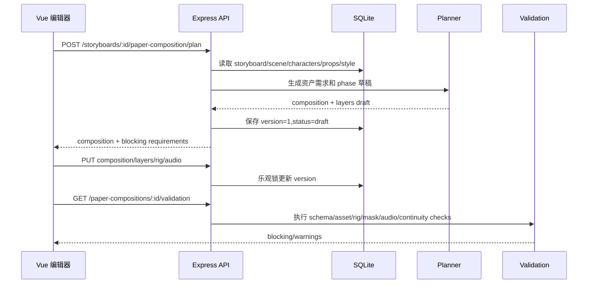
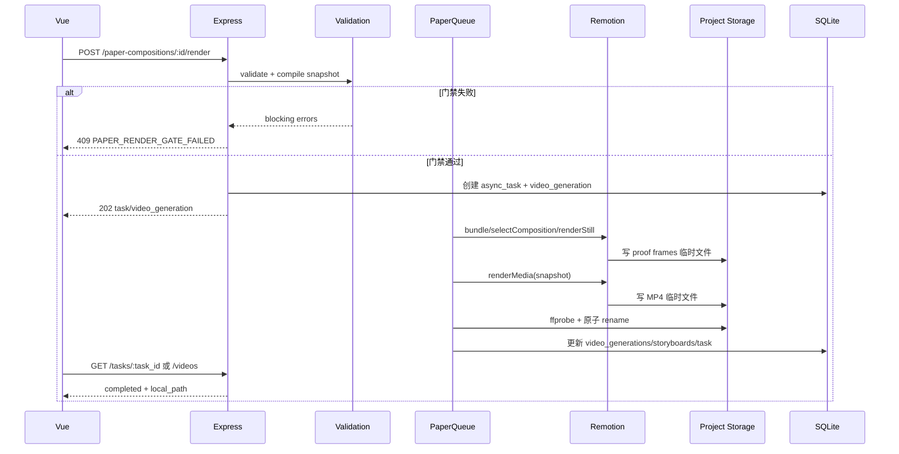

# LocalMiniDrama 纸片分层动画技术方案

> 文档状态：v1.0 技术方案草案
> 创建日期：2026-07-19
> 上游方案：[纸片分层动画实施方案](../plans/2026-07-19-paper-layer-animation-plan.md)
> 适用范围：阶段 0（渲染可行性）和阶段 1（单分镜完整动画 MVP）
> 目标：把上游生产方案落实为可以直接拆分开发任务的数据库、API、JSON、渲染器和验收合同。

## 0. 文档定位与决策边界

### 0.1 这份文档解决什么问题

上游实施方案回答“为什么做、做成什么样、分几阶段做”。本文件只回答“代码如何组织、数据如何流动、接口如何调用、失败如何恢复”。

本文件是阶段 0/1 的工程实现基线。若创意规则与本文件冲突，以实施方案的正式生产规则为准；若实现细节与当前代码冲突，以本文件列出的迁移和兼容策略为准。

### 0.2 已冻结的关键决策

| 项目 | 决策 |
|---|---|
| 视频模式 | 新增 `storyboards.video_render_mode`：`ai_video` 或 `paper_layered` |
| 正式模式 | 只有正式纸片分层链路；不提供整图自动切割、整图推拉或素材不足降级 |
| 渲染器 | 使用本地 Remotion；不把 `paper_layered` 发送到外部视频模型 |
| 运行位置 | 阶段 1 在现有 Express/Electron 主进程内运行，进程内队列并发 1 |
| 输入 | 只接受冻结的 `render_snapshot` 和项目 storage 内的本地媒体 |
| 动画时间 | 由 phase 编译器和已锁定的 `audio_timing` 生成，禁止 wall-clock 驱动 |
| 主角结构 | 需要动作的主角使用最小 `paper_rig`，整体 PNG 不能冒充 rig |
| 遮挡 | `z_index` 与 `depth` 分离；局部穿插必须使用 mask 或 occluder |
| 视频记录 | 继续写入 `video_generations`，并回写 `storyboards.video_url/local_path` |
| 整集合并 | 继续复用 `videoMergeService.js`；纸片片段输出统一编码，必要时走重编码回退 |
| TTS | 第一版复用现有 MiniMax/OpenAI 兼容 TTS；先锁定音频时序，再规划动作 |
| 参考分镜图 | 只能作为构图/风格参考，不能进入最终 `render_snapshot.layers` |

本项目已有上层方案明确选择 Remotion，因此本文件不做 Remotion → HyperFrames 的迁移。动画实现仍遵循 seek-safe、帧驱动、确定性和不可依赖实时计时器的原则。

### 0.3 不在本文件中实现的内容

- 专业级骨骼编辑器、自动口型同步、动作捕捉和 AI 肢体重绘；
- 整集 Remotion 时间轴替换现有 FFmpeg 合并；
- F5-TTS/ChatTTS 声音克隆；
- 自动从整张分镜图分割并修补背景；
- 多人协作和云端分布式渲染。

## 1. 目标、输入与输出

### 1.1 阶段 1 的完成定义

给定一个 `storyboard_id`，系统能够：

1. 创建纸片合成草稿并从当前分镜、场景、角色、道具生成语义图层需求。
2. 接收或生成正式背景板、透明主体、rig 部件、道具状态、前景遮挡和 mask。
3. 在 Vue 编辑器中修改图层、父子关系、pivot、相机、phase 和遮挡。
4. 锁定音频或无声 beat，编译出 v2 `render_snapshot`。
5. 通过素材、schema、rig、mask、音频、连续性和 proof frame 门禁。
6. 使用本地 Remotion 渲染六张 proof frames 和正式 MP4。
7. 创建/完成 `video_generations`，回写分镜视频，并可参与现有整集合并。

### 1.2 输入

业务输入来自现有 SQLite：

- `storyboards`：标题、描述、动作、对白、旁白、时长、镜头参数和关联资源；
- `scenes`：场景身份、视觉版本、主图和参考图；
- `characters` / `props` / `storyboard_props`：实体身份和关联关系；
- `drama_visual_style_versions`、`generation_context_snapshots`：活动视觉版本和生成 provenance；
- `audio_local_path`、`narration_audio_local_path`：已落盘的音频；
- `paper_*` 表：合成、资产、rig、层、连续镜头和 proof 状态。

渲染输入不直接读取这些业务表，而是先编译为冻结 snapshot。规划和编辑阶段可以读取业务表；`rendering` 之后只能读取 snapshot。

### 1.3 输出

| 输出 | 位置/记录 | 要求 |
|---|---|---|
| proof frames | `paper/compositions/storyboard-{id}/previews/` | 六张阶段证明图及诊断 JSON |
| 正式视频 | 项目 storage 的 `videos/` | H.264、`yuv420p`、30fps、AAC 或兼容静音轨 |
| 视频记录 | `video_generations` | `provider=local_remotion`、`generation_kind=paper_layered` |
| 分镜绑定 | `storyboards.video_url/local_path` | 与现有播放器和合并服务兼容 |
| 可追溯快照 | `video_generations.render_snapshot` | 包含 schema、素材 hash、音频 hash、渲染器版本 |

## 2. 当前系统接入点

### 2.1 现有调用链

```text
FilmCreate.vue
  → frontweb/src/api/videos.js
  → /api/v1/videos
  → backend-node/src/routes/videos.js
  → videoService.js
  → videoClient.callVideoApi()
  → video_generations
  → storyboards.video_url/local_path
  → videoMergeService.js
```

纸片模式不改上述 AI 视频行为，只在制作页选择 `paper_layered` 后进入新路由和新服务。

### 2.2 新调用链

```text
FilmCreate.vue
  → paperCompositions API
  → /api/v1/paper-compositions/...
  → paperCompositionService
       ├─ paperLayerPlannerService
       ├─ paperValidationService
       ├─ paperAudioTimingService
       └─ paperRenderService
             ├─ paperSpecCompiler
             ├─ Remotion bundle/selectComposition/renderMedia
             ├─ renderStill（proof frames）
             └─ ffprobe + 原子发布
  → video_generations(provider=local_remotion)
  → storyboards.video_url/local_path
  → 现有 videoMergeService.js
```

### 2.3 模块边界

| 模块 | 负责 | 不负责 |
|---|---|---|
| `paperCompositionService` | composition CRUD、版本、状态、编排服务调用 | 直接生成图片、直接写 Remotion JSX |
| `paperLayerPlannerService` | 把分镜语义转成资产需求、默认布局、动作和 phase 草稿 | 判断候选图是否合格、执行渲染 |
| `paperAssetService` | 资产 CRUD、hash、复用引用和 scope | 修改分镜主图、决定动画时间 |
| `paperRigService` | rig 部件父子关系、pivot、循环检查 | 生成角色图片 |
| `paperMatteService` | Alpha/绿幕/描边/mask 处理和诊断 | 语义理解、自动修补背景 |
| `paperAudioTimingService` | 音频 probe、cue、锁定和 hash | 重新生成 TTS |
| `paperValidationService` | 结构化门禁、错误码和 stale 传播 | 自动降级或删掉缺失层 |
| `paperSpecCompiler` | 将 DB 草稿规范化为 v2 snapshot | 读取渲染时变化的业务表 |
| `paperRenderService` | 任务、队列、Remotion、发布、回写 | 外部视频 API |
| `paper-renderer/` | 纯帧函数、rig、camera、mask 和 caption 渲染 | 数据库访问、文件上传 |
| `codexImageJobService` | 纸片资产候选图入队/导入/应用 | composition 排版 |

## 3. 运行时与进程模型

### 3.1 阶段 1 的进程模型

阶段 1 不新增 Node 服务，不新增消息队列。后端在现有 Express 进程内启动一个纸片渲染队列：

- 队列 key：`paper_render`；
- 并发：固定 1；
- 任务持久化：`async_tasks` + `video_generations`；
- 执行：`setImmediate()` 触发队列 pump，渲染器内部不得使用实时计时器；
- 重启：启动时将 `pending/processing` 的纸片任务标记为 `failed`，临时文件不发布；
- 取消：先阻止发布和前端轮询，若当前 Remotion 支持 cancel signal，再中断当前渲染。

### 3.2 目录和依赖边界

后端保持 CommonJS；Remotion 入口和渲染服务需要 ESM 时使用 `.mjs`/`.jsx` 隔离。阶段 1 先确认 Node 18、Electron 28 和目标平台的依赖兼容，再锁定具体 Remotion 版本。

不得在渲染过程中联网下载浏览器、字体、图片或二进制。所有媒体必须已经位于项目 storage；所有平台二进制必须随开发环境或安装包提供。

### 3.3 配置项

建议在现有 `configs/config.yaml` 的 `paper_render` 下增加：

```yaml
paper_render:
  enabled: true
  renderer_version: paper-layer-v1
  schema_version: 2
  fps: 30
  default_width: 1920
  default_height: 1080
  preview_scale: 0.5
  max_concurrency: 1
  max_layers: 40
  max_rig_parts: 12
  max_asset_pixels: 25000000
  max_memory_mb: 4096
  temp_subdir: paper/tmp
  proof_kinds:
    - first
    - anticipation
    - peak
    - settle
    - final_minus_hold
    - exact_final
  binaries_directory: null
```

配置读取规则：配置缺失时使用安全默认值；`max_concurrency` 不允许在 UI 中提升到大于 1；`enabled=false` 时 API 返回 `PAPER_RENDER_DISABLED`，不影响 AI 视频。

## 4. 端到端时序

### 4.1 创建和编辑



### 4.2 正式渲染



### 4.3 事务边界

数据库写入和文件写入不能放在一个 SQLite 事务里。采用以下顺序：

1. 读取并校验草稿；
2. 生成 snapshot 和 hash；
3. 事务内创建 `async_tasks`、`video_generations` 和 `paper_compositions.status=rendering`；
4. 文件全部写入同一项目 storage 下的唯一临时目录；
5. ffprobe 和 proof 校验通过后原子 rename 到正式目录；
6. 事务内更新完成状态和分镜绑定；
7. 任一环节失败，保留错误信息，删除/标记临时文件，状态为 `failed`，不写 `storyboards.video_url`。

## 5. 版本、hash 与幂等

### 5.1 版本字段

| 字段 | 作用 |
|---|---|
| `paper_compositions.version` | 编辑乐观锁；每次 PUT 成功后递增 |
| `paper_compositions.schema_version` | composition 草稿结构版本，当前为 2 |
| `paper_assets.schema_version` | 资产元数据结构版本 |
| `paper_layers.schema_version` | layer JSON 结构版本 |
| `renderer_version` | Remotion 模板和渲染代码版本 |
| `context_snapshot_id` | 图片生成时冻结的统一视觉上下文 |
| `style_version_id/signature` | 活动视觉版本 |

### 5.2 hash 计算

使用 SHA-256，输入按稳定 JSON 序列化（对象 key 排序、数组保持语义顺序、数字统一精度）：

```text
asset_hash = sha256(file_bytes)
timing_hash = sha256(canonical(audio_timing))
spec_hash = sha256(canonical(composition_draft_without_runtime_fields))
render_hash = sha256(
  schema_version
  + renderer_version
  + spec_hash
  + timing_hash
  + sorted(layer asset_hashes)
  + sorted(mask asset_hashes)
)
```

同一 `storyboard_id + render_hash` 已有 `completed` 记录时，`POST /render` 返回已有结果（`deduplicated=true`），不重复渲染。不同 hash 必须产生新 `video_generations`，历史记录不可覆盖。

### 5.3 stale 传播

以下任何变化都会把引用该资源的 composition 标记为 `stale`：

- asset 文件、Alpha/mask、媒体尺寸、`camera_signature` 或 `style_signature` 变化；
- rig 部件、父子关系、pivot 或动作 schema 变化；
- 音频文件、cue、分镜时长或画幅变化；
- sequence anchor、transition 或 renderer/schema 版本变化。

stale composition 必须重新 validation、锁定 timing、生成 proof frames 后才能回到 `ready`。

## 6. 数据库技术设计

### 6.1 迁移策略

新增文件：

```text
backend-node/migrations/30_paper_layer_animation.sql
```

迁移约定：

1. 新表使用 `CREATE TABLE IF NOT EXISTS`，重复执行安全。
2. 旧表新增列使用单独的 `ALTER TABLE ... ADD COLUMN` 语句；当前迁移执行器遇到 duplicate column 会跳过。
3. `backend-node/src/db/migrate.js` 的 `ensureAllColumns()` 同步加入兜底字段，保证旧数据库在没有完整迁移文件时不会出现运行时 `no such column`。
4. 所有时间写入 ISO 字符串；JSON 列保存 UTF-8 字符串，不在 SQLite 中保存二进制。
5. 阶段 1 不删除或重命名现有字段，不改变 `creation_mode` 的语义。
6. `desktop/scripts/copy-backend.js` 已复制 `migrations/`，打包冒烟测试必须确认 30 号迁移进入 `backend-app/migrations/`。

### 6.2 现有表增量字段

```sql
ALTER TABLE storyboards ADD COLUMN video_render_mode TEXT DEFAULT 'ai_video';

ALTER TABLE video_generations ADD COLUMN generation_kind TEXT DEFAULT 'ai';
ALTER TABLE video_generations ADD COLUMN paper_composition_id INTEGER;
ALTER TABLE video_generations ADD COLUMN render_snapshot TEXT;
ALTER TABLE video_generations ADD COLUMN render_hash TEXT;
ALTER TABLE video_generations ADD COLUMN renderer_version TEXT;
```

应用层允许值：

```text
storyboards.video_render_mode: ai_video | paper_layered
video_generations.generation_kind: ai | paper_layered
```

旧记录保持 `ai`；旧分镜保持 `ai_video`。纸片模式不能通过修改 `creation_mode` 触发。

`ensureAllColumns()` 至少加入：

```js
ensureColumns(database, 'storyboards', [
  { name: 'video_render_mode', type: "TEXT DEFAULT 'ai_video'" },
]);
ensureColumns(database, 'video_generations', [
  { name: 'generation_kind', type: "TEXT DEFAULT 'ai'" },
  { name: 'paper_composition_id', type: 'INTEGER' },
  { name: 'render_snapshot', type: 'TEXT' },
  { name: 'render_hash', type: 'TEXT' },
  { name: 'renderer_version', type: 'TEXT' },
]);
```

### 6.3 `paper_sequences`

```sql
CREATE TABLE IF NOT EXISTS paper_sequences (
  id INTEGER PRIMARY KEY AUTOINCREMENT,
  drama_id INTEGER NOT NULL,
  episode_id INTEGER NOT NULL,
  scene_id INTEGER,
  sequence_key TEXT NOT NULL,
  fps INTEGER NOT NULL DEFAULT 30,
  continuity_json TEXT NOT NULL DEFAULT '{}',
  status TEXT NOT NULL DEFAULT 'draft',
  version INTEGER NOT NULL DEFAULT 1,
  created_at TEXT NOT NULL,
  updated_at TEXT NOT NULL,
  deleted_at TEXT,
  UNIQUE(episode_id, sequence_key)
);

CREATE INDEX IF NOT EXISTS idx_paper_sequences_episode
  ON paper_sequences(episode_id, status);
```

`continuity_json` 最小结构：

```json
{
  "schema_version": 1,
  "entry_anchor": {
    "character_emperor.root": { "x": 0.48, "y": 0.82, "rotation": 0 },
    "character_emperor.head": { "x": 0.49, "y": 0.42, "facing": "right" }
  },
  "exit_anchor": {},
  "camera_signature": {
    "shot": "medium",
    "angle_h": "front",
    "angle_v": "eye_level",
    "horizon": 0.54,
    "light_direction": "upper_left"
  },
  "allowed_delta": {
    "position": 0.04,
    "scale": 0.06,
    "rotation": 8,
    "camera_center": 0.05
  },
  "transition": { "type": "hard_cut", "duration_frames": 0 },
  "continuity_break": false
}
```

### 6.4 `paper_compositions`

```sql
CREATE TABLE IF NOT EXISTS paper_compositions (
  id INTEGER PRIMARY KEY AUTOINCREMENT,
  drama_id INTEGER NOT NULL,
  episode_id INTEGER NOT NULL,
  storyboard_id INTEGER NOT NULL UNIQUE,
  sequence_id INTEGER,
  sequence_index INTEGER,
  version INTEGER NOT NULL DEFAULT 1,
  schema_version INTEGER NOT NULL DEFAULT 2,
  template_key TEXT NOT NULL DEFAULT 'paper_history_v1',
  fps INTEGER NOT NULL DEFAULT 30,
  width INTEGER NOT NULL,
  height INTEGER NOT NULL,
  duration_frames INTEGER NOT NULL,
  camera_json TEXT NOT NULL DEFAULT '{}',
  continuity_json TEXT NOT NULL DEFAULT '{}',
  audio_json TEXT NOT NULL DEFAULT '{}',
  audio_timing_status TEXT NOT NULL DEFAULT 'unlocked',
  audio_timing_hash TEXT,
  status TEXT NOT NULL DEFAULT 'draft',
  spec_hash TEXT,
  renderer_version TEXT,
  last_validation_json TEXT NOT NULL DEFAULT '{}',
  last_proof_hash TEXT,
  created_at TEXT NOT NULL,
  updated_at TEXT NOT NULL,
  deleted_at TEXT
);

CREATE INDEX IF NOT EXISTS idx_paper_compositions_episode
  ON paper_compositions(episode_id, status);
CREATE INDEX IF NOT EXISTS idx_paper_compositions_sequence
  ON paper_compositions(sequence_id, sequence_index);
```

状态由服务层校验，不能只依赖前端：

```text
draft → assets_pending → ready → rendering → rendered
  │          │             │          ├→ failed
  └──────────┴─────────────┴──────────┴→ stale
```

### 6.5 `paper_assets`

```sql
CREATE TABLE IF NOT EXISTS paper_assets (
  id INTEGER PRIMARY KEY AUTOINCREMENT,
  drama_id INTEGER NOT NULL,
  episode_id INTEGER,
  scene_id INTEGER,
  storyboard_id INTEGER,
  asset_scope TEXT NOT NULL DEFAULT 'storyboard',
  asset_key TEXT NOT NULL,
  asset_type TEXT NOT NULL,
  variant_key TEXT NOT NULL DEFAULT '',
  rig_key TEXT,
  source_entity_type TEXT,
  source_entity_id INTEGER,
  source_image_generation_id INTEGER,
  context_snapshot_id TEXT,
  style_version_id INTEGER,
  style_signature TEXT,
  prompt TEXT,
  negative_prompt TEXT,
  image_url TEXT,
  local_path TEXT,
  cutout_local_path TEXT,
  processing_json TEXT NOT NULL DEFAULT '{}',
  camera_signature TEXT,
  facing TEXT,
  foot_line REAL,
  content_bbox_json TEXT NOT NULL DEFAULT '{}',
  alpha_bbox_json TEXT NOT NULL DEFAULT '{}',
  matte_quality TEXT NOT NULL DEFAULT 'unknown',
  asset_hash TEXT,
  schema_version INTEGER NOT NULL DEFAULT 1,
  status TEXT NOT NULL DEFAULT 'missing',
  created_at TEXT NOT NULL,
  updated_at TEXT NOT NULL,
  deleted_at TEXT,
  UNIQUE(drama_id, asset_key, variant_key)
);

CREATE INDEX IF NOT EXISTS idx_paper_assets_scene
  ON paper_assets(scene_id, asset_scope, status);
CREATE INDEX IF NOT EXISTS idx_paper_assets_entity
  ON paper_assets(source_entity_type, source_entity_id, status);
CREATE INDEX IF NOT EXISTS idx_paper_assets_hash
  ON paper_assets(asset_hash);
```

应用层枚举：

```text
asset_scope: drama | scene | storyboard
asset_type: background_plate | midground | cutout | rig_part | prop_state |
            occluder | mask | atmosphere | texture | decoration
status: missing | candidate | needs_review | ready | stale | deleted
matte_quality: unknown | pass | warning | fail | manual_pass
```

删除素材时只做软删除；删除前必须检查 `paper_layers` 和 `paper_rigs.parts_json` 的引用。`variant_key` 统一把空值归一化为 `''`；软删除后同 key 默认恢复原记录或使用显式新 variant，不能产生隐式重复资产。

### 6.6 `paper_rigs`

```sql
CREATE TABLE IF NOT EXISTS paper_rigs (
  id INTEGER PRIMARY KEY AUTOINCREMENT,
  drama_id INTEGER NOT NULL,
  subject_type TEXT NOT NULL,
  subject_id INTEGER NOT NULL,
  rig_key TEXT NOT NULL,
  schema_version INTEGER NOT NULL DEFAULT 1,
  root_part_key TEXT NOT NULL,
  parts_json TEXT NOT NULL,
  status TEXT NOT NULL DEFAULT 'draft',
  created_at TEXT NOT NULL,
  updated_at TEXT NOT NULL,
  deleted_at TEXT,
  UNIQUE(subject_type, subject_id, rig_key)
);

CREATE INDEX IF NOT EXISTS idx_paper_rigs_subject
  ON paper_rigs(subject_type, subject_id, status);
```

`parts_json` 中每个部件必须包含 `key`、`asset_id`、`parent`、`pivot`、`initial_transform`；`parent` 为 `null` 的部件只能有一个 root。

### 6.7 `paper_layers`

```sql
CREATE TABLE IF NOT EXISTS paper_layers (
  id INTEGER PRIMARY KEY AUTOINCREMENT,
  composition_id INTEGER NOT NULL,
  paper_asset_id INTEGER,
  rig_id INTEGER,
  layer_key TEXT NOT NULL,
  layer_type TEXT NOT NULL,
  role TEXT,
  parent_layer_key TEXT,
  content_json TEXT NOT NULL DEFAULT '{}',
  z_index INTEGER NOT NULL DEFAULT 0,
  depth REAL NOT NULL DEFAULT 0.5,
  pivot_json TEXT NOT NULL DEFAULT '{}',
  transform_json TEXT NOT NULL DEFAULT '{}',
  animation_json TEXT NOT NULL DEFAULT '{}',
  occlusion_json TEXT NOT NULL DEFAULT '{}',
  mask_asset_id INTEGER,
  schema_version INTEGER NOT NULL DEFAULT 2,
  status TEXT NOT NULL DEFAULT 'missing',
  created_at TEXT NOT NULL,
  updated_at TEXT NOT NULL,
  deleted_at TEXT,
  UNIQUE(composition_id, layer_key)
);

CREATE INDEX IF NOT EXISTS idx_paper_layers_composition
  ON paper_layers(composition_id, z_index, status);
CREATE INDEX IF NOT EXISTS idx_paper_layers_asset
  ON paper_layers(paper_asset_id);
```

`layer_type`：

```text
background | distant | character | character_part | prop | foreground |
occluder | decoration | caption
```

### 6.8 `paper_render_proofs`

proof frame 不能只存在文件系统；数据库需要知道某次 render hash 是否已生成和验收：

```sql
CREATE TABLE IF NOT EXISTS paper_render_proofs (
  id INTEGER PRIMARY KEY AUTOINCREMENT,
  composition_id INTEGER NOT NULL,
  render_hash TEXT NOT NULL,
  proof_kind TEXT NOT NULL,
  frame INTEGER NOT NULL,
  local_path TEXT NOT NULL,
  image_hash TEXT NOT NULL,
  diagnostics_json TEXT NOT NULL DEFAULT '{}',
  status TEXT NOT NULL DEFAULT 'generated',
  created_at TEXT NOT NULL,
  updated_at TEXT NOT NULL,
  UNIQUE(composition_id, render_hash, proof_kind)
);

CREATE INDEX IF NOT EXISTS idx_paper_proofs_composition
  ON paper_render_proofs(composition_id, render_hash, status);
```

`proof_kind` 固定为 `first`、`anticipation`、`peak`、`settle`、`final_minus_hold`、`exact_final`；`status` 为 `generated | pass | fail`。只有六种都为 `pass` 且诊断通过，composition 才能进入 `rendered`。

### 6.9 `video_generations` 兼容规则

纸片记录写入：

```text
provider        = local_remotion
model           = paper-layer-v1
generation_kind = paper_layered
status          = processing | completed | failed
paper_composition_id = composition.id
render_snapshot = canonical JSON string
render_hash     = SHA-256
renderer_version= configured version
```

不要调用 `videoService.processVideoGeneration()`，因为它会进入外部 `videoClient`。纸片服务应复用一个抽象的“完成视频记录”函数，或在 `videoService.js` 增加只负责本地结果回写的 `finalizeLocalVideoGeneration()`。

## 7. v2 JSON 合同

### 7.1 顶层结构

`paperSpecCompiler.compile()` 的唯一输出是 `RenderSnapshot`。渲染器只接受这份对象，不接受数据库 row 集合。

顶层必填字段：

```text
schema_version
composition
timing
camera
layers
audio
provenance
limits
```

### 7.2 坐标和时间约定

- 所有位置、尺寸、pivot、脚底线和 bbox 使用相对于画布的 `0..1` 数值。
- `x/y` 表示锚点位置，不表示图片左上角；图片尺寸由 `width/height` 或等比 `width` 推导。
- `anchor_x/anchor_y`、`pivot` 也使用 `0..1`，原点由素材内容 bbox 校准。
- `frame` 是从 0 开始的整数；有效范围为 `0 <= frame < duration_frames`。
- `exact_final = duration_frames - 1`，严禁采样 `duration_frames`。
- 旋转单位为度，scale 为相对值，opacity 范围为 `0..1`。
- 所有空间动画最终编译为单一 transform track；相机和图层分别有自己的父级轨道。

### 7.3 RenderSnapshot 示例

```json
{
  "schema_version": 2,
  "composition": {
    "id": 12,
    "storyboard_id": 165,
    "sequence_id": 9,
    "sequence_index": 2,
    "template": "paper_history_v1",
    "width": 1920,
    "height": 1080,
    "fps": 30,
    "duration_frames": 150,
    "aspect_ratio": "16:9"
  },
  "timing": {
    "status": "locked",
    "source": "audio",
    "phases": [
      { "name": "anticipation", "start_frame": 0, "end_frame": 12 },
      { "name": "entry", "start_frame": 12, "end_frame": 32 },
      { "name": "action", "start_frame": 32, "end_frame": 82 },
      { "name": "peak", "start_frame": 82, "end_frame": 98 },
      { "name": "settle", "start_frame": 98, "end_frame": 118 },
      { "name": "hold", "start_frame": 118, "end_frame": 142 },
      { "name": "exit", "start_frame": 142, "end_frame": 150 }
    ],
    "cues": [
      { "id": "line-1-start", "frame": 18, "kind": "speech_start" },
      { "id": "line-1-emphasis", "frame": 84, "kind": "speech_peak" },
      { "id": "line-1-end", "frame": 88, "kind": "speech_end" }
    ],
    "timing_hash": "sha256:..."
  },
  "camera": {
    "signature": {
      "shot": "medium",
      "angle_h": "front",
      "angle_v": "eye_level",
      "horizon": 0.54,
      "light_direction": "upper_left"
    },
    "start": { "x": 0.5, "y": 0.5, "scale": 1.0, "rotation": 0 },
    "tracks": [
      {
        "property": "scale",
        "keyframes": [
          { "frame": 0, "value": 1.0 },
          { "frame": 150, "value": 1.015 }
        ],
        "ease": "sine.inOut"
      }
    ]
  },
  "layers": [
    {
      "key": "background",
      "type": "background",
      "role": "atmosphere",
      "asset_id": 501,
      "asset_hash": "sha256:...",
      "src": "projects/0004_20260719_history/paper/assets/scenes/scene-12/wide-background.png",
      "z_index": 0,
      "depth": 0.05,
      "transform": {
        "x": 0.5,
        "y": 0.5,
        "width": 1.08,
        "anchor_x": 0.5,
        "anchor_y": 0.5,
        "rotation": 0,
        "opacity": 1
      },
      "tracks": []
    },
    {
      "key": "character_emperor",
      "type": "character",
      "role": "primary",
      "rig_id": 22,
      "z_index": 40,
      "depth": 0.72,
      "transform": {
        "x": 0.48,
        "y": 0.82,
        "width": 0.34,
        "anchor_x": 0.5,
        "anchor_y": 1.0,
        "rotation": 0,
        "opacity": 1
      },
      "tracks": [
        {
          "property": "x",
          "keyframes": [
            { "frame": 12, "value": 0.44 },
            { "frame": 32, "value": 0.48 }
          ],
          "ease": "power3.out"
        }
      ],
      "occlusion": {
        "group": "emperor-body",
        "affected_part_keys": ["arm_front", "prop"],
        "occluder_layer_key": "foreground_table",
        "mask_asset_id": 702,
        "feather_px": 2
      }
    }
  ],
  "rigs": [
    {
      "id": 22,
      "key": "character-8-seated-right-v1",
      "root": "torso",
      "parts": [
        { "key": "torso", "asset_id": 516, "parent": null, "pivot": [0.5, 0.82] },
        { "key": "head", "asset_id": 517, "parent": "torso", "pivot": [0.5, 0.18] },
        { "key": "arm_front", "asset_id": 518, "parent": "torso", "pivot": [0.78, 0.36] },
        { "key": "prop", "asset_id": 519, "parent": "arm_front", "pivot": [0.92, 0.52] }
      ],
      "tracks": [
        {
          "target": "arm_front",
          "property": "rotation",
          "phase": "action",
          "from": -8,
          "to": 16,
          "ease": "power2.inOut"
        }
      ]
    }
  ],
  "audio": {
    "timing_hash": "sha256:...",
    "sources": [
      { "kind": "dialogue", "src": "projects/.../storyboards/sb-165/dialogue.mp3", "hash": "sha256:..." }
    ],
    "enforce_audio_track": true,
    "sample_rate": 48000
  },
  "provenance": {
    "style_version_id": 3,
    "style_signature": "style:...",
    "compiler_version": "paper-spec-v2",
    "renderer_version": "paper-layer-v1"
  },
  "limits": {
    "max_layers": 40,
    "allow_bleed": false,
    "seed": 165
  }
}
```

### 7.4 子结构 JSON

#### `transform_json`

```json
{
  "schema_version": 2,
  "x": 0.48,
  "y": 0.82,
  "width": 0.34,
  "anchor_x": 0.5,
  "anchor_y": 1.0,
  "rotation": 0,
  "scale": 1,
  "opacity": 1,
  "allow_bleed": false
}
```

#### `animation_json`

```json
{
  "schema_version": 2,
  "intentional_hold": false,
  "action_verb": "抬手递出酒杯",
  "motion_coverage": {
    "load_bearing_track": "rig.arm_front.rotation",
    "peak_frame": 84,
    "reaction_tracks": ["prop.rotation"]
  },
  "tracks": [
    {
      "target": "rig.arm_front",
      "property": "rotation",
      "phase": "action",
      "from": -8,
      "to": 16,
      "ease": "power2.inOut"
    },
    {
      "target": "layer",
      "property": "y",
      "phase": "settle",
      "keyframes": [
        { "offset": 0, "value": 0.01 },
        { "offset": 1, "value": 0 }
      ],
      "ease": "sine.out"
    }
  ],
  "ambient": {
    "preset": "paper_breath_v1",
    "phase": "hold",
    "amplitude": 0.0015,
    "period_frames": 100
  }
}
```

#### `occlusion_json`

```json
{
  "schema_version": 1,
  "group": "emperor-body",
  "occluder_layer_key": "foreground_table",
  "mask_asset_id": 702,
  "affected_part_keys": ["arm_front", "prop"],
  "clip_path": null,
  "feather_px": 2,
  "invert": false
}
```

### 7.5 Schema 与不变量

`paperSpecCompiler` 在渲染前执行以下检查；任一失败都返回字段路径和错误码：

1. `schema_version` 是支持的版本；未知版本不自动兼容。
2. `duration_frames = round(duration_seconds * fps)`，且大于 0；所有 frame 在有效范围内。
3. phase 按时间递增、允许边界相接但不能内部重叠；`peak` 在 `action` 之后，`settle` 在 `peak` 之后。
4. layer key 唯一；父层和 rig 部件存在，不能形成循环；每个 rig 只能有一个 root。
5. 所有 `src` 是 storage 相对路径，规范化后仍位于 storage root；拒绝 `..`、绝对路径和符号链接逃逸。
6. 每个可见图片层有 `asset_hash`、宽高、Alpha 状态和有效内容 bbox。
7. `primary` 层至少有空间 action/camera track，除非 `intentional_hold=true`；透明度淡入不能单独冒充 action。
8. 每个 transform 只有一个合并轨道；禁止两个动画源同时写同一空间属性。
9. occlusion 引用的 layer、mask 和 affected part 都存在；mask hash 与 snapshot 一致。
10. `timing.status=locked`，`timing_hash` 同时出现在 composition、audio 和 render hash 输入中。

### 7.6 规范化和 canonical JSON

实现文件：

```text
backend-node/src/services/paperSpecCompiler.js
backend-node/src/paper-renderer/schema/paperSpec.schema.json
backend-node/src/paper-renderer/schema/animation.schema.json
```

编译步骤：

```text
load draft rows
  → parse JSON columns with safe defaults
  → resolve asset paths and dimensions
  → normalize 0..1 coordinates and frame ranges
  → expand rig parts into layer instances
  → compile phases + audio cues into keyframes
  → validate schema/invariants/gates
  → sort layers by z_index then stable layer_key
  → canonical stringify
  → calculate spec_hash/render_hash
  → return immutable RenderSnapshot
```

canonical stringify 必须排序对象 key，但不能对 `layers`、`parts`、`tracks` 等有语义顺序的数组排序。

## 8. 后端 API 合同

### 8.1 通用规则

- 基础路径：`/api/v1`，由现有 `backend-node/src/app.js` 挂载。
- 成功响应继续使用 `response.success()` / `response.created()`：`{ success: true, data, timestamp }`。
- 失败响应使用 `response.error()`：`{ success: false, error: { code, message, details? }, timestamp }`。
- 本地媒体返回 `/static/<storage-relative-path>`，数据库只保存 storage 相对路径。
- 所有写操作携带 `version` 或 `expected_version`；版本不匹配返回 409，不静默覆盖编辑器状态。
- API 不提供 `fast`、`fallback`、`use_storyboard_image_as_layer` 等参数。
- 现有 `PUT /storyboards/:id` 增加 `video_render_mode` 白名单校验；切换模式只改变后续生成入口，不删除另一模式的历史视频或 composition。

### 8.2 Endpoint 总览

| 方法 | 路径 | 用途 | 成功状态 |
|---|---|---|---:|
| GET | `/paper-compositions?storyboard_id=:id` | 查询分镜合成和当前视频 | 200 |
| POST | `/storyboards/:id/paper-composition/plan` | 创建/重建草稿规划 | 201/200 |
| GET | `/paper-compositions/:id` | 获取 composition、layers、rig、proof | 200 |
| PUT | `/paper-compositions/:id` | 更新画幅、相机、模板和音频草稿 | 200 |
| GET | `/paper-compositions/:id/validation` | 执行只读门禁 | 200 |
| POST | `/paper-compositions/:id/lock-timing` | 锁定音频/无声 beat | 200 |
| POST | `/paper-compositions/:id/proof-frames` | 生成六张证明图 | 202 |
| POST | `/paper-compositions/:id/render` | 创建正式渲染任务 | 202/200（去重） |
| GET | `/paper-render/doctor` | 检查本地渲染工具链 | 200 |
| POST | `/paper-compositions/:id/duplicate` | 复制为新草稿 | 201 |
| POST | `/paper-compositions/:id/layers` | 新增 layer | 201 |
| PUT | `/paper-layers/:id` | 更新 layer | 200 |
| DELETE | `/paper-layers/:id` | 软删除 layer | 200 |
| POST | `/paper-rigs` | 创建 rig | 201 |
| GET/PUT | `/paper-rigs/:id` | 查询/更新 rig | 200 |
| DELETE | `/paper-rigs/:id` | 软删除 rig | 200 |
| GET | `/paper-assets` | 按 drama/scene/storyboard 查询资产 | 200 |
| POST | `/paper-assets` | 创建资产记录/上传元数据 | 201 |
| POST | `/paper-assets/:id/source` | 上传/固化源图到项目 storage | 201 |
| PUT | `/paper-assets/:id` | 更新资产状态和校准数据 | 200 |
| DELETE | `/paper-assets/:id` | 软删除资产 | 200 |
| POST | `/paper-assets/:id/matte` | 执行 Alpha/绿幕处理 | 202 |
| GET/PUT | `/paper-sequences/:id` | 查询/更新连续镜头合同 | 200 |

### 8.3 规划接口

请求：

```json
{
  "template_key": "paper_history_v1",
  "expected_version": null,
  "rebuild_layers": false,
  "audio_mode": "existing_storyboard_audio"
}
```

规则：

- 不传 composition 时创建一份草稿；已有草稿且 `rebuild_layers=false` 时返回已有草稿；
- `rebuild_layers=true` 只重建未被用户锁定的层，不能覆盖用户已确认的 asset、rig 或 hand-edited transform；
- planner 只保存需求和草稿，不调用图片模型，不创建正式 `video_generations`；
- 规划结果包含 `requirements[]`，每项含 `layer_key`、`semantic_role`、`asset_type`、`required`、`suggested_prompt`、`action_verb` 和 `blocking_reason`。

### 8.4 Composition 更新

请求必须带版本：

```json
{
  "expected_version": 3,
  "template_key": "paper_history_v1",
  "camera_json": { "schema_version": 1, "start": { "x": 0.5, "y": 0.5, "scale": 1 } },
  "continuity_json": {},
  "audio_json": {}
}
```

服务层行为：

1. 查询 `version=expected_version` 的 row；
2. 只更新允许字段；`storyboard_id/drama_id/episode_id` 不可通过此接口修改；
3. `version + 1`，更新 `updated_at`；
4. 如果改变画幅、时长、相机、音频或 schema，清空旧 validation/proof 结果并标记 `stale`；
5. 返回完整 composition，不只返回 SQL row。

### 8.5 Validation 响应

```json
{
  "ok": false,
  "composition_id": 12,
  "version": 4,
  "status": "assets_pending",
  "blocking": [
    {
      "code": "MISSING_SEMANTIC_ASSET",
      "path": "layers.character_emperor.rig.arm_front",
      "layer_key": "character_emperor",
      "required": "rig_part",
      "message": "主角动作需要可见手臂部件"
    },
    {
      "code": "AUDIO_TIMING_UNLOCKED",
      "path": "audio_timing_status",
      "message": "请先锁定对白/旁白 cue"
    }
  ],
  "warnings": [
    { "code": "SAFE_AREA_BLEED", "path": "layers.foreground.transform", "message": "前景超出安全区" }
  ],
  "computed": {
    "visible_semantic_layers": 6,
    "ready_assets": 4,
    "motion_coverage": { "ok": true, "peak_frame": 84 },
    "proof_frames": { "complete": false, "missing": ["peak", "exact_final"] }
  }
}
```

Validation 是只读接口，但可以把 `last_validation_json` 和 `status` 以短事务写回；不能创建视频。

### 8.6 Lock timing

请求：

```json
{
  "expected_version": 4,
  "source": "audio",
  "cues": [
    { "id": "line-1-start", "frame": 18, "kind": "speech_start" },
    { "id": "line-1-emphasis", "frame": 84, "kind": "speech_peak" },
    { "id": "line-1-end", "frame": 88, "kind": "speech_end" }
  ],
  "allow_manual_cues": false
}
```

`source`：`audio` 或 `manual`。`audio` 必须验证音频路径存在、probe 成功、duration 与 storyboard 时长相容；`manual` 必须保存编辑者输入和原因。成功后计算 `audio_timing_hash`，状态变为 `locked`，并递增 composition version。

### 8.7 Proof frames 与 render

`POST /proof-frames`：

- 只允许 composition 已通过素材/schema/rig/mask 基础检查；
- 不创建正式 `video_generations`；
- 创建 `async_tasks(type=paper_proof)`；
- 生成六张图后写入 `paper_render_proofs`；
- proof 失败不改变为 `ready`。

`POST /render` 请求：

```json
{
  "expected_version": 5,
  "preview": false
}
```

服务端强制执行：

- `preview=false` 只接受 `audio_timing_status=locked`；
- 完整 validation 和 snapshot compile 通过后才创建记录；
- `preview` 只能降低分辨率，不能减少层、跳过 mask、换整图或绕过门禁；
- `preview=true` 可以在编辑阶段使用 `provisional` timing，但结果只能作为编辑预览，不能创建 `completed` 视频、回写 `storyboards.video_url` 或参与整集合并；
- 同一 render hash 已有完成记录时返回 200 + `deduplicated=true`；
- 新任务返回 202：`{ task_id, video_generation_id, composition_id, render_hash }`。

### 8.8 错误码

| HTTP | code | 触发条件 |
|---:|---|---|
| 400 | `PAPER_INVALID_ARGUMENT` | 参数或枚举非法 |
| 404 | `PAPER_NOT_FOUND` | composition/asset/rig 不存在 |
| 409 | `PAPER_VERSION_CONFLICT` | 乐观锁版本不匹配 |
| 409 | `PAPER_RENDER_GATE_FAILED` | blocking 门禁未通过 |
| 409 | `PAPER_TIMING_NOT_LOCKED` | 正式渲染未锁定 timing |
| 409 | `PAPER_STALE_COMPOSITION` | composition 依赖已变化 |
| 409 | `PAPER_ASSET_IN_USE` | 删除仍被引用的资产 |
| 413 | `PAPER_LIMIT_EXCEEDED` | 层数、像素或内存预算超限 |
| 422 | `PAPER_SCHEMA_INVALID` | JSON schema/不变量失败 |
| 503 | `PAPER_RENDER_DISABLED` | 配置关闭 |
| 503 | `PAPER_RENDER_TOOLCHAIN_UNAVAILABLE` | 浏览器、ffmpeg、ffprobe 或 bundle 不可用 |
| 507 | `PAPER_MEMORY_LIMIT` | 内存或磁盘预算不足 |
| 409 | `PAPER_CANCELLED` | 用户取消任务 |
| 500 | `PAPER_RENDER_FAILED` | 渲染/ffprobe/发布失败 |

`PAPER_RENDER_GATE_FAILED` 的 `details` 必须包含 `blocking[]`，不能只返回一段无法定位的字符串。

## 9. 后端服务实现合同

### 9.1 文件布局

新增：

```text
backend-node/src/routes/paperCompositions.js
backend-node/src/routes/paperAssets.js
backend-node/src/routes/paperSequences.js
backend-node/src/routes/paperRigs.js
backend-node/src/routes/paperRender.js
backend-node/src/services/paperCompositionService.js
backend-node/src/services/paperAssetService.js
backend-node/src/services/paperLayerPlannerService.js
backend-node/src/services/paperSequenceService.js
backend-node/src/services/paperRigService.js
backend-node/src/services/paperAudioTimingService.js
backend-node/src/services/paperValidationService.js
backend-node/src/services/paperToolchainService.js
backend-node/src/services/paperMatteService.js
backend-node/src/services/paperSpecCompiler.js
backend-node/src/services/paperRenderService.mjs
backend-node/src/paper-renderer/entry.jsx
backend-node/src/paper-renderer/Root.jsx
backend-node/src/paper-renderer/PaperComposition.jsx
backend-node/src/paper-renderer/PaperLayer.jsx
backend-node/src/paper-renderer/PaperRig.jsx
backend-node/src/paper-renderer/PaperOcclusion.jsx
backend-node/src/paper-renderer/CaptionTrack.jsx
backend-node/src/paper-renderer/motion/phaseCompiler.js
backend-node/src/paper-renderer/motion/layerMotion.js
backend-node/src/paper-renderer/motion/rigMotion.js
backend-node/src/paper-renderer/motion/cameraMotion.js
backend-node/src/paper-renderer/schema/paperSpec.schema.json
backend-node/src/paper-renderer/schema/animation.schema.json
backend-node/scripts/render-paper-storyboard.mjs
backend-node/scripts/verify-paper-render.js
```

修改：

```text
backend-node/src/routes/index.js
backend-node/src/db/migrate.js
backend-node/src/services/videoService.js
backend-node/src/services/videoMergeService.js
backend-node/src/services/codexImageJobService.js
backend-node/src/services/promptCompiler.js
backend-node/src/services/referencePackService.js
backend-node/src/services/generationContextService.js
backend-node/src/services/dramaExportService.js
backend-node/src/services/dramaImportService.js
backend-node/package.json
desktop/package.json
desktop/scripts/copy-backend.js
```

### 9.2 `paperCompositionService`

服务公开方法：

```js
createOrPlan(db, log, storyboardId, options)
get(db, compositionId, options)
update(db, log, compositionId, patch, expectedVersion)
duplicate(db, log, compositionId, options)
validate(db, log, compositionId, options)
lockTiming(db, log, compositionId, payload, expectedVersion)
requestProofFrames(db, log, compositionId, payload)
requestRender(db, log, compositionId, payload)
```

方法规则：

- 所有方法先确认 `storyboard_id`、`drama_id`、`episode_id` 所属关系，不能通过请求体跨剧集引用资产；
- `get()` 统一组装 composition、layers、assets、rigs、sequence、proofs 和当前 video generation；
- `update()` 使用 `db.transaction()`，更新 composition 和被修改的 layer/rig 必须在同一版本检查内完成；
- `requestRender()` 只负责门禁、创建任务和入队，不在 HTTP 请求内阻塞等待 MP4；
- 业务错误抛出带 `code/details` 的 `PaperError`，route 层映射到 `response.error()`。

### 9.3 规划器输入和输出

`paperLayerPlannerService.plan()` 输入：


```js
{
  storyboard,
  scene,
  characters,
  props,
  activeStyleVersion,
  previousComposition,
  previousSequenceSnapshot,
  audioTiming,
  templateKey
}
```

输出：

```js
{
  compositionPatch: {
    template_key,
    fps,
    width,
    height,
    duration_frames,
    camera_json,
    continuity_json,
    audio_json
  },
  requirements: [
    {
      layer_key: 'character_emperor',
      semantic_role: 'primary',
      asset_type: 'cutout',
      required: true,
      source_entity_type: 'character',
      source_entity_id: 8,
      variant_key: 'seated-right',
      action_verb: '抬手递出酒杯',
      needs_rig: true,
      needs_occlusion: true,
      suggested_prompt: '...'
    }
  ],
  layerDrafts: [],
  timingDraft: { phases: [], cues: [] },
  warnings: []
}
```

规划算法固定顺序：

1. 从 `storyboards.action/dialogue/narration/shot_type/movement` 提取动作动词和镜头意图；
2. 从显式角色、道具和场景关系生成语义对象，不从整张分镜图猜测隐藏主体；
3. 根据 `camera_signature` 查找可复用 scene asset；
4. 为 primary/secondary/foreground 分配默认 depth、z-index、foot line 和安全区；
5. 如果动作涉及局部身体或道具，创建 rig/occlusion requirement；
6. 根据音频 cue 选择 phase preset，生成相对时间草稿；
7. 读取上一镜 `exit_anchor` 和下一镜约束，生成 continuity warning；
8. 保存草稿，不自动将任意现有分镜图加入 render layers。

### 9.4 资产服务和引用计数

`paperAssetService` 必须提供：

```js
createAsset(db, input)
updateAsset(db, id, patch, expectedVersion)
listAssets(db, filters)
resolveAssetForRender(db, assetId)
markStaleByDependency(db, dependency)
countReferences(db, assetId)
softDeleteAsset(db, assetId)
```

`resolveAssetForRender()` 检查：

- status 为 `ready` 或允许的 `manual_pass`；
- `cutout_local_path`/`local_path` 存在且是项目 storage 相对路径；
- 文件 hash、媒体尺寸和数据库一致；
- style signature、camera signature 和当前 composition 相容；
- Alpha/matte 诊断通过；
- 不属于完整 storyboard image。

`POST /paper-assets/:id/source` 使用现有 upload/multer 约定，但目标 category 固定为 `paper/assets`，上传成功后立即计算媒体尺寸和 source hash；如果 asset 类型为 `cutout/rig_part/mask`，状态先为 `needs_review`，不能因为上传成功就变成 `ready`。

资产复用不复制文件；layer 只保存 `paper_asset_id`。相同 `asset_hash + asset_type + style_signature + camera_signature` 可以提示复用，但不能自动把不同朝向或不同剧情状态合并。

### 9.5 Matte/Alpha 处理

`paperMatteService` 的处理链：

```text
read source
  → sharp.ensureAlpha()
  → detect existing valid alpha
  → green-screen color-distance matte（仅绿幕合同）
  → soft edge + despill
  → optional external matting adapter
  → crop transparent bounds + safety margin
  → paper outline + contact-shadow metadata
  → write PNG temp file
  → calculate diagnostics and hashes
  → publish only after review/pass
```

输出 `processing_json`：

```json
{
  "schema_version": 1,
  "method": "green_screen_v1",
  "source_hash": "sha256:...",
  "output_hash": "sha256:...",
  "width": 2048,
  "height": 2048,
  "alpha_bbox": { "x": 0.12, "y": 0.04, "width": 0.71, "height": 0.91 },
  "green_edge_ratio": 0.003,
  "transparent_ratio": 0.41,
  "safety_margin": 0.06,
  "review": { "status": "pass", "operator": "system", "at": "2026-07-19T00:00:00.000Z" }
}
```

`sharp` 只做像素处理，不被当作头发、纱衣和烟雾的语义 matting 模型。若 green edge ratio、主体面积或 bbox 诊断超阈值，状态必须为 `needs_review`；人工 mask 要保存 mask hash 和操作记录。

### 9.6 音频时序服务

`paperAudioTimingService`：

```js
probeStoryboardAudio(db, cfg, storyboardId)
normalizeCues(rawCues, fps, durationFrames)
lockTiming(db, compositionId, payload, expectedVersion)
invalidateTiming(db, compositionId, reason)
```

实现规则：

- 使用项目已有 FFmpeg/ffprobe 路径解析本地音频；
- 对白/旁白文件在 `audio_local_path` 和 `narration_audio_local_path` 中查找；
- cue 可来自人工输入、脚本分词或后续语音分析，但最终统一为 frame；
- frame = `clamp(round(milliseconds / 1000 * fps), 0, duration_frames - 1)`；
- hard cue（重音、音效命中、转场）默认允许 ±2 帧；
- 音频文件 hash 或分镜时长变化时立即标记 `stale`；
- 不在 Remotion 组件内读取音频时长或调用外部 API。

### 9.7 Validation 服务

验证顺序固定为：

```text
ownership/version
  → schema JSON
  → semantic asset coverage
  → local path/hash/security
  → alpha/matte
  → rig graph/pivot
  → occlusion/mask
  → timing lock/cue range
  → continuity contract
  → motion coverage
  → resource limits
  → proof frame completeness
```

任何 blocking 错误都收集后一次性返回，便于前端显示修复清单；不要遇到第一个错误就结束验证。

### 9.8 Codex 任务扩展

现有 `codexImageJobService.js` 的 `entity_type` 白名单需要加入 `paper_asset`，但候选应用必须走独立分支：

```text
entity_type = paper_asset
entity_id   = paper_assets.id
frame_type  = background | cutout | rig_part | prop_state | foreground | mask
target_category = paper-assets
```

需要同步修改：

```text
backend-node/src/services/codexImageJobService.js
backend-node/src/routes/codexImageJobs.js
backend-node/src/services/promptCompiler.js
backend-node/src/services/referencePackService.js
backend-node/src/services/generationContextService.js
frontweb/src/components/CodexImageJobButton.vue
frontweb/src/components/CodexImageCandidatePicker.vue
docs/codex-image-workflow.md
```

候选图应用流程：

1. 检查 job 的 `entity_type/entity_id/frame_type` 与 paper asset 当前版本一致；
2. 复制到 `codex-candidates/paper-assets/`；
3. 用户点击“使用”后复制到 `paper/assets/...`，只更新 `paper_assets.image_url/local_path`；
4. 对 cutout/rig_part 执行 matte 或等待用户上传 Alpha；
5. 不更新 `characters/props/scenes/storyboards` 的主图字段；
6. 写入 candidate、context snapshot、style signature 和 output hash。

旧的 `character/prop/scene/storyboard` 任务行为保持不变。

### 9.9 路由注册

在 `backend-node/src/routes/index.js` 中按现有工厂模式注册，不直接在 route 文件创建新的 DB 连接：

```js
const paperCompositions = require('./paperCompositions')(db, cfg, log);
const paperAssets = require('./paperAssets')(db, cfg, log);
const paperSequences = require('./paperSequences')(db, cfg, log);
const paperRigs = require('./paperRigs')(db, cfg, log);
const paperRender = require('./paperRender')(db, cfg, log);

r.get('/paper-compositions', paperCompositions.list);
r.post('/storyboards/:id/paper-composition/plan', paperCompositions.plan);
r.get('/paper-compositions/:id', paperCompositions.get);
r.put('/paper-compositions/:id', paperCompositions.update);
r.get('/paper-compositions/:id/validation', paperCompositions.validation);
r.post('/paper-compositions/:id/lock-timing', paperCompositions.lockTiming);
r.post('/paper-compositions/:id/proof-frames', paperCompositions.proofFrames);
r.post('/paper-compositions/:id/render', paperCompositions.render);
r.get('/paper-render/doctor', paperRender.doctor);
```

具体 layer/asset/rig/sequence 路由沿用同一 `db/cfg/log` 注入方式。路由层只做参数解析和 response 映射，事务和业务规则留在 service。

## 10. Remotion 渲染器技术设计

### 10.1 依赖和版本

阶段 0 在 `backend-node/package.json` 和 `desktop/package.json` 中加入同一版本的：

```text
remotion
@remotion/bundler
@remotion/renderer
react
react-dom
```

具体版本以阶段 0 的许可证、Node 18、Electron 28 和目标平台冒烟结果为准，并写入 lockfile；两个 package 不允许使用不同 Remotion 主版本。渲染器不得在运行时执行安装或下载。

### 10.2 Renderer 目录

```text
backend-node/src/paper-renderer/
  entry.jsx
  Root.jsx
  PaperComposition.jsx
  PaperLayer.jsx
  PaperRig.jsx
  PaperOcclusion.jsx
  CaptionTrack.jsx
  motion/
    phaseCompiler.js
    layerMotion.js
    rigMotion.js
    cameraMotion.js
  schema/
    paperSpec.schema.json
    animation.schema.json
```

服务端调用层：

```text
backend-node/src/services/paperRenderService.mjs
backend-node/scripts/render-paper-storyboard.mjs
backend-node/scripts/verify-paper-render.js
```

### 10.3 组件输入输出

`Root` 只接收：

```js
{
  snapshot,
  mediaBasePath,
  previewScale,
  reducedMotion
}
```

`PaperComposition`：

- 从 `useCurrentFrame()` 获取当前帧；
- 根据 `snapshot.composition.fps`、`timing` 和 tracks 计算样式；
- 只渲染本地 snapshot 引用的媒体；
- 不访问 SQLite、HTTP、业务 API 或浏览器输入状态；
- 不改变 snapshot，不写文件。

`PaperLayer`：

- 外层 wrapper 负责进入/离场；
- 内层 image/rig 负责局部动作或材质呼吸；
- 一个 DOM 节点只有一个最终 transform style；
- `zIndex` 由 snapshot 决定，`depth` 只参与视差和阴影计算。

### 10.4 Phase 编译

`phaseCompiler.compilePhases(snapshot.timing, fps)` 的输入是 phase 百分比草稿和 audio cues，输出是绝对帧：

```js
{
  anticipation: { start: 0, end: 12 },
  entry: { start: 12, end: 32 },
  action: { start: 32, end: 82 },
  peak: { start: 82, end: 98 },
  settle: { start: 98, end: 118 },
  hold: { start: 118, end: 142 },
  exit: { start: 142, end: 150 }
}
```

算法：

1. 读取模板 phase ratio；
2. 根据 `duration_frames` 转为整数帧；
3. 用 audio cue 把 `peak` 吸附到最近的可用 cue；
4. 重新分配相邻 phase，确保总长度不变、无负时长；
5. 对太短的镜头使用 `quiet_hold`，不硬塞完整七阶段；
6. 写回 snapshot，渲染器不再次推断时间。

任何一个 phase 的开始/结束在模板代码中写死都视为实现错误。

### 10.5 Rig 评估

`PaperRig` 先计算父部件的局部矩阵，再递归合成世界变换：

```text
world(root) = layerTransform × rootLocalTransform
world(child) = world(parent) × translate(parentPivot)
                × rotate(childAngle)
                × translate(-childPivot)
```

实现注意事项：

- pivot 坐标在 asset content bbox 内校准；
- parent 不存在、循环、多个 root 或部件 asset 缺失时在 validation 阶段拒绝；
- 旋转和位移使用 `interpolate()` 或预计算 keyframe，不能在每帧读取 DOM bbox；
- rig 子部件和整体 layer 不得同时写同一 transform 属性；
- 角色的脚底 anchor 由 root 控制，动作结束时必须回到 continuity contract 允许范围。

### 10.6 相机、视差和材质

相机作为所有 layer 的父级：

```text
CompositionRoot
  └─ CameraWorld (camera track)
       ├─ Background (depth 0.05)
       ├─ Midground  (depth 0.45)
       ├─ Primary    (depth 0.72)
       └─ Foreground (depth 0.95)
```

视差位移由 `camera_delta * depth_factor` 计算；不能把所有 layer 的 `scale` 同时写成同一个 Ken Burns 值。纸片阴影由 depth、light direction 和接触点计算，白边和纹理使用共享资产/共享参数。

### 10.7 局部遮挡实现

实现顺序：

1. 先按 `z_index` 构建基础层；
2. 按 `occlusion.group` 聚合受影响部件；
3. 对 `occluder_layer_key` 使用独立前景层；
4. 对 `mask_asset_id` 使用验证过的 SVG/raster mask；
5. 在 peak proof frame 重新检查 mask 覆盖区域和边缘。

不允许的实现：

- 缺 mask 时自动移除 mask；
- 用整张前景图盖住所有内容；
- 用 CSS `visibility/display` 在帧间切换来伪造遮挡；
- 在渲染时读取 DOM `getBoundingClientRect()` 再决定裁剪位置。

对于 raster mask，优先使用经过阶段 0 验证的 SVG `<mask>`/`<image>` 路径；如果目标平台不稳定，必须在 preflight 阶段失败并提示修复，不能静默改成无 mask。

### 10.8 动画确定性规则

渲染器代码必须遵循：

- 只使用 `useCurrentFrame()`、fps、snapshot 和本地媒体；
- 不使用 `Date.now()`、`performance.now()`、未保存的 `Math.random()`、`setInterval()` 或网络请求；
- seed 若存在，必须来自 snapshot，并使用固定伪随机函数；
- 持续 ambient 由有限帧函数计算，不使用无限循环；
- 空间变化只写 `transform` 的预定属性，不动画 `width/height/top/left` 造成布局漂移；
- 任何入口/持续动画冲突都通过父子 wrapper 或单一复合函数解决；
- `reducedMotion=true` 只减少 ambient，不删除语义动作、mask 或层级。

### 10.9 Remotion 调用流程

`paperRenderService.mjs`：

```text
validateComposition()
  → compileSnapshot()
  → resolveBundleCache(rendererVersion)
  → bundle({ entryPoint })
  → selectComposition({ serveUrl, id, inputProps: { snapshot } })
  → renderStill() × 6（临时 proof 目录）
  → validateProofFrames()
  → renderMedia({ composition, serveUrl, inputProps, codec: 'h264' })
  → ffprobe()
  → publishAtomically()
  → finalizeVideoGeneration()
```

Bundle 缓存 key：`renderer_version + package_lock_hash + entry_source_hash`。`inputProps` 在 `selectComposition` 和 `renderMedia` 中必须完全一致。

### 10.10 输出和 ffprobe

阶段 1 固定输出：

```text
container: mp4
video codec: h264
pixel format: yuv420p
fps: 30
audio: AAC 48kHz，或明确的兼容静音轨
resolution: composition.width × composition.height
```

`verify-paper-render.js` 检查：

- 视频文件存在且大小大于最小阈值；
- width/height/fps 与 snapshot 一致；
- duration 与 `duration_frames/fps` 偏差不超过 1 帧；
- pixel format 为 `yuv420p`；
- 音轨存在且采样率为 48000，或 snapshot 明确 `silent_track=true`；
- 六张 proof frame 和 MP4 的对应帧可读取；
- 文件位于项目 storage，不能是任意绝对路径。

### 10.11 临时目录和原子发布

目录：

```text
paper/tmp/render-{task_id}/
  snapshot.json
  proof/
  output.mp4
  ffprobe.json
paper/compositions/storyboard-{id}/
  specs/render-{hash}.json
  previews/{proof-kind}.png
  previews/{proof-kind}.json
videos/vg_{video_generation_id}_{uuid}.mp4
```

写入规则：

1. 所有临时文件使用 task UUID，不能与其他任务共享；
2. `output.mp4` 完成且 ffprobe 通过后，用同文件系统 `rename` 发布；
3. 先发布视频和 proof，再在 SQLite 中写 `completed`；
4. SQLite 更新失败时，文件保留但记录任务 `failed`，下次可用 hash 清理/复用；
5. 永远不把临时路径写入 `storyboards.local_path`。

## 11. 前端技术设计

### 11.1 文件布局

新增：

```text
frontweb/src/api/paperCompositions.js
frontweb/src/api/paperAssets.js
frontweb/src/api/paperRigs.js
frontweb/src/api/paperSequences.js
frontweb/src/utils/paperComposition.js
frontweb/src/composables/usePaperComposition.js
frontweb/src/components/paper/PaperLayerEditor.vue
frontweb/src/components/paper/PaperLayerList.vue
frontweb/src/components/paper/PaperLayerCanvas.vue
frontweb/src/components/paper/PaperLayerInspector.vue
frontweb/src/components/paper/PaperRigEditor.vue
frontweb/src/components/paper/PaperAssetLibrary.vue
frontweb/src/components/paper/PaperValidationPanel.vue
frontweb/src/components/paper/PaperRenderProgress.vue
```

修改：

```text
frontweb/src/views/FilmCreate.vue
frontweb/src/utils/dramaCanvasAdapter.js
frontweb/src/composables/useCanvasWorkflowRunner.js
frontweb/src/components/dramaCanvas/CanvasStoryboardNode.vue
frontweb/src/components/dramaCanvas/CanvasStoryboardPanel.vue
```

不把 Remotion React Player 直接引入 `FilmCreate.vue`。阶段 1 使用后端 proof frames 和低清 MP4；后续 Player 独立页面通过 `postMessage` 通信。

### 11.2 Vue 状态模型

`usePaperComposition()` 维护：

```js
{
  composition: null,
  layers: [],
  assets: [],
  rigs: [],
  sequence: null,
  proofs: [],
  validation: null,
  task: null,
  videoGeneration: null,
  loading: false,
  saving: false,
  dirty: false,
  error: null
}
```

`FilmCreate.vue` 只负责读取/写入 `storyboard.video_render_mode` 和打开纸片编辑器；纸片业务状态不存进 `creation_mode`，也不复制到已有 AI 视频表单。

状态规则：

- 所有保存请求带当前 `composition.version`；
- 409 后保留用户本地草稿，重新 GET 后提示冲突，不自动覆盖；
- `dirty=true` 时切换分镜需二次确认；
- validation 结果按 version 绑定，version 变化后立即标为过期；
- 渲染任务通过现有 `/tasks/:task_id` 轮询，同时刷新 `/videos?storyboard_id=`；
- `PAPER_RENDER_GATE_FAILED` 只显示修复入口，不显示“降级生成”。

### 11.3 编辑器交互合同

第一版画布提供：

- 图层列表、语义类型、role、z-index、depth；
- 父子关系和 rig 部件树；
- 归一化位置、尺寸、pivot、脚底线和安全区；
- 相机 start/track；
- phase 标签和动作动词；
- action/peak/settle/hold 的帧预览；
- occluder、mask 边界和受影响部件；
- paper edge、contact shadow、texture 预览；
- 六张 proof frames、validation blocking/warnings、渲染进度。

第一版不提供逐点自由曲线，但数据结构必须支持 keyframes；预设编辑器只能写合法的 v2 `animation_json`。

UI 不显示“快速模式/正式模式”开关。选择纸片分层即进入正式门禁；素材不完整时显示“补齐正式素材”。

### 11.4 预览合同

预览分两类：

| 类型 | 接口 | 与正式渲染差异 |
|---|---|---|
| Proof frames | `POST /paper-compositions/:id/proof-frames` | 六个指定帧，分辨率可按 preview scale 降低 |
| Low-res MP4 | `POST /paper-compositions/:id/render` body `preview=true` | 只降低尺寸/码率，不删层、不跳 mask、不改 timing |

预览和正式渲染必须使用同一个 snapshot 编译器和 renderer version。若 preview 与正式结果使用不同组件，视为 bug。

### 11.5 画布节点

阶段 4 再接入画布，节点约定：

```text
sbpaper:{storyboardId}  → 纸片图层合成
sbvid:{storyboardId}    → 纸片视频记录
```

新增 pipeline step：

```text
paper_assets | paper_render
```

`paper_render` 不映射到现有外部 video API step；重试/取消沿用 `async_tasks` 语义。

## 12. 存储、路径和安全

### 12.1 目录结构

沿用 `storageLayout.getProjectStorageSubdir(db, drama_id)`：

```text
data/storage/projects/<stable-project-dir>/
  paper/
    assets/
      scenes/scene-12/
        wide-background.png
        medium-background.png
        foreground-table.png
      characters/character-8/
        seated-right-source.png
        seated-right-cutout.png
        seated-right-mask.png
      props/prop-3/
        open-box-cutout.png
      shared/
        paper-texture.png
        smoke-overlay.png
    rigs/character-8/seated-right-v1.json
    compositions/storyboard-165/
      specs/composition-v2.json
      specs/render-<hash>.json
      previews/first.png
      previews/anticipation.png
      previews/peak.png
      previews/settle.png
      previews/final-minus-hold.png
      previews/exact-final.png
      previews/*.json
    tmp/render-<task-id>/
  videos/vg_<id>_<uuid>.mp4
```

### 12.2 路径安全

统一使用 `resolveStorageRelativePath()`：

1. 只接受数据库中的相对 POSIX 路径；
2. 转换前拒绝空值、绝对路径、驱动器前缀、`..` 和 NUL；
3. `path.resolve(storageRoot, rel)` 后验证 `startsWith(storageRoot + path.sep)`；
4. 拒绝指向 storage 外的符号链接；
5. 读取前校验实际文件 hash 与 snapshot hash；
6. URL 只由后端转换为 `/static/...`，前端不拼接任意文件系统路径。

### 12.3 媒体安全和资源限制

- 图片上传沿用现有 multer 限制，并在 sharp 解码前检查 MIME、文件头和像素数；
- `max_asset_pixels`、`max_layers`、`max_rig_parts` 和 `max_memory_mb` 在 API 和 renderer 双重检查；
- 只允许 PNG/WebP/JPEG 输入，正式 cutout 输出统一 PNG；
- 不读取远程 URL 作为 render input；远程候选必须先下载到项目 storage 并 hash；
- 字体、纸纹和装饰纹理也必须是本地冻结资产，字体文件 hash 参与 `render_hash`；
- 删除使用软删除和引用计数，不因为删除 composition 误删共享场景素材；
- 临时目录按 task 清理，服务启动时清理超过 TTL 且无活动任务的临时目录。

## 13. 视频记录与整集合并

### 13.1 本地视频完成回写

新增 `videoService.finalizeLocalVideoGeneration()`（或独立 `localVideoRecordService`），统一处理：

```text
UPDATE video_generations
  SET status='completed', video_url, local_path, completed_at,
      render_snapshot, render_hash, renderer_version
UPDATE storyboards
  SET video_url, local_path, updated_at
UPDATE async_tasks
  SET status='completed', progress=100, result
UPDATE paper_compositions
  SET status='rendered', last_proof_hash, renderer_version
```

所有更新在一个 SQLite transaction 内完成；任何一个更新失败则任务标记 failed，不能只更新视频记录而不回写分镜。

### 13.2 视频列表兼容

`videoService.rowToItem()` 增加但不破坏现有字段：

```js
{
  id,
  storyboard_id,
  provider,
  model,
  generation_kind,
  paper_composition_id,
  video_url,
  local_path,
  status,
  render_hash,
  renderer_version,
  error_msg,
  created_at,
  updated_at,
  completed_at
}
```

前端仍可按 `video_url/local_path/status` 播放；纸片专用字段用于显示来源和重新渲染按钮。

### 13.3 FFmpeg 合并策略

现有 `videoMergeService.js` 首先尝试 concat copy。纸片片段必须输出统一的：

```text
H.264 / yuv420p / same width / same height / 30fps / AAC 48kHz
```

如果 AI 视频和纸片视频的编码参数不一致：

1. 记录 concat copy 失败原因；
2. 使用现有 FFmpeg 对所有片段生成统一临时编码；
3. 再执行 concat；
4. 临时文件只在 merge 完成后清理；
5. 仍失败则 video merge 任务失败，不修改已完成的分镜视频。

整集的对白、旁白、字幕和 BGM 继续由 `mergedEpisodePostProcess.js` 处理；它必须消费纸片 composition 已锁定的分镜时长和 audio timing，不重新计算动作时间。

## 14. Electron 和离线打包

### 14.1 打包变更

必须验证：

- `desktop/package.json` 与 `backend-node/package.json` 的 Remotion/React 版本一致；
- `desktop/scripts/copy-backend.js` 复制 `src/paper-renderer`、新 service、route 和 migration；
- compositor、Chrome headless shell、ffmpeg、ffprobe 等平台文件被放入 `extraResources` 或正确 `asarUnpack`；
- `binariesDirectory` 在开发模式、打包目录和安装后路径都能解析；
- 不允许运行时从网络下载浏览器、FFmpeg、字体或 renderer 依赖；
- macOS arm64/x64 和 Windows x64 至少各有一次离线 render 冒烟。

当前实现的打包落点：`desktop/scripts/prepare-remotion-runtime.js` 将已缓存的
Chrome Headless Shell 放入 `remotion-runtime/browser/<platform>-<arch>`，四份
electron-builder 配置统一解包 `@remotion/compositor-*`、Remotion bundler/renderer、
esbuild 与 Rspack 原生模块，并通过 `extraResources` 发布 `remotion-runtime/`。
Electron 主进程将 `REMOTION_BINARIES_DIRECTORY`、`ESBUILD_BINARY_PATH`、
`REMOTION_BROWSER_EXECUTABLE` 指向安装后的真实文件系统路径；纸片渲染 worker 继承
`ELECTRON_RUN_AS_NODE=1`，不会启动第二个 Electron 窗口。正式发布可设置
`REMOTION_REQUIRE_OFFLINE_RUNTIME=1`，缺少目标架构浏览器时在打包前直接失败。

### 14.2 Doctor 接口

新增：

```text
GET /api/v1/paper-render/doctor
```

返回：

```json
{
  "ok": true,
  "renderer_version": "paper-layer-v1",
  "schema_version": 2,
  "platform": "darwin-arm64",
  "node": "18.x",
  "remotion_bundle": { "available": true, "path": "..." },
  "browser": { "available": true, "path": "..." },
  "compositor": { "available": true, "path": "..." },
  "esbuild": { "available": true, "path": "..." },
  "ffmpeg": { "available": true, "path": "..." },
  "ffprobe": { "available": true, "path": "..." },
  "storage": { "writable": true, "free_bytes": 1234567890 },
  "offline_ready": true,
  "offline": { "ready": true, "browser": true, "compositor": true, "esbuild": true },
  "limits": { "max_layers": 40, "max_memory_mb": 4096 }
}
```

doctor 只读检查，不自动下载或修复依赖。缺少二进制时正式 render 返回 `PAPER_RENDER_DISABLED` 或 `PAPER_RENDER_TOOLCHAIN_UNAVAILABLE`。

## 15. 性能、并发和可观测性

### 15.1 资源预算

阶段 1 默认限制：

| 资源 | 默认值 | 超限行为 |
|---|---:|---|
| 渲染并发 | 1 | 排队，不并发启动第二个 compositor |
| composition 图层 | 40 | API 返回 `PAPER_LIMIT_EXCEEDED` |
| rig 部件 | 12 | 需要合并群组或拆镜，不静默删层 |
| 单素材像素 | 25 MP | 先生成代理图或拒绝处理 |
| 预览输出 | 50% scale | 只降低尺寸，不改变层和动画 |
| 正式输出 | 配置画幅 | 必须通过内存和磁盘预检 |
| 临时目录 TTL | 24 小时 | 启动清理无活动引用的目录 |

渲染前检查可用磁盘空间至少为“输出文件估算大小 × 2 + proof frames × 2”。内存超限时终止当前任务并保留 `PAPER_MEMORY_LIMIT` 错误，不启动重试风暴。

### 15.2 缓存

- Remotion bundle 按 renderer/package/source hash 缓存；
- 已完成的 matte 输出按 source hash + processing params hash 复用；
- 同一 render hash 的 proof 和 MP4 可复用；
- 代理图只用于预览，不能替代正式 asset，也不能进入 render hash；
- 缓存命中必须记录 `cache_hit=true` 和命中 key，便于排查旧素材未失效。

### 15.3 日志字段

所有纸片相关日志至少带：

```json
{
  "module": "paper-render",
  "task_id": "uuid",
  "composition_id": 12,
  "storyboard_id": 165,
  "video_generation_id": 44,
  "render_hash": "sha256:...",
  "renderer_version": "paper-layer-v1",
  "phase": "proof|render|probe|publish",
  "duration_ms": 1234
}
```

禁止把 API key、完整 prompt 中的敏感配置或绝对用户目录泄漏到普通日志；失败日志保留可定位的相对路径和错误码。

### 15.4 任务进度

`async_tasks.progress` 建议按阶段映射：

```text
0   queued
5   validating
10  compiling_snapshot
20  bundling
30  proof_first_half
45  proof_second_half
55  rendering_media
90  ffprobe
95  publishing
100 completed
```

进度不是渲染器帧百分比的精确承诺；消息字段显示当前阶段。用户取消后状态为 `failed`，error 使用 `PAPER_CANCELLED`，保持与现有 taskService 的失败语义一致。

## 16. 测试设计

### 16.1 后端单元/集成测试

新增：

```text
backend-node/test/paperCompositionService.test.js
backend-node/test/paperAssetService.test.js
backend-node/test/paperRigService.test.js
backend-node/test/paperSequenceService.test.js
backend-node/test/paperAudioTimingService.test.js
backend-node/test/paperValidationService.test.js
backend-node/test/paperSpecCompiler.test.js
backend-node/test/paperMatteService.test.js
backend-node/test/paperRenderService.test.js
backend-node/test/paperVideoMergeCompatibility.test.js
backend-node/test/paperCodexImageJob.test.js
```

必须覆盖：

- migration 在新库/旧库/重复启动下成功；
- composition/layer/asset/rig CRUD 和软删除；
- version 冲突返回 409，不覆盖用户修改；
- rig root、循环引用、缺父部件、pivot 越界被拒绝；
- 归一化坐标、phase 编译和 cue 吸附的边界值；
- `exact_final` 为 `duration_frames - 1`；
- z-index/depth 分离、mask/occluder 引用完整；
- semantic asset coverage 不完整时 render 被拒绝；
- 完整分镜图不能成为 render layer；
- 音频文件/hash/时长变化传播 stale；
- source hash 相同时 matte 缓存命中；
- Codex `paper_asset` 候选只写回 paper asset，不覆盖业务主图；
- local renderer 不调用 `videoClient.callVideoApi()`；
- 渲染失败、取消、重启 orphan task 的状态恢复；
- concat copy 失败后的统一编码回退。

### 16.2 Renderer 测试

Renderer 测试不访问数据库，使用固定 fixture：

```text
backend-node/test/fixtures/paper/
  snapshot-basic.json
  snapshot-rig.json
  snapshot-occlusion.json
  snapshot-intentional-hold.json
  assets/*.png
  masks/*.png
```

测试：

1. 同一 snapshot 连续 render 两次，六张 proof 的 image hash 一致；
2. 不同 frame seek 后结果与线性播放无关；
3. rig 父子变换在 peak/settle 正确；
4. mask 缺失时 renderer 返回明确错误而不渲染无 mask 版本；
5. reduced motion 只影响 ambient；
6. 画幅 16:9、9:16、1:1 的安全区和归一化坐标正确；
7. layer 数量达到上限时拒绝，不出现内存静默降级。

### 16.3 前端测试和构建

新增：

```text
frontweb/test/paperComposition.test.js
frontweb/test/paperRenderMode.test.js
frontweb/test/paperValidation.test.js
```

覆盖：

- AI/纸片模式切换不改变 `creation_mode`；
- 409 version conflict 保留本地草稿；
- blocking 门禁显示补素材入口，不出现 fallback 按钮；
- 六张 proof frame 和渲染进度展示；
- API 返回的 `/static/` URL 正确展示；
- `npm run build` 通过。

### 16.4 命令

```bash
cd backend-node && node --test test/*.test.js
cd frontweb && node --test test/*.test.js
cd frontweb && npm run build
```

阶段 0/1 额外命令：

```bash
cd backend-node
node scripts/verify-paper-render.js --snapshot test/fixtures/paper/snapshot-basic.json
node scripts/render-paper-storyboard.mjs --composition 12 --proof-only
```

## 17. 实施顺序和交付切片

### Slice 0：工具链闸门

- 确认 Remotion 版本、许可证、Node/Electron/平台兼容；
- 建立最小 JSX composition；
- 离线完成 5 秒、4 层、30fps MP4 和六张 still；
- 记录二进制路径、安装包体积、耗时和内存。

出口条件：同一 snapshot 两次输出一致，开发模式和至少一个 Electron 打包模式均可运行。

### Slice 1：数据库和领域服务

- 迁移 30 号表和字段；
- `paperAssetService`、`paperRigService`、`paperSequenceService`；
- CRUD API 和 version lock；
- 旧库启动/导入导出兼容测试。

出口条件：不渲染也能创建、编辑、复制、软删除 composition/layer/asset/rig，并正确标记 stale。

### Slice 2：Schema、规划和门禁

- `paperLayerPlannerService`；
- `paperSpecCompiler` 和 JSON schema；
- `paperAudioTimingService`；
- `paperValidationService`；
- blocking/warning API 和六种 proof 记录。

出口条件：缺少主体、rig、mask、audio lock、路径或连续性时均能给出字段级错误，且没有视频记录。

### Slice 3：完整动画 MVP

- 手工正式素材导入和 matte；
- `PaperLayer`、`PaperRig`、`PaperOcclusion`、camera/phase motion；
- proof frames 和低清 MP4；
- 一个主角动作、一个反应和一个相机/ambient 机制。

出口条件：分镜 165 通过人工动画验收，结果写入视频列表并能单独播放。

### Slice 4：正式视频和合并

- `paperRenderService` 正式 MP4；
- 本地 video generation 完成回写；
- FFmpeg concat copy/re-encode fallback；
- 分镜 165/166/167 三镜对照样片。

出口条件：纸片/AI 混合整集合并成功，失败可重试且不污染已完成记录。

### Slice 5：素材自动化和 Codex

- `paper_asset` Codex job；
- 普通图片模型生成背景/姿势/道具变体；
- matte 候选应用和人工复核；
- 视觉版本 stale 传播。

出口条件：候选图不会覆盖普通角色/场景/分镜主图，跨镜头复用和 provenance 完整。

### Slice 6：Electron 和批量

- doctor；
- macOS/Windows 离线安装包；
- 批量补资产、批量渲染和取消；
- 画布节点。

出口条件：不配置外部视频 API 也能在目标安装包中完成正式纸片分镜渲染。

## 18. 验收、回滚与上线策略

### 18.1 自动验收门槛

- backend 全部测试、frontend 全部测试和 build 通过；
- migration 可重复执行，旧库默认仍走 `ai_video`；
- 同一 snapshot/render hash 的 proof 和 MP4 可复现；
- 所有语义对象、rig、mask、audio timing 和 continuity gate 通过；
- 输出参数和音轨符合规范；
- `GET /videos` 可列出纸片视频，分镜播放器可播放；
- AI/纸片混合 concat 成功或明确返回重编码错误；
- 后端重启不会把半成品标记 completed；
- 目录穿越、远程输入和任意绝对路径均被拒绝。

### 18.2 人工验收门槛

- 能明确说出每镜动作动词和峰值；
- 主角至少有可辨识局部动作或有意镜头动作；
- 遮挡、pivot、脚底、白边、阴影和光线统一；
- 六张 proof frame 和最终 MP4 一致；
- 相邻连续镜头没有无意跳位；
- 结果不是整图推拉或统一漂浮；
- 16:9、9:16、1:1 安全区合格。

### 18.3 回滚

代码回滚：

- `paper_render.enabled=false` 关闭入口，不影响 AI 视频；
- 保留已完成纸片视频和 `video_generations` 历史记录；
- 不删除 migration 新表，避免已存在的历史记录失去解释；
- 若 renderer 版本有问题，使用 snapshot 的 `renderer_version` 选择上一稳定 bundle 重试。

数据回滚：

- migration 前备份 SQLite；
- 不回滚/删除 `storyboards.video_render_mode`，旧值保持 `ai_video`；
- composition/layer/asset 使用软删除和版本快照恢复；
- 正式视频文件只追加，不覆盖旧 hash 文件。

### 18.4 实现前必须确认的阻塞项

```text
[ ] Remotion 具体版本、许可证和 Electron 分发方式
[ ] 目标平台 compositor/browser/ffmpeg/ffprobe 的离线路径
[ ] raster mask 在 macOS/Windows 渲染器中的兼容实现
[ ] 16:9/9:16/1:1 的默认输出尺寸和内存预算
[ ] 是否第一版将对白音轨嵌入分镜 MP4，还是统一由整集合并混音
[ ] 分镜 165/166/167 的实际角色、场景、道具和音频素材是否已备齐
```

这些项目未确认前，不进入批量生图或整集改造。

## 19. 参考和关联文件

- 上游实施方案：[docs/plans/2026-07-19-paper-layer-animation-plan.md](../plans/2026-07-19-paper-layer-animation-plan.md)
- Codex 队列规则：[docs/codex-image-workflow.md](../codex-image-workflow.md)
- 统一视觉上下文：[docs/visual-style-v2-migration-plan.md](../visual-style-v2-migration-plan.md)
- 画布工作流：[docs/plans/2026-06-15-drama-canvas-workflow-plan.md](../plans/2026-06-15-drama-canvas-workflow-plan.md)
- Remotion SSR：[Node SSR rendering](https://www.remotion.dev/docs/ssr-node)
- Remotion renderer：[renderMedia](https://www.remotion.dev/docs/renderer/render-media)
- Remotion bundler：[bundle](https://www.remotion.dev/docs/bundle)

## 20. 文档变更记录

| 日期 | 版本 | 变更 |
|---|---|---|
| 2026-07-19 | 1.0 | 根据实施方案冻结阶段 0/1 的数据、API、JSON、渲染、前端、打包和验收合同 |
