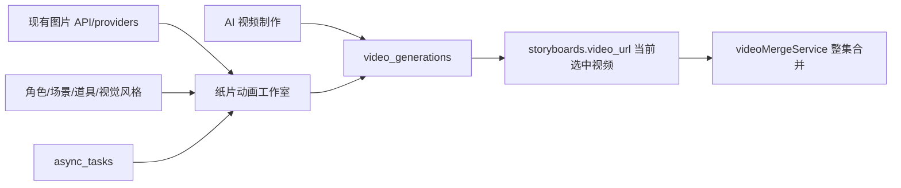
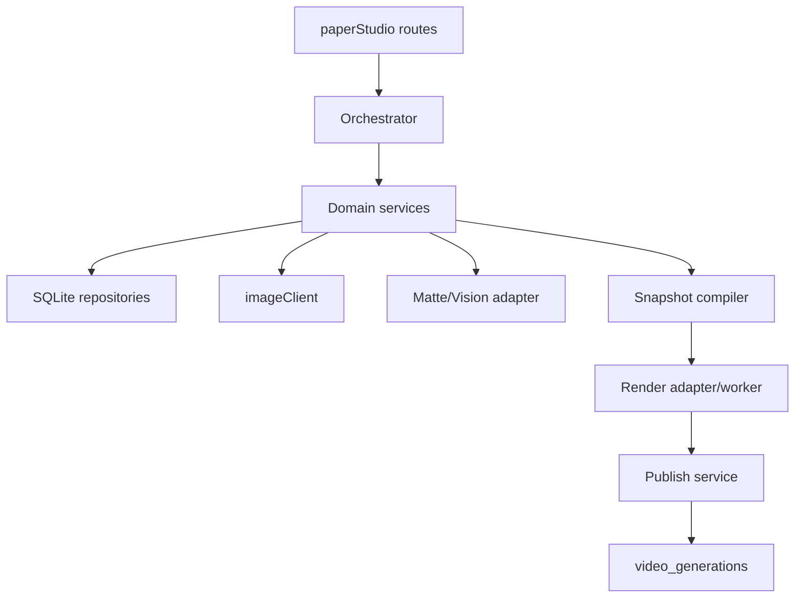
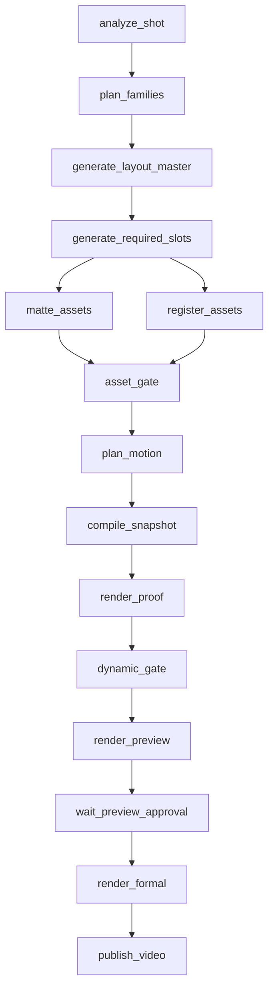

# LocalMiniDrama 独立纸片动画工作室 v3 技术方案

> 文档状态：技术设计基线，可直接拆分开发任务
> 日期：2026-07-24
> 上游产品/生产方案：[纸片动画 v3 全链路预研与实施方案](../plans/2026-07-24-paper-animation-v3-research.md)
> 目标：在不扰动现有 AI 视频制作流程的前提下，新增独立“纸片动画工作室”，跑通图片 API 素材生产、同源组合、动作规划、动态证明、预览、正式渲染和发布
> 硬约束：不依赖 Codex 生图队列；所有生成图片调用 LocalMiniDrama 已配置的图片 API/provider

## 当前实施状态（2026-07-25）

- 产品层只新增一个独立模式：`纸片动画工作室`。独立路由、v3 数据域、Ajv Schema、project/run/shot、Doctor、Pinia 工作台和旧 v2 隔离均已完成。
- 通用生产代码已贯通语义合同、source family/slot、不可变资产版本、项目图片 API、Alpha/边缘处理、递归 Remotion renderer、受限 Motion DSL、动态 proof、预览批准、正式渲染和发布；生产协议中没有船、水面或其他测试剧情专用分支。
- 动作目录、自然语言安全修订、关系层级修订和跨镜身份连续性合同已实现。未知动作、越界关键帧、camera-only 假动作和缺失的前序身份参考会被门禁阻断。
- 持久化 orchestrator 已实现依赖检查、SQLite 独占 lease、心跳、图片/本地/渲染并发队列、失败恢复和启动恢复；自动流程在预览批准点停止，批准后继续正式渲染和发布。
- source revision v4 会覆盖分镜、关联角色/道具/场景、视觉风格、生产档位和 provider 能力签名；每个昂贵步骤前 lazy compare，同时提供分镜、场景、道具和视觉风格即时失效 hook。
- 工作台已提供后台状态轮询、动作修订、连续性/修订计数和脱敏生产报告导出；报告包含 step、图片 attempts、正式素材、snapshot/render hash、proof evidence、发布视频和稳定 report hash。
- 项目导出已包含 `paper_studio_manifest.json` 和通过 hash 校验的正式产物；导入会重映射 ID、保留历史并标为 stale/untrusted，不继承审批信任；项目删除会同步软删除/取消 v3 生产图。
- 本地确定性链路测试已覆盖 `analyze → assets → snapshot → proof → preview → approve → formal → publish`，preview/formal 绑定相同 render hash。当前后端 143 项通过、1 项按设计跳过，前端 8 项通过，生产构建通过。
- 最终真实验收仍未完成：必须先确认用户指定的 4 个真实分镜，再用当前项目图片 API 生成全部正式素材，逐镜通过 proof 和人工预览批准，完成正式渲染、发布与整集合并。fixture、旧 run 或模拟素材都不能替代该验收。

### 模式与测试场景的边界

- 产品层只有一种新增模式：`纸片动画工作室`。
- 任意分镜统一经过“语义合同 → 通用关系/动作原语 → 素材生产 → 组合与动作 → proof → 预览 → 正式渲染”。
- 船、水、桌、门框、对话等词只参与当前镜头的语义分析，不能创建新的产品模式，也不能进入用户手工选择的模板列表。
- 内部 `catalog_key` 仅是可观测性与回归标识，必须使用 `supported-subject`、`registered-boundary-crossing`、`foreground-occlusion`、`multi-subject-interaction` 等能力名称，不允许把具体剧情名作为生产协议。
- “沉船断路”只证明通用原语能组合出船体下沉、水面遮挡和人物状态变化；该 fixture 通过不代表任意分镜完成，最终验收仍要求真实四分镜在同一模式中完成生产。

## 0. 已冻结的架构决策

1. 新模式是剧集级独立工作台，不是 `FilmCreate.vue` 内的一个新 tab，也不是分镜卡片上继续堆按钮。
2. 新前端路由为 `/film/:id/paper-studio`，通过 query 选择 episode/shot；旧 `/film/:id/paper` 仅保留为 v2 legacy 入口。
3. 新后端 API 统一位于 `/api/v1/paper-studio/*`，不继续扩充 `/paper-compositions` v2 API。
4. v3 新建独立生产表和 renderer 目录；v2 `paper_compositions/paper_layers/paper_assets/paper_rigs` 保留只读兼容，不自动迁移。
5. 底层复用现有：
   - `imageClient` 图片 provider 路由；
   - `ai_service_configs`；
   - visual style/version 与 generation context；
   - `async_tasks`；
   - SQLite、项目 storage、FFmpeg/ffprobe；
   - `video_generations` 和整集合并。
6. `async_tasks` 只负责前端可见进度，不作为 v3 工作流真相源；可恢复状态保存在 `paper_job_steps`。
7. 图片 API 结果先生成不可变 candidate/version，不直接覆盖正式纸片资产。
8. 每个镜头使用 source family、递归 composition tree、受限 Motion DSL 和 proof target。
9. preview 与 formal render 消费同一个不可变 snapshot；只允许 scale、codec 和 debug overlay 不同。
10. 第一阶段不在 Vue 中嵌入 React/Remotion Player。工作台播放已渲染低清 MP4、proof 图和 debug 图，减少框架混合与预览/成片漂移。
11. 当前 Remotion 4 renderer 继续使用，但通过 `PaperRenderAdapter` 隔离，便于后续处理许可证或替换渲染器。
12. 正式纸片动作不得退化为相机推拉、整体漂浮或呼吸微动。

## 1. 当前项目基线与需要切开的边界

### 1.1 当前前端结构

当前已有：

```text
/film/:id                → FilmCreate.vue（约 1.2 万行）
/film/:id/canvas         → DramaCanvas.vue
/film/:id/paper          → PaperLayerAnimation.vue（27 行壳）
                           └─ PaperLayerEditor.vue（v2 扁平图层编辑器）
```

`FilmCreate.vue` 在分镜视频占位区同时放置：

- “生成分镜视频”；
- “纸片分层”；
- 首尾帧/分镜图动作；
- 视频轮询、错误和删除。

这会把两套完全不同的生产状态混在一张分镜卡片里。v3 完成后：

- `FilmCreate.vue` 继续只负责 AI 视频制作；
- DramaDetail 和 FilmCreate 顶部提供“纸片动画工作室”入口；
- 分镜卡片只展示已发布纸片视频的来源标签，不承载素材、动作、mask 或 proof 编辑；
- 若需要深链，可在分镜更多菜单提供“在纸片工作室打开”，而不是主按钮。

### 1.2 当前后端可复用能力

| 能力 | 当前入口 | v3 用法 |
|---|---|---|
| 图片 API 多 provider | `imageClient.callImageApi()` | 保持唯一 provider 调用层 |
| 图片异步记录 | `image_generations` | 增加 `generation_kind` 和纸片 version 关联 |
| 视觉风格 | `visualStyleVersionService` | 每次 run 冻结 style id/signature |
| 生成上下文 | `generationContextService` | `entity_type=paper_asset_slot` |
| 任务进度 | `taskService` / `async_tasks` | UI 轮询外壳 |
| 项目路径 | `storageLayout` | 新增 `paper-studio/` 子树 |
| 本地渲染 | v2 Remotion worker | 新建 v3 worker，不改 v2 snapshot |
| 音频探测 | `paperAudioTimingService` / ffprobe | 抽取通用 cue/timing service |
| 视频发布 | `video_generations` | `generation_kind=paper_studio` |
| 整集合并 | `videoMergeService` | 无需认识 renderer 内部 |
| 桌面离线运行时 | `desktop/remotion-runtime` | 扩展 doctor 与 v3 entrypoint 检查 |

### 1.3 当前后端不可直接复用的部分

- `paperLayerPlannerService`：固定 torso/head/arm 和扁平 layer；
- `paperValidationService`：允许 camera-only motion coverage；
- `paperSpecCompiler`：只支持 schema v2 和 layers/rigs；
- `paperRenderService`：proof/preview 会重新 compile，且 preview 输出位于临时目录；
- `videoService.finalizeLocalVideoGeneration()`：强绑定 `generation_kind=paper_layered` 和 `paper_compositions`；
- `paperMatteService`：RGB 色键只能作为 debug fallback；
- `taskService.failOrphanedAsyncTasksOnStartup()`：会把所有内存任务统一失败，不足以恢复多步骤生产。

## 2. GitHub 项目调研与借鉴边界

### 2.1 paper-collage-video

借鉴：

- source family；
- `asset | group` 递归组合树；
- `free | supported-subject | registered-environment`；
- 支撑前后槽位、contact zone、occlusion zone；
- 注册环境 boundary/mask；
- 资产质量与组合质量分离；
- proof target 和 debug evidence；
- cue 作为动作/音效唯一时间源。

不照搬：

- Codex plugin 的交互和 provider 状态机；
- 文件型 project.json 作为主数据库；
- 人工命令行 checkpoint；
- 面向一次性视频项目的审批流程。

LocalMiniDrama 将这些合同持久化到 SQLite，并由产品内 orchestrator 执行。

### 2.2 OpenCut

可借鉴：

- 编辑器状态与 compositor 分离；
- 时间使用整数单位，避免浮点累计误差；
- track role 明确区分视觉主层、overlay、audio；
- command/diff 思路利于可撤销和可测试更新；
- mask、preview、export 分属不同子系统。

不采用：

- Rust/wgpu/WASM compositor；
- 通用 NLE 多轨时间线；
- 120,000 tick 时间基。

LocalMiniDrama 固定镜头 fps，直接使用整数 frame；工作台只展示 semantic beat/action，不做 CapCut 克隆。

### 2.3 Revideo / Motion Canvas

可借鉴：

- template 输入和 renderer 分离；
- preview/player 与 headless render 使用同一项目数据；
- renderer 可部署为调用接口而不是人工点击导出。

不采用：

- generator-based TypeScript animation API；
- 新增第二套视频框架。

当前 Remotion 已经打包进入 Electron，替换框架不能解决 source family、关系和动作规划问题。

### 2.4 OpenVideo Editor（原 React Video Editor）/ 通用时间轴项目

只借鉴资产栏、预览区、时间线、属性区的 UI 信息架构。该项目当前采用双许可证，超过其免费条件的组织需要 company license，因此不复制源码、不引入依赖。纸片工作室也不需要自由拖拽任意视频、音频和滤镜。

## 3. 产品与技术边界

### 3.1 独立工作台入口

```text
剧集管理
├── 进入 AI 视频制作
├── 进入纸片动画工作室
└── 进入画布模式
```

路由：

```text
/film/:dramaId/paper-studio
  ?episode=:episodeId
  &shot=:storyboardId
  &run=:runId
```

规则：

- 没有 episode：进入项目总览；
- 有 episode：打开该集最近一次未完成 run；
- 有 shot：聚焦指定分镜；
- 有 run：打开历史生产 run，只读或继续恢复。

### 3.2 与现有制作流程共享什么



共享的是稳定基础设施和发布出口；不共享 UI 表单、production state、动作 schema 和质量门。

### 3.3 v2 兼容策略

- `/film/:id/paper` 暂时保留；
- v2 表、API、renderer 不删除；
- v3 不读取 v2 composition 作为正式输入；
- 可提供“使用旧视频作为参考”，但不能把旧 layer 自动升级为 v3 合同；
- v3 上线稳定后，旧路由默认跳转新工作室并显示 legacy 历史入口；
- `storyboards.video_render_mode` 保持 v2 legacy 字段，v3 不依赖、不写入。

## 4. 前端技术设计

### 4.1 新目录

```text
frontweb/src/
├── api/
│   └── paperStudio.js
├── stores/
│   └── paperStudioStore.js
├── views/
│   └── PaperStudio.vue
├── components/paper-studio/
│   ├── PaperStudioHeader.vue
│   ├── PaperEpisodeRail.vue
│   ├── PaperShotRail.vue
│   ├── PaperRunOverview.vue
│   ├── PaperPlanStep.vue
│   ├── PaperFamilyBoard.vue
│   ├── PaperAssetSlotCard.vue
│   ├── PaperMotionStep.vue
│   ├── PaperBeatTimeline.vue
│   ├── PaperEvidenceStep.vue
│   ├── PaperPreviewPlayer.vue
│   ├── PaperIssueDrawer.vue
│   ├── PaperPublishPanel.vue
│   └── PaperStudioDoctor.vue
└── utils/paper-studio/
    ├── state.js
    ├── issues.js
    ├── timeline.js
    └── media.js
```

保持纯 JavaScript，不引入 TypeScript。

### 4.2 页面布局

```text
┌──────────────────────────────────────────────────────────────┐
│ 返回剧集  纸片动画工作室  集数  档位  运行状态  Doctor/设置   │
├────────────┬─────────────────────────────────┬───────────────┤
│ 分镜列表   │ 当前步骤主区域                  │ 问题/证据     │
│ #1 ✓       │ 计划 / 素材 family / 动作 /    │ blocking      │
│ #2 生成中  │ proof / preview                 │ warning       │
│ #3 失败    │                                 │ retry scope   │
│ #4 待开始  │                                 │ provenance    │
├────────────┴─────────────────────────────────┴───────────────┤
│ semantic beat/action timeline（只读为主，允许预设级修改）     │
└──────────────────────────────────────────────────────────────┘
```

### 4.3 工作台步骤

1. `overview`：选择集、分镜范围、档位、provider、预算；
2. `plan`：审阅镜头动作、组合模式、素材 family；
3. `assets`：查看 family/slot、API 生成、自动处理、失败局部重试；
4. `motion`：查看 beat、cue、action preset 和动作 proof；
5. `evidence`：查看 full/crop/debug/metrics；
6. `preview`：播放同 snapshot 低清 MP4并批准；
7. `publish`：正式渲染并发布到分镜。

步骤来自后端 `next_action`，前端不自行推断状态机。

### 4.4 Pinia store

`paperStudioStore` 只缓存界面状态：

```js
{
  project,
  activeRun,
  shots,
  activeShotId,
  activeStep,
  families,
  evidence,
  tasks,
  loading,
  lastError
}
```

规则：

- 后端是状态真相源；
- mutation 成功后以返回的新 version 替换本地实体；
- 不把大 snapshot、图片二进制和完整 proof report 放 Pinia；
- 页面刷新通过 run/shot API 恢复；
- 使用 `expected_version` 处理并发修改；
- task polling 可复用 `taskAPI`，但不扩展现有 `generationTaskStore` 的大量 AI 制作分支。

建议新增轻量 `usePaperTaskPoller`，只根据 task id 刷新 run/shot，不映射角色、场景等资源类型。

### 4.5 不嵌入 Remotion Player

阶段 1–4 使用：

- `<video>` 播放持久化 preview MP4；
- `` 展示 proof/full/crop/debug；
- SVG 绘制 semantic timeline；
- 后端生成低清动作 proof。

原因：

- 当前前端是 Vue，Remotion renderer 是 React；
- 嵌入 Player 会新增 React island 和两套状态同步；
- 浏览器实时预览和服务器正式渲染容易使用不同资源生命周期；
- 用户不需要逐像素拖拽坐标。

如未来需要近实时预演，可新增只读 iframe，输入仍必须是 snapshot，不直接读取 Pinia 草稿。

## 5. 后端目录与模块

```text
backend-node/src/
├── routes/
│   └── paperStudio.js
├── services/paper-studio/
│   ├── paperStudioProjectService.js
│   ├── paperStudioRunService.js
│   ├── paperStudioShotService.js
│   ├── paperOrchestratorService.js
│   ├── paperRecoveryService.js
│   ├── paperSourceRevisionService.js
│   ├── paperShotAnalyzerService.js
│   ├── paperSemanticContractService.js
│   ├── paperSourceFamilyService.js
│   ├── paperPromptCompiler.js
│   ├── paperImageGenerationService.js
│   ├── paperAssetVersionService.js
│   ├── paperMatteAdapterService.js
│   ├── paperRegistrationService.js
│   ├── paperCompositionGraphService.js
│   ├── paperMotionPlannerService.js
│   ├── paperMotionCompilerService.js
│   ├── paperCueService.js
│   ├── paperAssetGateService.js
│   ├── paperCompositionGateService.js
│   ├── paperDynamicGateService.js
│   ├── paperSnapshotService.js
│   ├── paperProofService.js
│   ├── paperStudioRenderService.js
│   ├── paperPublishService.js
│   ├── paperStudioDoctorService.js
│   └── paperStudioUtils.js
├── paper-studio-renderer/
│   ├── Root.jsx
│   ├── PaperStudioComposition.jsx
│   ├── RecursiveNode.jsx
│   ├── RegisteredEnvironment.jsx
│   ├── SupportedSubject.jsx
│   ├── AssetNode.jsx
│   ├── ProceduralWater.jsx
│   ├── DebugOverlay.jsx
│   └── motion/
│       ├── compileTrack.js
│       ├── resolveTrack.js
│       └── presets.js
└── paper-studio-schema/
    ├── semantic-contract.schema.json
    ├── source-family.schema.json
    ├── composition-node.schema.json
    ├── motion-plan.schema.json
    ├── proof-target.schema.json
    └── render-snapshot-v3.schema.json

backend-node/scripts/
└── render-paper-studio.mjs
```

### 5.1 模块依赖方向



renderer worker 禁止依赖数据库、Express、provider 或业务 service；只读取冻结 snapshot 和 staging public 目录。

### 5.2 JSON Schema 校验

现有 schema 文件没有在运行时真正执行。v3 建议新增 `ajv@8`：

- API 入参先校验；
- LLM/文本模型计划输出校验；
- snapshot compile 后校验；
- worker 启动前再次校验；
- schema 错误统一返回 `{code,path,message}`。

`Ajv` 仅在 backend 使用，renderer 不重复引入复杂业务校验。所有 snapshot 在入 worker 前已经通过。

## 6. 数据库设计

### 6.1 迁移策略

新增：

```text
backend-node/migrations/31_paper_studio_v3.sql
```

同时在 `migrate.js` 新增 `ensurePaperStudioTables()`，只重放 migration 31 的 `CREATE TABLE/INDEX`。新增旧表字段仍进入 `ensureAllColumns()`。

原因：当前桌面旧数据库可能漏跑迁移，v3 必须和 v2 一样自愈。

### 6.2 `paper_studio_projects`

一个 drama 一条纸片工作室配置：

```sql
CREATE TABLE IF NOT EXISTS paper_studio_projects (
  id INTEGER PRIMARY KEY AUTOINCREMENT,
  drama_id INTEGER NOT NULL UNIQUE,
  schema_version INTEGER NOT NULL DEFAULT 3,
  default_tier TEXT NOT NULL DEFAULT 'balanced',
  config_json TEXT NOT NULL DEFAULT '{}',
  status TEXT NOT NULL DEFAULT 'active',
  version INTEGER NOT NULL DEFAULT 1,
  created_at TEXT NOT NULL,
  updated_at TEXT NOT NULL,
  deleted_at TEXT
);
```

`config_json` 保存纸片工作室默认 provider、并发、纸张风格和 proof 策略，不保存 API key。

### 6.3 `paper_studio_runs`

一次 run 表示某一集或一组分镜的一次生产版本：

```sql
CREATE TABLE IF NOT EXISTS paper_studio_runs (
  id INTEGER PRIMARY KEY AUTOINCREMENT,
  project_id INTEGER NOT NULL,
  drama_id INTEGER NOT NULL,
  episode_id INTEGER NOT NULL,
  run_number INTEGER NOT NULL,
  request_id TEXT,
  selection_json TEXT NOT NULL DEFAULT '{}',
  quality_tier TEXT NOT NULL DEFAULT 'balanced',
  style_version_id INTEGER,
  style_signature TEXT,
  source_revision_hash TEXT,
  budget_json TEXT NOT NULL DEFAULT '{}',
  status TEXT NOT NULL DEFAULT 'draft',
  progress INTEGER NOT NULL DEFAULT 0,
  last_error_json TEXT NOT NULL DEFAULT '{}',
  version INTEGER NOT NULL DEFAULT 1,
  created_at TEXT NOT NULL,
  updated_at TEXT NOT NULL,
  completed_at TEXT,
  deleted_at TEXT,
  UNIQUE(project_id, episode_id, run_number),
  UNIQUE(project_id, request_id)
);
```

允许同一集有多个历史 run。默认打开最近一个未 delivered 的 run；历史 delivered run 只读。

### 6.4 `paper_studio_shots`

```sql
CREATE TABLE IF NOT EXISTS paper_studio_shots (
  id INTEGER PRIMARY KEY AUTOINCREMENT,
  run_id INTEGER NOT NULL,
  drama_id INTEGER NOT NULL,
  episode_id INTEGER NOT NULL,
  storyboard_id INTEGER NOT NULL,
  shot_index INTEGER NOT NULL,
  source_revision_hash TEXT,
  semantic_contract_json TEXT NOT NULL DEFAULT '{}',
  plan_summary_json TEXT NOT NULL DEFAULT '{}',
  status TEXT NOT NULL DEFAULT 'pending',
  current_snapshot_id INTEGER,
  approved_snapshot_id INTEGER,
  published_video_generation_id INTEGER,
  last_error_json TEXT NOT NULL DEFAULT '{}',
  version INTEGER NOT NULL DEFAULT 1,
  created_at TEXT NOT NULL,
  updated_at TEXT NOT NULL,
  deleted_at TEXT,
  UNIQUE(run_id, storyboard_id)
);
```

### 6.5 `paper_source_families`

```sql
CREATE TABLE IF NOT EXISTS paper_source_families (
  id INTEGER PRIMARY KEY AUTOINCREMENT,
  shot_id INTEGER NOT NULL,
  family_key TEXT NOT NULL,
  pattern TEXT NOT NULL,
  registration_canvas_json TEXT NOT NULL DEFAULT '{}',
  contract_json TEXT NOT NULL DEFAULT '{}',
  layout_master_version_id INTEGER,
  context_snapshot_id TEXT,
  provider_signature TEXT,
  status TEXT NOT NULL DEFAULT 'planned',
  version INTEGER NOT NULL DEFAULT 1,
  created_at TEXT NOT NULL,
  updated_at TEXT NOT NULL,
  deleted_at TEXT,
  UNIQUE(shot_id, family_key)
);
```

`pattern` 只允许：

```text
free | supported-subject | registered-environment
```

### 6.6 `paper_asset_slots`

slot 是逻辑需求，不是文件：

```sql
CREATE TABLE IF NOT EXISTS paper_asset_slots (
  id INTEGER PRIMARY KEY AUTOINCREMENT,
  family_id INTEGER NOT NULL,
  slot_key TEXT NOT NULL,
  asset_type TEXT NOT NULL,
  generation_purpose TEXT NOT NULL,
  constraints_json TEXT NOT NULL DEFAULT '{}',
  required_for_gate INTEGER NOT NULL DEFAULT 1,
  current_version_id INTEGER,
  status TEXT NOT NULL DEFAULT 'planned',
  version INTEGER NOT NULL DEFAULT 1,
  created_at TEXT NOT NULL,
  updated_at TEXT NOT NULL,
  deleted_at TEXT,
  UNIQUE(family_id, slot_key)
);
```

### 6.7 `paper_asset_versions`

文件和 provenance 不可变：

```sql
CREATE TABLE IF NOT EXISTS paper_asset_versions (
  id INTEGER PRIMARY KEY AUTOINCREMENT,
  slot_id INTEGER NOT NULL,
  source_family_id INTEGER NOT NULL,
  image_generation_id INTEGER,
  parent_version_id INTEGER,
  attempt_index INTEGER NOT NULL DEFAULT 1,
  derivation_kind TEXT NOT NULL,
  source_local_path TEXT,
  alpha_local_path TEXT,
  mask_local_path TEXT,
  source_hash TEXT,
  alpha_hash TEXT,
  mask_hash TEXT,
  processing_json TEXT NOT NULL DEFAULT '{}',
  registration_json TEXT NOT NULL DEFAULT '{}',
  provenance_json TEXT NOT NULL DEFAULT '{}',
  quality_report_json TEXT NOT NULL DEFAULT '{}',
  status TEXT NOT NULL DEFAULT 'candidate',
  created_at TEXT NOT NULL,
  accepted_at TEXT,
  rejected_at TEXT
);
```

只允许状态流转：

```text
generating → candidate → processing → pass | fail → accepted | rejected
```

accepted 后禁止修改路径、hash、processing 和 provenance。需要修复时创建新 version。

### 6.8 `paper_composition_nodes`

```sql
CREATE TABLE IF NOT EXISTS paper_composition_nodes (
  id INTEGER PRIMARY KEY AUTOINCREMENT,
  shot_id INTEGER NOT NULL,
  node_key TEXT NOT NULL,
  parent_node_id INTEGER,
  node_kind TEXT NOT NULL,
  pattern TEXT,
  slot TEXT,
  asset_version_id INTEGER,
  transform_json TEXT NOT NULL DEFAULT '{}',
  relation_json TEXT NOT NULL DEFAULT '{}',
  clip_json TEXT NOT NULL DEFAULT '{}',
  local_z INTEGER NOT NULL DEFAULT 0,
  status TEXT NOT NULL DEFAULT 'draft',
  version INTEGER NOT NULL DEFAULT 1,
  created_at TEXT NOT NULL,
  updated_at TEXT NOT NULL,
  deleted_at TEXT,
  UNIQUE(shot_id, node_key)
);
```

### 6.9 `paper_motion_plans`

```sql
CREATE TABLE IF NOT EXISTS paper_motion_plans (
  id INTEGER PRIMARY KEY AUTOINCREMENT,
  shot_id INTEGER NOT NULL UNIQUE,
  schema_version INTEGER NOT NULL DEFAULT 1,
  semantic_contract_hash TEXT NOT NULL,
  timing_hash TEXT,
  plan_json TEXT NOT NULL,
  compiled_tracks_json TEXT NOT NULL DEFAULT '{}',
  status TEXT NOT NULL DEFAULT 'draft',
  version INTEGER NOT NULL DEFAULT 1,
  created_at TEXT NOT NULL,
  updated_at TEXT NOT NULL
);
```

保留 plan intent 与 compiled tracks 两层，compiler 升级时不丢创意意图。

### 6.10 `paper_render_snapshots`

```sql
CREATE TABLE IF NOT EXISTS paper_render_snapshots (
  id INTEGER PRIMARY KEY AUTOINCREMENT,
  shot_id INTEGER NOT NULL,
  schema_version INTEGER NOT NULL DEFAULT 3,
  renderer_version TEXT NOT NULL,
  source_revision_hash TEXT NOT NULL,
  timing_hash TEXT,
  snapshot_json TEXT NOT NULL,
  snapshot_hash TEXT NOT NULL,
  render_hash TEXT NOT NULL,
  local_path TEXT,
  status TEXT NOT NULL DEFAULT 'compiled',
  approved_at TEXT,
  created_at TEXT NOT NULL,
  UNIQUE(shot_id, render_hash)
);
```

snapshot 一经创建不可修改。批准只写 `approved_at/status`。

### 6.11 `paper_proof_runs` 与 `paper_proof_evidence`

```sql
CREATE TABLE IF NOT EXISTS paper_proof_runs (
  id INTEGER PRIMARY KEY AUTOINCREMENT,
  shot_id INTEGER NOT NULL,
  snapshot_id INTEGER NOT NULL,
  run_kind TEXT NOT NULL,
  scale REAL NOT NULL DEFAULT 0.5,
  status TEXT NOT NULL DEFAULT 'pending',
  preview_local_path TEXT,
  report_json TEXT NOT NULL DEFAULT '{}',
  proof_hash TEXT,
  created_at TEXT NOT NULL,
  completed_at TEXT
);

CREATE TABLE IF NOT EXISTS paper_proof_evidence (
  id INTEGER PRIMARY KEY AUTOINCREMENT,
  proof_run_id INTEGER NOT NULL,
  target_key TEXT NOT NULL,
  frame INTEGER NOT NULL,
  full_local_path TEXT,
  crop_local_path TEXT,
  debug_local_path TEXT,
  metrics_json TEXT NOT NULL DEFAULT '{}',
  assertion_json TEXT NOT NULL DEFAULT '{}',
  status TEXT NOT NULL DEFAULT 'generated',
  created_at TEXT NOT NULL,
  UNIQUE(proof_run_id, target_key, frame)
);
```

`run_kind`：`motion_proof | preview | formal_preflight`。

### 6.12 `paper_job_steps`

这是工作流真相源：

```sql
CREATE TABLE IF NOT EXISTS paper_job_steps (
  id INTEGER PRIMARY KEY AUTOINCREMENT,
  run_id INTEGER NOT NULL,
  shot_id INTEGER,
  step_key TEXT NOT NULL,
  input_hash TEXT NOT NULL,
  depends_on_json TEXT NOT NULL DEFAULT '[]',
  status TEXT NOT NULL DEFAULT 'queued',
  attempt INTEGER NOT NULL DEFAULT 1,
  max_attempts INTEGER NOT NULL DEFAULT 2,
  async_task_id TEXT,
  lease_owner TEXT,
  lease_expires_at TEXT,
  result_json TEXT NOT NULL DEFAULT '{}',
  error_json TEXT NOT NULL DEFAULT '{}',
  started_at TEXT,
  completed_at TEXT,
  created_at TEXT NOT NULL,
  updated_at TEXT NOT NULL
);
```

SQLite 的 `UNIQUE` 会允许多行 `NULL`，因此幂等约束使用表达式唯一索引，确保 shot-level 和 `shot_id=NULL` 的 run-level step 都不会重复调度：

```sql
CREATE UNIQUE INDEX IF NOT EXISTS idx_paper_job_steps_idempotency
ON paper_job_steps (
  run_id,
  COALESCE(shot_id, 0),
  step_key,
  input_hash,
  attempt
);
```

状态：

```text
queued | ready | running | waiting_external | completed |
failed_retryable | failed_terminal | cancelled | skipped | unknown
```

### 6.13 扩展现有表

`image_generations` 新增：

```text
generation_kind TEXT DEFAULT 'standard'
paper_asset_version_id INTEGER
generation_purpose TEXT
request_fingerprint TEXT
provider_task_id TEXT
```

`video_generations` 新增：

```text
paper_studio_shot_id INTEGER
paper_snapshot_id INTEGER
```

v3 视频约定：

```text
generation_kind = paper_studio
provider = local_remotion
model = paper-studio-v3
paper_composition_id = NULL
paper_studio_shot_id = <shot id>
```

### 6.14 索引

至少增加：

```text
paper_studio_runs(project_id, episode_id, status, updated_at)
paper_studio_shots(run_id, status, shot_index)
paper_source_families(shot_id, status)
paper_asset_slots(family_id, status)
paper_asset_versions(slot_id, status, created_at)
paper_job_steps(run_id, status, updated_at)
paper_render_snapshots(shot_id, created_at)
paper_proof_runs(snapshot_id, status)
image_generations(paper_asset_version_id, status)
video_generations(paper_studio_shot_id, status)
```

项目当前未启用 SQLite foreign key，v3 不单独改变全库语义；所有 service 必须做 drama/run/shot ownership 检查，并用 prepared statements。

## 7. 状态机

### 7.1 Run 状态

```text
draft
→ analyzing
→ plan_review
→ assets_generating
→ assets_processing
→ motion_planning
→ proofing
→ preview_ready
→ approved
→ rendering
→ delivered
```

旁路：

```text
partial
failed
cancelled
stale
```

run 由所有 selected shot 聚合：部分镜头失败时为 `partial`，不强行把整集标成 `failed`。

### 7.2 Shot 状态

```text
pending
→ analyzed
→ plan_confirmed
→ asset_pending
→ asset_ready
→ motion_ready
→ proof_ready
→ preview_ready
→ approved
→ rendered
→ published
```

失败：

```text
asset_failed
motion_failed
proof_failed
render_failed
stale
cancelled
```

### 7.3 next_action

后端每次返回：

```json
{
  "status": "asset_failed",
  "next_action": {
    "type": "retry_asset_slot",
    "target_id": 781,
    "label": "重试 boat_front",
    "blocking": true
  }
}
```

前端只展示 next_action，不复制状态转换规则。

## 8. API 设计

### 8.1 Project / Run

```text
GET  /paper-studio/projects/:drama_id
POST /paper-studio/projects/:drama_id
PUT  /paper-studio/projects/:id

GET  /paper-studio/runs?project_id=&episode_id=
POST /paper-studio/runs
GET  /paper-studio/runs/:id
POST /paper-studio/runs/:id/analyze
POST /paper-studio/runs/:id/confirm-plan
POST /paper-studio/runs/:id/start
POST /paper-studio/runs/:id/cancel
POST /paper-studio/runs/:id/recover
```

创建 run：

```json
{
  "project_id": 12,
  "episode_id": 8,
  "storyboard_ids": [101, 102, 103, 104],
  "quality_tier": "balanced",
  "image_provider_config_id": 5,
  "budget": {"max_images": 24, "max_auto_retries_per_slot": 2}
}
```

### 8.2 Shot

```text
GET  /paper-studio/shots/:id
PUT  /paper-studio/shots/:id/plan
POST /paper-studio/shots/:id/generate-assets
POST /paper-studio/shots/:id/plan-motion
POST /paper-studio/shots/:id/proof
POST /paper-studio/shots/:id/preview
POST /paper-studio/shots/:id/approve-preview
POST /paper-studio/shots/:id/render
POST /paper-studio/shots/:id/publish
POST /paper-studio/shots/:id/revise
GET  /paper-studio/shots/:id/evidence
```

### 8.3 Family / Asset

```text
GET  /paper-studio/shots/:id/families
GET  /paper-studio/families/:id
POST /paper-studio/families/:id/rebuild

GET  /paper-studio/asset-slots/:id
POST /paper-studio/asset-slots/:id/generate
POST /paper-studio/asset-slots/:id/reprocess
POST /paper-studio/asset-slots/:id/retry
POST /paper-studio/asset-versions/:id/accept
POST /paper-studio/asset-versions/:id/reject
```

accept/reject 仅在专家诊断 fallback 使用；正常流程由 asset gate 自动 accept。

### 8.4 Task / Doctor

```text
GET  /paper-studio/runs/:id/steps
GET  /paper-studio/doctor
POST /paper-studio/doctor/benchmark-matte
POST /paper-studio/doctor/render-fixture
```

### 8.5 幂等与乐观锁

所有 mutation body 包含：

```json
{
  "expected_version": 3,
  "request_id": "uuid-from-client"
}
```

规则：

- version 不一致返回 `409 PAPER_STUDIO_VERSION_CONFLICT`；
- 相同 request id 和相同 input hash 返回已有 task/result；
- 相同 render hash 复用已有正式视频；
- 图片生成请求只在已有 accepted version 或明确 provider idempotency 支持时自动去重；
- provider 调用中进程崩溃且无法确认结果时标记 `unknown`，不自动再次扣费。

## 9. Orchestrator 与恢复

### 9.1 为什么不能只用 setImmediate

当前图片和纸片渲染主要使用进程内 `setImmediate()`；应用重启后任务丢失，`taskService` 会把 pending/processing 统一标失败。纸片工作室包含多步骤、付费 API 和可复用产物，必须拥有持久化 step graph。

### 9.2 Step DAG

单镜头典型 DAG：



### 9.3 调度器

`paperOrchestratorService`：

- 查询 `queued/ready/failed_retryable` steps；
- 检查依赖是否 completed；
- 通过 SQLite transaction 获取 lease；
- 根据 step 类型进入 image/matte/render 队列；
- 更新 async task 进度；
- step 完成后唤醒下游；
- run/shot 状态由 step 聚合。

进程内并发：

```text
text/analyze: 1
image generation: min(provider.max_parallel, config.max_image_concurrency)，默认 2
matte: 1
proof/render: 1
```

### 9.4 启动恢复

应用启动顺序修改为：

```text
run migrations
apply vendor config
fail legacy orphan tasks
resume provider video polls
paperRecoveryService.reconcile()
paperOrchestratorService.start()
```

reconcile 规则：

- `running` lease 过期：根据 step 类型变为 ready/unknown；
- 纯本地 deterministic step：直接重新排队；
- render 临时目录存在但未发布：验证 manifest/hash 后继续 publish，否则重渲染；
- image_generation 已 completed：导入 candidate 后继续；
- provider_task_id 存在：恢复轮询；
- provider request 已发出但无 task id/结果：标 `unknown`，等待用户确认重试；
- approved snapshot 永不重新 compile。

## 10. 图片 API 集成

### 10.1 Provider capability

复用 `ai_service_configs.settings`：

```json
{
  "paper_capabilities": {
    "text_to_image": true,
    "reference_images": true,
    "max_references": 6,
    "image_edit": false,
    "masked_edit": false,
    "transparent_output": false,
    "async_job": true,
    "idempotency_key": false,
    "max_parallel": 2
  }
}
```

不根据 provider/model 名称静默猜测。可在 AI 配置页提供默认能力模板，但保存时明确展示。

### 10.2 paperPromptCompiler

输入：

```text
active visual style
storyboard snapshot
scene/character/prop snapshots
family contract
slot constraints
layout master
accepted sibling versions
provider capability
quality tier
```

输出：

```json
{
  "compiled_prompt": "...",
  "compiled_negative_prompt": "...",
  "reference_images": [],
  "reference_labels": [],
  "size": "1920x1080",
  "quality": "high",
  "request_fingerprint": "sha256:...",
  "source_snapshot": {},
  "diagnostics": []
}
```

然后调用 `generationContextService.createSnapshot()`：

```text
entity_type = paper_asset_slot
entity_id = slot.id
frame_type = generation_purpose
```

### 10.3 与 imageService 的关系

阶段 1 不重构现有普通生图路径，新增 `paperImageGenerationService`：

1. 创建 `paper_asset_versions(status=generating)`；
2. 创建 `image_generations(generation_kind=paper_studio)`；
3. 调用 `imageClient.callImageApi()`；
4. 使用现有 download/storage 工具落盘；
5. 回写 image generation 和 asset version；
6. 触发 processing step。

只复用 provider client，不复用会自动更新 character/scene/prop 主图的完成逻辑。

完成垂直切片并有测试后，可再抽取通用 `imageGenerationRunnerService`，供普通生图和纸片生图共享。

### 10.4 async provider refactor

为了重启恢复，逐步把当前内部 submit+poll 合并函数拆为：

```js
submitImageJob(request) -> {
  mode: 'immediate' | 'async',
  providerTaskId,
  immediateResult
}

pollImageJob(providerTaskId) -> {
  status,
  imageUrl,
  error
}
```

旧 `callImageApi()` 继续作为兼容 wrapper。不能一次性重写所有 provider；先覆盖用户当前启用的图片 provider，再扩其他协议。

### 10.5 生成顺序

一个 family：

```text
layout master
→ clean plate / support master
→ required member slots（可并行）
→ optional detail/effect slots
→ matte/register
→ family gate
```

耦合成员不能绕过 master 独立生成。

## 11. Matte 与 Vision

### 11.1 Adapter

```js
class PaperMatteAdapter {
  async health() {}
  async matte(inputPath, options) {}
  async segment(inputPath, prompts, options) {}
  async benchmark() {}
}
```

实现顺序：

1. `native_alpha`：provider 已返回有效 Alpha；
2. `onnx_node`：Node ONNX Runtime + 审核过的模型；
3. `rembg_http`：可选外部/本地 sidecar；
4. `chroma_key`：只用于 debug 和低风险纯色资产，不允许 balanced/formal 默认通过。

### 11.2 ONNX 技术 spike

项目当前 Node 要求 `>=18`，Electron 28 使用 Node 18 系列。最新版 `onnxruntime-node` 声明支持 Node 16+、Electron 15+，但推荐 Node 20+、Electron 28+；这只说明版本范围，不保证 native binary 在当前打包、签名和目标平台中可用。实施前必须在以下矩阵 benchmark：

```text
macOS arm64 + Electron 28
macOS x64 + Electron 28
Windows x64 + Electron 28
backend plain Node 18
```

验证：

- 是否有匹配预构建 binary/N-API；
- 是否需要 electron-rebuild；
- 1024/2048 图像耗时、峰值内存；
- 模型体积；
- 打包后路径和 code signing；
- 商业可用的代码和权重许可证。

Spike 未通过时不把 ONNX native module塞入主安装包，改用 `rembg_http` 或 provider native alpha。

### 11.3 Sharp 后处理

`sharp` 继续负责：

- trim/bbox；
- alpha erode/dilate；
- feather；
- 去色溢；
- 暗/亮背景 stress 图；
- hash；
- ROI 像素差异；
- mask intersection。

不再根据 RGB 距离决定复杂人物主轮廓。

### 11.4 模型和许可证清单

新增 `THIRD_PARTY_NOTICES.md` 或现有 notices 条目，记录：

- inference runtime；
- model name/version/source；
- weight license；
- checksum；
- 下载/打包方式；
- 商业使用限制。

代码 MIT 不代表模型权重一定可以商用，二者必须分别审核。

## 12. Source revision 与 stale

### 12.1 source revision hash

每个 shot 在进入昂贵步骤前计算：

```text
sha256(canonical({
  storyboard semantic fields,
  related scene,
  related characters and props,
  active visual style signature,
  reference image hashes,
  audio file hashes,
  quality tier,
  provider capability signature
}))
```

不依赖所有业务 update 路径都主动触发 invalidation；每次读取/继续生产时做 lazy compare。

### 12.2 失效矩阵

| 变化 | 可复用 | 必须失效 |
|---|---|---|
| 仅对白音频变化 | 已接受视觉资产 | cue、motion compile、proof、preview、formal |
| 分镜动作变化 | identity/场景 family 视情况 | semantic contract、动作状态图、motion、proof/render |
| 角色主图变化 | clean environment | 角色相关 asset versions、组合 proof/render |
| 场景变化 | drama 级角色 identity | environment family、registration、全部 proof/render |
| style signature 变化 | 无正式视觉资产 | 全部生成资产、proof/render |
| matte model 变化 | source candidate | alpha version、registration、proof/render |
| renderer version 变化 | accepted assets/motion intent | snapshot、proof、preview/formal |
| proof 规则变化 | assets/snapshot 可重编 | proof approval、formal approval |

stale 不删除历史文件，创建新 version/snapshot。

### 12.3 即时 invalidation hook

作为 UX 增强，在以下位置调用 `paperSourceRevisionService.markAffectedStale()`：

- `storyboardService.updateStoryboard()`；
- visual style activate；
- character/scene/prop 主图应用；
- TTS 回写；
- storyboard duration/关联实体变化。

即使 hook 遗漏，lazy hash 仍保证正式渲染前发现变化。

## 13. 语义合同、组合树与动作

### 13.1 Analyzer

输入分镜字段：

```text
action/dialogue/narration/result
shot_type/angle_h/angle_v/angle_s/movement
layout_description
characters/props/scene
duration/audio
```

处理顺序：

1. deterministic rule extraction；
2. 可选文本模型补全；
3. JSON Schema；
4. entity、predicate、action catalog 校验；
5. 生成 families/slots/proof targets；
6. 无可执行动作直接 blocking。

文本模型只能返回受限数据，不能返回代码、CSS、路径或 SQL。

### 13.2 Composition tree

节点：

```text
asset
group(pattern=free)
group(pattern=supported-subject)
group(pattern=registered-environment)
procedural
```

pattern validators：

- supported：rear/subject/front、contact anchor/zone、occlusion zone；
- registered：同画布、boundary、upper/lower masks、coverage；
- free：不得承载 persistent contact/boundary 关系。

### 13.3 Motion DSL

时间统一使用整数 frame；作者层可使用 0..1 beat，compiler 一次换算。

```json
{
  "beats": [
    {"id":"establish","at":0},
    {"id":"action","at":0.38},
    {"id":"peak","at":0.60},
    {"id":"final","at":1}
  ],
  "cues": [
    {"id":"transition_peak","frame":92,"kind":"event"}
  ],
  "actions": [
    {
      "id":"supported_boundary_transition",
      "preset":"supported_boundary_transition",
      "actor":"group.supported_group",
      "params":{"dy":0.22,"rotation":13,"occlusion":0.62}
    }
  ]
}
```

### 13.4 Compiler

- 只输出 allowlist property：x/y/scale/rotation/opacity/state/submerge/effect progress；
- `useCurrentFrame()` 驱动；
- `interpolate()` + 显式 Bézier/easing；
- 输入、输出都 clamp；
- 不使用 CSS animation/transition；
- 不使用 wall clock、未 seeded random、无限 repeat；
- 动画覆盖 0..duration-1；
- group transform 只应用一次；
- audio/SFX 和动作引用同 cue。

### 13.5 第一批 catalog

```text
enter, exit, reveal, settle
gesture, point, raise, turn, push, pull, carry, strike, kneel, recoil
pose_swap, walk_cycle
lift, drop, tilt, open, close, break_apart, sink, float
attach, detach, handoff, supported_move, boundary_occlude
transition_effect, environment_effect, paper_shake
camera_push, camera_pull, camera_pan, camera_shake（辅助）
```

每个 preset 含 min magnitude、所需 slots/states、合法 pattern、proof requirements。

## 14. 音频和 cue

### 14.1 通用 cue service

从现有 `paperAudioTimingService` 抽取不依赖 v2 composition 的：

- storyboard audio lookup；
- ffprobe；
- file hash；
- cue normalize；
- timing hash。

v3 `paperCueService.lockForShot(shotId, payload)` 写入 motion plan/timing，而不是 `paper_compositions.audio_json`。

### 14.2 时间规则

- fps 默认 30，由 run 冻结；
- shot duration 从 storyboard duration 和已锁定音频推导；
- cue 保存 frame，不保存仅秒数；
- authoring 秒数在 compile 时 `round(seconds * fps)`；
- proof peak 优先引用 semantic cue；
- 音频变化令 timing hash stale。

### 14.3 Renderer media

项目当前尚未安装 `@remotion/media`。实施 v3 时新增与现有 Remotion `4.0.491` 完全一致的版本并使用其 `<Audio>`；所有本地资源通过 `staticFile()` staging，不在 render 时请求网络。

## 15. Snapshot v3

### 15.1 Compile once

```text
DB drafts
→ validate ownership/source hash
→ resolve accepted immutable versions
→ compile graph/motion/cues/proof targets
→ validate JSON Schema
→ canonical JSON
→ snapshot_hash/render_hash
→ DB + storage frozen snapshot
```

之后 proof、preview、formal 都按 snapshot id 工作，不再按 shot id 重新编译。

### 15.2 render hash

```text
render_hash = sha256(canonical({
  snapshot_hash,
  renderer_version,
  accepted_asset_hashes,
  mask_hashes,
  audio_hashes,
  timing_hash,
  proof_rule_version
}))
```

scale、codec 和 debug overlay 不参与内容 render hash；输出 artifact hash 单独记录。

### 15.3 snapshot 内容

```text
schema_version
composition(width,height,fps,duration)
timing(beats,cues,timing_hash)
source_families
boundaries
recursive root
motion plan + compiled tracks
audio sources/SFX
proof targets
provenance
limits/seed
```

API key、数据库路径、绝对用户目录和临时路径禁止进入 snapshot。

## 16. Renderer 与 worker

### 16.1 新 renderer

v3 不在 `PaperComposition.jsx` 上继续加条件。新建 `paper-studio-renderer`：

```text
PaperStudioComposition
└── RecursiveNode
    ├── AssetNode
    ├── FreeGroup
    ├── SupportedSubject
    ├── RegisteredEnvironment
    └── ProceduralNode
```

### 16.2 Remotion 规则

- 图片只用 ``；
- 音频用 `@remotion/media`；
- 所有动画由 frame/fps；
- Sequence 必须 premount；
- 不使用原生 `` 或 render-time remote URL；
- layout/anchor 在 snapshot compile 阶段预计算；
- worker 使用固定 browser/compositor/esbuild；
- 同一次 proof 重复采样复用同一 browser，检查确定性。

### 16.3 Worker 输入输出

命令：

```text
node render-paper-studio.mjs
  --snapshot <frozen.json>
  --public-dir <staged-public>
  --output <temp-output>
  --mode proof|preview|formal
  --scale 0.5|1
  --debug-overlay 0|1
```

输出 manifest：

```json
{
  "snapshot_hash":"...",
  "render_hash":"...",
  "toolchain":{},
  "proofs":{},
  "video":{},
  "ffprobe":{},
  "deterministic":true
}
```

### 16.4 Bundle cache

当前 v2 每次渲染都会 bundle。v3 按：

```text
renderer_version + entrypoint hash + package lock hash
```

缓存 serve bundle。资产通过每次 job 的 public staging 提供，bundle 中不内嵌项目媒体。

阶段 1 可以先保守每次 bundle，垂直切片通过后再引入缓存；缓存必须有失效测试。

### 16.5 Preview 持久化

preview 发布到：

```text
paper-studio/shots/{storyboardId}/previews/{renderHash}/preview.mp4
```

不能像 v2 一样在 finally 中删除。临时目录只保存未验证产物；通过 manifest/hash 后原子移动到正式 preview 目录。

### 16.6 Formal publish

正式视频先写：

```text
paper-studio/shots/{storyboardId}/renders/{renderHash}/output.mp4
```

验证通过后：

1. 创建/确认 `video_generations`；
2. 原子移动到现有 `projects/.../videos/vg_<id>_<hash>.mp4`；
3. SQLite transaction 完成 video row、shot、storyboard、async task；
4. 支持相同 render hash 幂等重试。

## 17. 质量门与 proof

### 17.1 Gate 顺序

```text
schema
→ source revision
→ asset
→ family registration
→ composition relationship
→ motion semantic
→ proof pixel
→ preview approval
→ render technical
```

任何 blocking 不允许进入下一个昂贵步骤。

### 17.2 Asset gate

- 文件存在且位于 storage；
- sha256 一致；
- 尺寸/像素上限；
- Alpha/透明比例；
- content/alpha bbox；
- 最大连通域和碎片；
- 边缘色溢和 stress 图；
- slot 约束：单主体、朝向、脚底、裁切；
- accepted version immutable。

### 17.3 Family gate

supported subject：

- rear/subject/front required slots；
- contact anchor 位于 contact zone；
- front 在 occlusion zone 有有效 Alpha；
- 成员共享 source family；
- shared motion 没有独立漂移。

registered environment：

- 画布尺寸和原点一致；
- boundary/masks 存在；
- upper/lower forbidden coverage 低于阈值；
- semantic coverage 不重复；
- texture motion 被固定 mask 限制。

### 17.4 Motion gate

主动作至少满足：

- primary transform 达到 preset minimum；
- pose/state 改变；
- semantic rig part 改变；
- contact/boundary relationship 改变。

以下不计：

- camera-only；
- ambient；
- paper breath；
- background texture；
- 全组 1–2px 漂浮。

### 17.5 Proof targets

每个 target：

```json
{
  "key":"boat_peak",
  "frame_source":{"cue":"splash_peak"},
  "roi":{"node":"boat","padding":0.08},
  "assertions":[
    {"metric":"rotation_delta","op":">=","value":8},
    {"metric":"water_occlusion_ratio","op":"between","value":[0.15,0.45]}
  ]
}
```

产物：

- full frame；
- ROI crop；
- debug overlay；
- metrics/assertions；
- asset Alpha thumbnails；
- snapshot/render hash。

### 17.6 像素指标

优先使用 `sharp.raw()` 实现稳定、可解释的：

```text
changed_pixel_ratio
mean_absolute_difference
alpha_coverage
mask_intersection_ratio
bbox displacement
centroid displacement
edge spill ratio
```

主体 ROI 像素变化必须和 semantic track 同时满足；背景或相机变化不能单独通过。

### 17.7 用户批准

批准记录绑定：

```text
shot_id
snapshot_id
render_hash
proof_hash
preview artifact hash
approved_at
```

任何绑定内容变化，批准失效。

## 18. 发布与现有视频系统兼容

### 18.1 新 publish service

不直接复用强绑定 v2 的 `finalizeLocalVideoGeneration()`。新增：

```js
paperPublishService.publish({
  shotId,
  snapshotId,
  videoGenerationId,
  artifact,
  proofRunId
})
```

transaction 校验：

- shot ownership；
- snapshot approved；
- render/proof hash；
- video row kind/shot id；
- storyboard still exists；
- artifact storage path/hash；
- 未被其他 worker 完成。

### 18.2 `video_generations`

最终记录继续进入统一列表，现有播放器和 merge 无需新类型判断。需要确保 `rowToItem()` 返回：

```text
generation_kind
paper_studio_shot_id
paper_snapshot_id
render_hash
renderer_version
```

### 18.3 分镜当前视频

发布时更新 `storyboards.video_url`。纸片工作室保留 `published_video_generation_id`，用于：

- 判断当前分镜是否仍指向该纸片视频；
- 删除时安全解绑；
- AI 视频和纸片视频来回切换；
- 历史 run 保留。

后续可泛化新增 `storyboards.current_video_generation_id`，但不阻塞阶段 1。

### 18.4 整集合并

纸片输出统一：

```text
H.264
yuv420p
BT.709
30fps
AAC 48kHz 或 enforceAudioTrack
目标画幅像素
```

继续交给 `videoMergeService`。混合 AI/纸片镜头时，如果编码参数不同，现有 normalize/reencode 路径处理。

## 19. Storage 设计

```text
projects/{project}/paper-studio/
├── projects/
│   └── project-{paperProjectId}/
├── runs/
│   └── run-{runId}/
│       └── plan.json
├── families/
│   └── family-{familyId}-{familyKey}/
│       ├── master/
│       ├── versions/{versionId}/
│       │   ├── source.png
│       │   ├── alpha.png
│       │   ├── mask.png
│       │   └── diagnostics.json
│       └── evidence/
├── shots/
│   └── storyboard-{storyboardId}/
│       ├── snapshots/{renderHash}.json
│       ├── proofs/{renderHash}/
│       ├── previews/{renderHash}/preview.mp4
│       └── renders/{renderHash}/output.mp4
└── tmp/
    └── task-{taskId}/
```

规则：

- DB 存相对 storage 路径；
- 所有路径经 `normalizeRelativePath/resolveStorageFile/isPathInsideReal`；
- rejected candidate 默认保留供诊断，可配置清理；
- accepted version、snapshot、approved preview 和 published render 不自动清理；
- tmp 只删除 lease 结束且未被 manifest 引用的目录。

## 20. 配置与 Doctor

### 20.1 config.yaml

```yaml
paper_studio:
  enabled: true
  legacy_v2_enabled: true
  schema_version: 3
  renderer: remotion
  renderer_version: paper-studio-v3
  fps: 30
  preview_scale: 0.5
  max_image_concurrency: 2
  max_matte_concurrency: 1
  max_render_concurrency: 1
  max_auto_retries_per_slot: 2
  max_asset_pixels: 25000000
  max_snapshot_bytes: 5242880
  proof_rule_version: paper-proof-v3
  matte:
    adapter: auto
    model_path: null
    service_url: null
  render:
    crf_preview: 28
    crf_formal: 20
    timeout_ms: 300000
```

### 20.2 Doctor 检查

- paper studio enabled；
- migration/schema；
- active image provider + paper capabilities；
- storage writable；
- FFmpeg/ffprobe；
- Remotion bundle；
- Chrome Headless Shell；
- compositor/esbuild；
- matte adapter/model/checksum；
- 512/1024 fixture benchmark；
- v3 snapshot fixture proof；
- license acknowledgement 状态（商业发行配置）。

Doctor 返回 `blocking/warnings`，页面在创建 run 前展示。

### 20.3 Desktop 打包

修改：

- `desktop/scripts/copy-backend.js` 检查 v3 entrypoint、renderer、schemas；
- `remotion-runtime.json` 增加 v3 composition；
- 如果加入 native ONNX，electron-builder `asarUnpack` 和双架构 native binaries；
- 模型放 `paper-vision-models/`，manifest 记录 checksum；
- Mac code signing/notarization 验证；
- Windows 安装包路径和长路径验证。

## 21. 安全设计

### 21.1 输入安全

- LLM 只能输出 JSON Schema 数据；
- action preset、property、easing、node type 全部 allowlist；
- 禁止执行模型生成的 JS/React/CSS/SQL；
- clip path/mask path 限长并拒绝 `url()`, `javascript:`, `data:`；
- prompt、reference、snapshot 大小限制；
- API mutation 做 ownership 和 expected_version。

### 21.2 文件安全

- renderer 只访问 staged public；
- 不接受任意绝对路径；
- 不跟随越出 storage 的 symlink；
- worker spawn 固定 executable/args，`shell:false`；
- 临时文件原子 rename；
- hash mismatch 立即 stale。

### 21.3 密钥与隐私

- snapshot/provenance 不保存 API key；
- 日志不输出 Authorization 和完整 data URL；
- provider request log 只记录 hash、数量和截断 prompt；
- 本地 matte 不上传资产；
- 外部 matte/vision adapter 必须显式配置并在 UI 标识会上传。

## 22. 性能与容量

### 22.1 默认限制

```text
单镜头 required slots: draft <= 8, balanced <= 16, full-depth <= 30
递归节点 <= 80
rig parts <= 12/subject
单素材 <= 25MP
snapshot <= 5MB
proof targets <= 20
render concurrency = 1
```

### 22.2 优化顺序

1. source/result fingerprint 复用；
2. 同 model matte session reuse；
3. 图片生成局部并发；
4. render bundle cache；
5. proof 只渲染 target frames；
6. preview 0.5 scale；
7. accepted asset staging 使用 copy-if-hash-missing；
8. 浏览器和 compositor 进程复用（稳定后）。

### 22.3 不做的提前优化

- 不引入 Redis/消息队列；
- 不引入 Rust/WASM compositor；
- 不做多机渲染；
- 不在数据库存图片二进制；
- 不一开始支持可变 fps。

Express + SQLite + 单机持久化 orchestrator 足以覆盖当前本地桌面产品。

## 23. 日志、错误和可观测性

### 23.1 结构化字段

所有日志至少：

```text
module=paper-studio
project_id
run_id
shot_id
step_key
asset_slot_id/version_id
task_id
request_fingerprint/render_hash
duration_ms
```

### 23.2 错误格式

```json
{
  "code":"PAPER_WATER_OCCLUSION_TOO_LOW",
  "path":"proof_targets.boat_peak.water_occlusion_ratio",
  "message":"峰值帧船体水面遮挡不足",
  "blocking":true,
  "retry_scope":{"type":"motion_or_mask","target_id":44},
  "details":{"actual":0.08,"minimum":0.15}
}
```

错误不能只显示“生成失败”。UI 用 `retry_scope` 决定局部按钮。

### 23.3 生产报告

每个 run 可导出：

- shot 状态；
- 图片生成 attempts/成本；
- accepted asset provenance；
- quality gates；
- snapshot/render hashes；
- proof evidence；
- published video ids；
- warnings 和人工批准。

## 24. 删除、导出和导入

### 24.1 删除

drama 删除流程增加 v3 表 soft delete/清理计数：

- projects/runs/shots；
- families/slots；
- job steps；
- 未发布候选；
- proof/snapshot 引用。

当前项目目录整体删除会覆盖 `paper-studio/` 文件，但 DB 仍需一致处理和测试。

### 24.2 导出

当前 drama export 不包含 v2 paper。v3 phase 5 增加可选：

```text
paper_studio_manifest.json
accepted asset versions
approved snapshots/proofs/previews
published render references
```

默认不导出 rejected candidates 和 tmp，提供“包含诊断历史”选项。

### 24.3 导入

- 校验 manifest/schema/hash；
- 重映射 project/run/shot/family/slot/version IDs；
- 重新绑定 storyboard by exported original id/shot index；
- renderer/proof rule 不兼容时保留历史 artifact，标记 snapshot stale；
- 不自动信任 imported approval，需本地 hash 验证。

## 25. 测试方案

### 25.1 后端单元测试

```text
paperStudioState.test.js
paperSourceRevision.test.js
paperSemanticContract.test.js
paperSourceFamily.test.js
paperPromptCompiler.test.js
paperAssetVersion.test.js
paperRegistration.test.js
paperCompositionGraph.test.js
paperMotionPlanner.test.js
paperMotionCompiler.test.js
paperQualityGate.test.js
paperSnapshot.test.js
paperOrchestrator.test.js
paperRecovery.test.js
paperPublish.test.js
paperStudioSecurity.test.js
```

### 25.2 Fixture

必须包含：

1. 正确 person-in-boat；
2. 缺 support-front；
3. anchor 在 contact zone 外；
4. 岸树跨入 water lower mask；
5. mask 与 canvas 尺寸不一致；
6. camera-only 假动作；
7. pose 状态未改变；
8. 正确 sink + water occlusion；
9. preview/formal snapshot mismatch；
10. asset hash drift；
11. worker crash before publish；
12. duplicate request/idempotent retry。

### 25.3 集成测试

- 临时 SQLite 跑 migration 31；
- fake image provider 返回固定 PNG；
- fake matte adapter 返回固定 Alpha；
- 完整 orchestrator DAG；
- 重启恢复；
- proof fail 后局部重试；
- publish transaction rollback；
- 与 `video_generations/storyboards` 兼容；
- drama delete/export/import。

CI 不调用真实付费 provider。

### 25.4 Renderer 测试

- snapshot schema；
- recursive transform 只应用一次；
- supported slot order；
- registered mask；
- proof frame 重复 hash；
- `` 资源完整加载；
- 音频轨和 cue；
- ffprobe 规格；
- 0.5/1.0 scale 内容几何一致。

跨平台不要求不同 GPU/Chromium 的 PNG byte hash 完全相同；同一 worker 重复渲染必须相同，跨平台使用几何/像素容差。

### 25.5 前端测试

当前前端没有 Vue component test 框架，阶段 1：

- Node test 测 `state/issues/timeline/media` pure utils；
- store 状态转换用 mock API；
- `npm run build`；
- 手工/Electron smoke。

如果工作台交互扩大，再引入 Vitest + Vue Test Utils，不在垂直切片前扩测试工具链。

## 26. 实施阶段与验收

### Phase 0：隔离骨架和 schema

代码：

- migration 31；
- v3 route/service/store/page shell；
- Ajv schemas；
- project/run/shot CRUD；
- v2 legacy 保持；
- Doctor 基础项。

验收：

- `/film/:id/paper-studio` 独立打开；
- 可选择一集和 4 个分镜创建 run；
- `FilmCreate` AI 视频流程测试不变；
- migration 在空库和旧库都通过。

### Phase 1：注册边界与支撑主体垂直切片（沉船仅作 fixture）

代码：

- shot analyzer（输出通用语义原语；沉船只是第一条 regression fixture）；
- source family/asset versions；
- 当前启用图片 provider 接入；
- matte adapter PoC；
- recursive v3 renderer；
- supported subject / registered environment；
- push/sink/waterline/splash；
- proof/dynamic gate；
- preview/formal snapshot parity；
- publish。

验收：

- 真实 API 生图，不使用 SVG demo 作为最终资产；
- clean plate；
- 士卒至少 3 个动作状态；
- 船 peak rotation ≥ 8°；
- final water occlusion ≥ 50%；
- cue 偏差 ≤ 2 帧；
- camera-only=false；
- preview/formal render hash 相同；
- 发布到 `video_generations` 并可合并。

### Phase 2：通用素材生产

- provider capability UI（已实现）；
- generic paperPromptCompiler（已实现 clean plate、角色/道具同源参考和不可变版本）；
- environment/character/prop family templates；
- immutable versions；
- partial retry/cache/budget；
- async provider resume。

验收：人物对话、手持道具、桌后遮挡、岸水边界四类镜头。

### Phase 3：动作 planner 和门禁

- action catalog；
- rule + constrained LLM planner；
- cue/SFX；
- motion/relationship metrics；
- natural-language revise；
- continuity。

验收：错误 fixture 不得通过，20 条代表性镜头无 camera-only 假合格。

### Phase 4：4 分镜/整集工作台

- run orchestration（按阶段批量推进与聚合状态已实现）；
- shot rail/family board/evidence；
- 批量任务、局部恢复（启动安全恢复和未知付费任务阻断已实现）；
- mixed AI/paper publish；
- run report。

验收：用户不打开坐标/Alpha/JSON 编辑器完成 4 个分镜。

### Phase 5：发布硬化

- ONNX/sidecar 最终选型；
- desktop 双架构打包；
- bundle cache；
- export/import/delete；
- license notices；
- 性能和回归。

验收：断网可渲染已冻结 snapshot；重启可恢复；Mac/Windows doctor 通过。

## 27. 建议开发任务拆分

### Backend A：基础域

1. migration 31 + ensure；
2. repositories/ownership/version；
3. run/shot state machine；
4. source revision/stale；
5. routes/API tests。

### Backend B：素材

1. provider capability；
2. paper prompt compiler；
3. image generation wrapper；
4. asset versions；
5. matte/registration/gates。

### Backend C：动作/渲染

1. schemas；
2. composition graph；
3. motion catalog/compiler；
4. snapshot；
5. renderer/proof/dynamic gates；
6. publish。

### Frontend

1. route/entry/store/API；
2. overview/shot rail；
3. plan/family views；
4. motion/evidence/preview；
5. issue/retry/publish；
6. doctor/report。

### Desktop

1. renderer entry/package checks；
2. browser/compositor doctor；
3. matte runtime spike；
4. model manifest；
5. packaging smoke。

开发可以按模块并行，但 Phase 1 必须用同一个沉船 snapshot 集成，不允许各模块只交孤立 demo。

## 28. 风险与决策门

| 风险 | 决策门 |
|---|---|
| 图片 provider 无参考图/透明/edit 能力 | 创建 run 前 capability blocking；需要本地 matte/registration |
| Node 18/Electron 28 与 ONNX native 不兼容 | Phase 1 spike；失败改 rembg HTTP/native alpha |
| 模型权重商用许可不清 | 不进入正式包，先用明确许可方案 |
| API 动作状态身份漂移 | 同 family/refs/QC；预览人工批准；超过重试预算阻断 |
| LLM planner 不稳定 | rule-first、catalog、Ajv、禁止代码 |
| 通用工作台范围膨胀 | 不做自由 NLE；只做 semantic action 与 evidence |
| preview/formal 漂移 | snapshot id API，正式 render 禁止 shot-id compile |
| 重启重复扣费 | provider task id/idempotency；unknown 状态禁止自动 retry |
| Remotion 商业许可 | 发布前 license decision；adapter 隔离 |
| FilmCreate 回归 | 新路由/新表/新 API；仅发布时写共享字段 |

## 29. 最终落地顺序

严格按以下顺序：

```text
独立路由和数据域
→ v3 schema/错误 fixture
→ recursive renderer
→ supported/registered 两种耦合关系
→ 沉船 Motion DSL
→ proof/dynamic gate
→ 图片 API + immutable versions
→ matte/registration
→ compile-once preview/formal
→ publish
→ 工作台 UI
→ 通用 planner/批量/打包
```

原因：先证明系统能表达正确关系和动作，再投入大规模 API 生图与 UI；避免再次生成大量“文件合格但组合无用”的素材。

## 30. 技术完成定义

纸片动画工作室 v3 完成，不是“出现新页面”或“能导出 MP4”，而是同时满足：

1. 与 AI 视频流程独立；
2. 图片全部走已配置 API；
3. 资产具有 source family 和不可变版本；
4. 场景有 clean plate 和 registered boundary；
5. 支撑关系有 rear/subject/front/contact/occlusion；
6. 主体有可辨识动作；
7. proof 带像素和几何断言；
8. preview/formal 同 snapshot；
9. 工作流可重启恢复且不静默重复扣费；
10. 正式视频进入现有 `video_generations` 与整集合并；
11. 用户无需手工抠图、坐标、JSON 或骨骼编辑器；
12. “沉船断路”真实镜头通过全部垂直切片阈值。

## 31. 参考项目与文档

- [paper-collage-video](https://github.com/cyberlesterr/paper-collage-video)：递归组合、source family、supported/registered pattern、proof/quality gate。
- [OpenCut](https://github.com/OpenCut-app/OpenCut)：编辑器/渲染内核分离、整数时间、类型化轨道、mask 和 headless 方向。
- [Revideo](https://github.com/midrender/revideo)：模板化输入、实时 player 与 headless render。
- [OpenVideo Editor](https://github.com/openvideodev/react-video-editor)：只参考编辑器 UI 信息架构；双许可证项目，不复制或引入源码。
- [Remotion](https://github.com/remotion-dev/remotion)：当前本地逐帧渲染框架。
- [Remotion License](https://github.com/remotion-dev/remotion/blob/main/LICENSE.md)：商业使用与 company license 条件。
- [rembg](https://github.com/danielgatis/rembg)：可选本地/HTTP background removal adapter。
- [BiRefNet](https://github.com/ZhengPeng7/BiRefNet)：高分辨率 dichotomous segmentation/matting 候选模型。
- [ONNX Runtime Node](https://onnxruntime.ai/docs/get-started/with-javascript/node.html)：Node 本地模型运行候选，需先验证 Electron/Node 版本矩阵。
- [SAM 2](https://github.com/facebookresearch/sam2) / [Grounded-SAM-2](https://github.com/IDEA-Research/Grounded-SAM-2)：可选高级语义分割，不作为默认桌面依赖。
